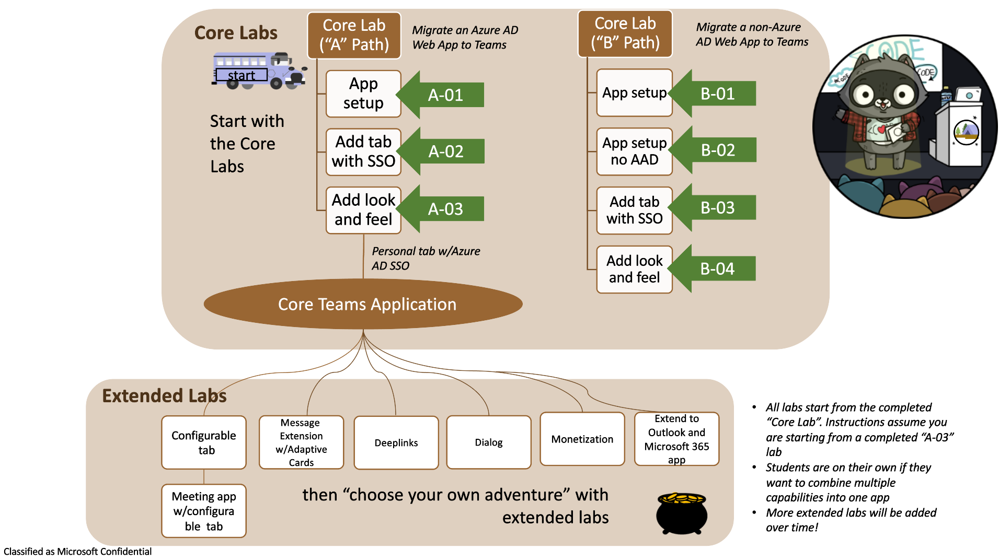

# Microsoft Teams App Camp V2

_Migrate applications into Microsoft Teams_

Our developers come first and we want you to thrive in Microsoft Teams app development! 

In this workshop we want you to,

**LEARN > ASK QUESTIONS > UNBLOCK**

so you can focus on building and monetizing amazing applications.

This hands-on experience will lead developers through the steps needed to take an existing SaaS app from "zero Microsoft" to a complete Microsoft Teams app running in the Teams.
It will also enable them to extend their application with capabilities currently supported in Teams and take them to the Team's app store.

In this series of labs, you will port a simple "Northwind Orders" web application to become a full-fledged Microsoft Teams application. To make the app understandable by a wide audience, it is written in vanilla JavaScript with no UI framework, however it does use modern browser capabilities such as web components, CSS variables, and ECMAScript modules. The server side is also in plain JavaScript, using Express, the most popular web server platform for NodeJS.

**Document outline**
<!-- no toc -->
- [Paths 🛣️](#paths-️)
- [Labs 📚](#labs)
  - [Path A: Core application development](#path-a-core-application-development)
  - [Path B: Core application development](#path-b-core-application-development)
- [Prerequisites 📃](#prerequisites)
- [Contributing](#contributing)
- [Trademarks](#trademarks)

## Paths 🛣️

There are two paths for doing the core application development labs. (NOTE that the labs are "Core"; the "Core Teams Application" is just a simple Teams application that we can build on in the labs that follow.)

- **The "A" path** is for developers with apps that are already based on Azure Active Directory. The starting app uses Azure Active Directory and the Microsoft Authentication Library (MSAL). Path A includes optional modules for extending the core application. There is a set of optional modules for extending the core application.

- **The "B" path** is for developers with apps that use some other identity system. It includes a simple cookie-based auth system based on the Employees table in the Northwind database. This cookie-based system is not secure and should never be used in production! But it does serve to show how to map identities from an existing login system to Azure AD identities using Teams Single Sign-on.

Links to resources referenced throughout App Camp can be found [here, on the Resources page](./docs/Resources.md).

## Labs 📚

### Path A: Core application development

**Mandatory** for AAD apps.
Selling Your SaaS-based Teams Extension
  1. [Prerequisites 📃](#prerequisites)
  2. [Start with Azure Active Directory](./lab-instructions/aad/A01-begin-app.md)
  3. [Create a Teams app with Azure AD Single Sign-On](./lab-instructions/aad/A02-after-teams-sso.md)
  4. [Teams styling and themes](./lab-instructions/aad/A03-after-apply-styling.md)

**Optional** for AAD apps. Choose your own adventure! 

> For extending your application with capabilities below, make sure you complete your core Teams application lab.

  - [Add a Configurable Tab](./lab-instructions/aad/ConfigurableTab.md)
  - [Add a Deep link to a personal Tab](./lab-instructions/aad/Deeplink.md)
  - [Add a Messaging Extension](./lab-instructions/aad/MessagingExtension.md)
  - [Add a Task Module ](./lab-instructions/aad/TaskModules.md)
  - [Selling Your SaaS-based Teams Extension](./lab-instructions/aad/Monetization.md)
   
### Path B: Core application development

**Mandatory** for non-AAD apps.
  
  1. [Prerequisites 📃](#prerequisites)
  2. [Start with a non-Azure Active Directory Identity System](./lab-instructions/bespoke/B01-begin-app.md)
  3. [Teams App with Bespoke Authentication](./lab-instructions/bespoke/B02-after-teams-login.md)
  4. [Enable Azure AD Single Sign-On](./lab-instructions/bespoke/B03-after-teams-sso.md)
  5. [Teams styling and themes](./lab-instructions/bespoke/B04-after-apply-styling.md)
  
## Prerequisites 📃 

This lab is intended for developers. Most of the labs don't assume a lot of specialized knowledge; coding is  in JavaScript without use of specialized frameworks or libraries. But if you're not comfortable with coding, you may find it a bit challenging.

Technical prerequisites are explained [in the repo wiki](https://github.com/OfficeDev/m365-msteams-northwind-app-samples/wiki/Prerequisites)

## Contributing

This project welcomes contributions and suggestions.  Most contributions require you to agree to a
Contributor License Agreement (CLA) declaring that you have the right to, and actually do, grant us
the rights to use your contribution. For details, visit https://cla.opensource.microsoft.com.

When you submit a pull request, a CLA bot will automatically determine whether you need to provide
a CLA and decorate the PR appropriately (e.g., status check, comment). Simply follow the instructions
provided by the bot. You will only need to do this once across all repos using our CLA.

This project has adopted the [Microsoft Open Source Code of Conduct](https://opensource.microsoft.com/codeofconduct/).
For more information see the [Code of Conduct FAQ](https://opensource.microsoft.com/codeofconduct/faq/) or
contact [opencode@microsoft.com](mailto:opencode@microsoft.com) with any additional questions or comments.

## Trademarks

This project may contain trademarks or logos for projects, products, or services. Authorized use of Microsoft 
trademarks or logos is subject to and must follow 
[Microsoft's Trademark & Brand Guidelines](https://www.microsoft.com/en-us/legal/intellectualproperty/trademarks/usage/general).
Use of Microsoft trademarks or logos in modified versions of this project must not cause confusion or imply Microsoft sponsorship.
Any use of third-party trademarks or logos are subject to those third-party's policies.
