# Lab A01: Start with Azure Active Directory

## Overview

This is the very first lab in Path A, which begins with an application that already uses Azure AD.

---8<--- "are-you-on-the-right-path.md"

In this lab you will set up the Northwind Orders application, which can be found in the [A01-begin-app](https://github.com/microsoft/app-camp/blob/main/src/create-core-app/aad/A01-begin-app) folder. The labs that follow will lead you step by step into extending the web application to be a Microsoft Teams application as well. 

* A01-begin-app: Setting up the application with Azure AD (📍You are here)
* [A02-after-teams-sso: Creating a Teams app with Azure ADO SSO](./A02-after-teams-sso.md)
* [A03-after-apply-styling: Teams styling and themes](./A03-after-apply-styling.md)

In this lab you will learn to:

- Run a web application using NodeJS
- Expose a local web application using ngrok
- [Register an application with the Microsoft identity platform](https://docs.microsoft.com/en-us/azure/active-directory/develop/quickstart-register-app?WT.mc_id=m365-58890-cxa){target=_blank}
- How to use the [Microsoft Authentication Library (MSAL)](https://docs.microsoft.com/en-us/azure/active-directory/develop/msal-overview?WT.mc_id=m365-58890-cxa){target=_blank}
- How to validate an [Azure AD access token](https://docs.microsoft.com/en-us/azure/active-directory/develop/access-tokens?WT.mc_id=m365-58890-cxa){target=_blank} in a NodeJS application

???+ info "Video briefing"
    

      </img>
      
Lab A01 Briefing

    

??? note "Table of Contents (open to display ►)"
    - [Overview](#overview)
    - [Features](#features)
    - [Exercise 1: Install prerequisites](#exercise-1-install-prerequisites)
      - [Step 1: Install NodeJS](#step-1-install-nodejs)
      - [Step 2: Install a Code Editor](#step-2-install-a-code-editor)
      - [Step 3: Install ngrok](#step-3-install-ngrok)
    - [Exercise 2: Set up your Microsoft 365 Subscription](#exercise-2-set-up-your-microsoft-365-subscription)
      - [Step 1: Get a tenant](#step-1-get-a-tenant)
      - [Step 2: Enable Teams application uploads](#step-2-enable-teams-application-uploads)
    - [Exercise 3: Assign users as Northwind "Employees"](#exercise-3-assign-users-as-northwind-employees)
      - [Step 1: Edit Azure AD users](#step-1-edit-azure-ad-users)
      - [Step 2: Ensure the users have managers](#step-2-ensure-the-users-have-managers)
      - [Step 3: Ensure the users are licensed for Microsoft 365](#step-3-ensure-the-users-are-licensed-for-microsoft-365)
    - [Exercise 4: Register your application with Azure AD](#exercise-4-register-your-application-with-azure-ad)
      - [Step 1: Start ngrok](#step-1-start-ngrok)
      - [Step 2: Register your application in Azure Active Directory](#step-2-register-your-application-in-azure-active-directory)
      - [Step 3: Grant your application permission to call the Microsoft Graph API](#step-3-grant-your-application-permission-to-call-the-microsoft-graph-api)
      - [Step 4: Consent to the permission](#step-4-consent-to-the-permission)
      - [Step 5: Expose an API](#step-5-expose-an-api)
    - [Exercise 5: Configure and run the application](#exercise-5-configure-and-run-the-application)
      - [Step 1: Download the starting application](#step-1-download-the-starting-application)
      - [Step 2: Install the app's dependencies](#step-2-install-the-apps-dependencies)
      - [Step 3: Download the sample data](#step-3-configure-the-app-settings)
      - [Step 4: Configure the app settings](#step-4-configure-the-app-settings)
      - [Step 5: Run the application](#step-5-run-the-application)
    - [Known issues](#known-issues)
    - [Next steps](#next-steps)

## Features

- View orders associated with the logged-in user (sales representative)
- View products by category
- View product details and orders for a product
- View order details

The application is based on the Northwind Traders Database, which is a sample relational database that originally shipped with Microsoft Access. The Northwind Traders Database is now available as a [demonstration OData service](https://services.odata.org/){target=_blank}, which is queried in this lab. This is a read-only data source; some of the later exercises appear to update the data but the changes are only stored in the server memory and will only persist until the server is restarted.

## Exercise 1: Install prerequisites

You can complete these labs on a Windows, Mac, or Linux machine, but you do need the ability to install the prerequisites. If you are not permitted to install applications on your computer, you'll need to find another machine (or virtual machine) to use throughout the workshop.

### Step 1: Install NodeJS

NodeJS is a program that allows you to run JavaScript on your computer; it uses the open source "V8" engine, which is used in popular web browsers such as Microsoft Edge and Google Chrome. You will need NodeJS to run the web server code used throughout this workshop.

Browse to [https://nodejs.org/en/download/](https://nodejs.org/en/download/){target=_blank} and install the "LTS" (Long Term Support) version for your operating system. This lab has been tested using NodeJS version 14.17.4 and 16.14.0. If you already have another version of NodeJS installed, you may want to set up the [Node Version Manager](https://github.com/nvm-sh/nvm){target=_blank} (or [this variation](https://github.com/coreybutler/nvm-windows){target=_blank} for Microsoft Windows), which allows you to easily switch Node versions on the same computer.

### Step 2: Install a Code Editor

You can really use any code editor you wish, but we recommend [Visual Studio Code](https://code.visualstudio.com/download){target=_blank}.

### Step 3: Install ngrok

ngrok is a tunneling program that allows you to access your local web server (running in NodeJS in this case) from the Internet. To complete this exercise, [sign up for a free ngrok account](https://ngrok.com/){target=_blank} and install ngrok on your computer.

The free version of ngrok will assign a URL similar to https://something.ngrok.io, where "something" is a random identifier. As long as ngrok is running (leave it going in a command or terminal window), you can browse your web site at that URL. If you start and stop ngrok, or try to keep it running for more than 8 hours, you'll get a new identifier and you'll need to update your app registration, environment variables, etc. The paid version of ngrok allows you to reserve the same URL for use over time, removing the need to update it when you return to the lab.

While ngrok isn't strictly required for developing Microsoft Teams applications, it makes things much easier, especially if Bots are involved. An example of this is the Message Extension lab since Message Extensions use a Bot to communicate with Microsoft Teams.

???+ info "More information"
    

      <iframe src="//www.youtube.com/embed/A5U-3o-mHD0" frameborder="0" allowfullscreen></iframe>
      
What is ngrok and do you really need it?

    

## Exercise 2: Set up your Microsoft 365 Subscription

The initial Northwind Orders application doesn't require Microsoft 365, but it does use Azure AD. So let's set up a Microsoft 365 tenant now, which will give you an Azure AD instance where you're a full administrator so you can register the Northwind Orders application. In the labs which follow, you'll also use this tenant to run Microsoft Teams.

### Step 1: Get a tenant

If you don't yet have a tenant, please join the [Microsoft 365 Developer Program](https://developer.microsoft.com/microsoft-365/dev-program?WT.mc_id=m365-58890-cxa){target=_blank} to get a free one. Your tenant includes 25 [E5 user licenses](https://www.microsoft.com/microsoft-365/enterprise/compare-office-365-plans?WT.mc_id=m365-58890-cxa){target=_blank} and can be renewed as long as you keep developing!

Select "Join now" to begin.
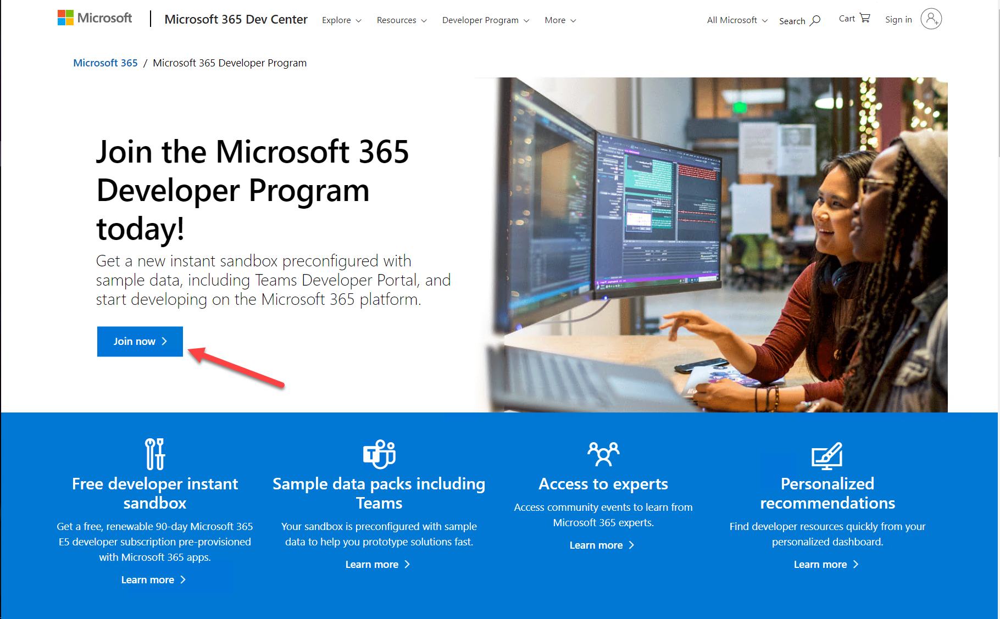

Log in with any Microsoft personal or work and school account, enter your information, and select "Next". You will have an opportunity to choose what kind of "sandbox" you want; the "Instant sandbox" is recommended.

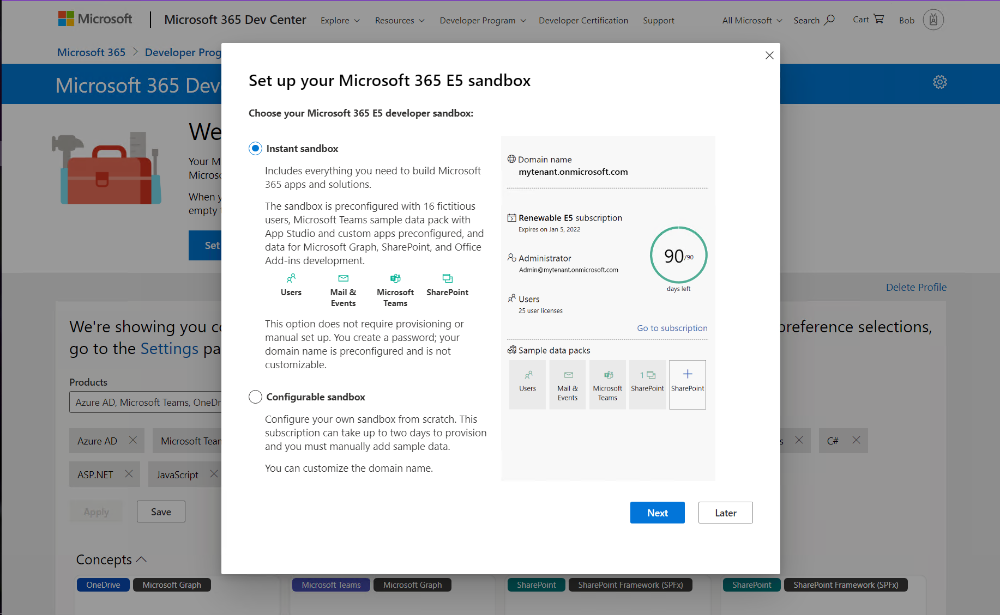

Follow the wizard and select your administrator username and password, tenant domain name, etc. The domain name you choose is just the left-most portion - for example if you enter "Contoso" your domain will be "Contoso.onmicrosoft.com".

Remember this information as you'll need it throughout the labs! You will log in as &gt;username&lt;@&gt;domain&lt;.onmicrosoft.com with the password you chose. You'll be prompted for your phone number and then the system will set up your subscription.

Eventually you'll be prompted to log into your new tenant. Be sure to use the new administrator credentials you just created, not the ones you used when you signed up for the developer program.

???+ info "More information"
    

      <iframe src="//www.youtube.com/embed/DhhpJ1UjbJ0" frameborder="0" allowfullscreen></iframe>
      
Setting up your Microsoft 365 Development tenant

    

!!! tip "Tip: Navigating many tenants"
    Consider creating a browser profile for each tenant that will have its own favorites, stored credentials, and cookies so you can easily swtch between tenants as you work.

!!! note "You may be asked to enable multi-factor authentication (MFA)"
    [This is certainly a good idea!](https://www.microsoft.com/security/blog/2019/08/20/one-simple-action-you-can-take-to-prevent-99-9-percent-of-account-attacks/){target=_blank} Just follow the instructions. If you really must turn off MFA, [here are instructions](https://docs.microsoft.com/en-us/answers/questions/101179/how-to-disable-the-two-factor-authentication-from.html){target=_blank}. 

### Step 2: Enable Teams application uploads

By default, end users can't upload Teams applications directly; instead an administrator needs to upload them into the enterprise app catalog. In this step you will enable direct uploads to make developement easier and allow installation directly from the Teams user interface.

  a. Navigate to [https://admin.microsoft.com/](https://admin.microsoft.com/){target=_blank}, which is the Microsoft 365 Admin Center.

  b. In the left panel of the admin center, select "Show all" to open up the entire navigation

  

  When the panel opens, select Teams to open the Microsoft Teams admin center.

  

  c. In the left of the Microsoft Teams admin center, open the Teams apps accordion 1️⃣ and select Setup Policies 2️⃣. You will see a list of App setup policies. Select the Global (Org-wide default) policy 3️⃣.

  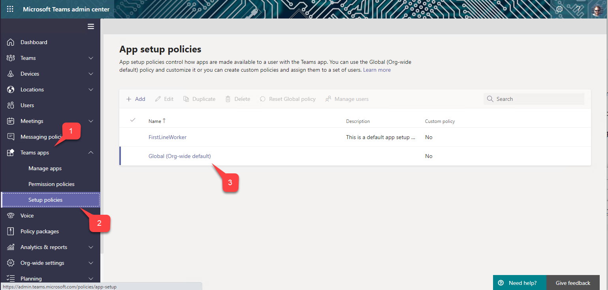

 d. Ensure the first switch, "Upload custom apps" is turned On.

 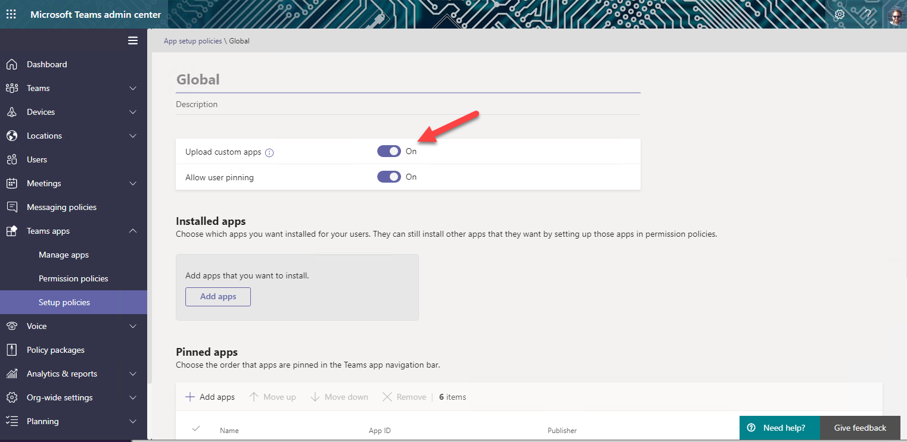

Be sure to scroll down and select the "Save" button to persist your change.

 
 We have been working to get this enabled by default on developer tenants, so it may already be set for you. The change can take up to 24 hours to take effect, but usually it's much faster.

## Exercise 3: Assign users as Northwind "Employees"

 The Northwind database contains 9 employees, so up to 9 users in your tenant will be able to use the application. (You'll only need two to complete the labs.)

The Northwind Orders application expects each user's employee ID in Azure Active Directory to match their employee ID in the Northwind database. In this exercise you'll set up some test users accordingly.

### Step 1: Edit Azure AD users

 - Navigate to the Microsoft 365 admin center at [https://admin.microsoft.com/](https://admin.microsoft.com){target=_blank} and log in as the administrator of your new dev tenant.

 - In the left navigation, select "Show All" to reveal the full list of admin centers, and then select "Azure Active Directory". This will bring you to the [Azure AD admin center](https://aad.portal.azure.com/){target=_blank}.

- Select "Azure Active Directory" again in the left navigation bar.

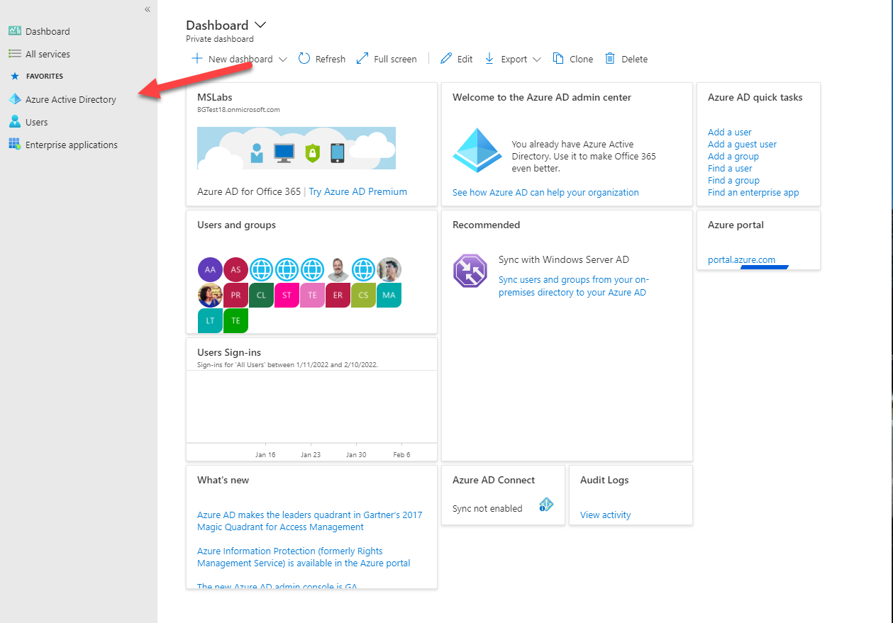

- This will bring you to the overview of your Azure AD tenant. Note that a "tenant" is a single instance of Azure Active Directory, with its own users, groups, and app registrations. Verify that you're in the developer tenant you just created, and select "Users" in the navigation bar.

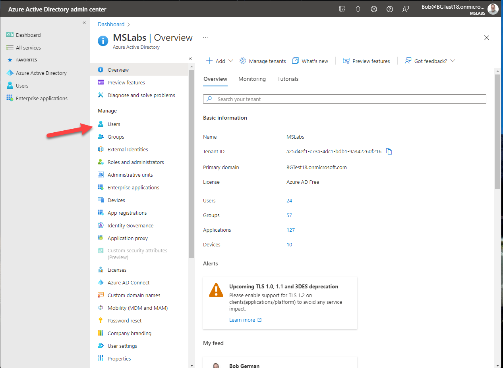

You can use existing users to run the Northwind Orders application (the names may not match the Northwind database unless you change them, but you'll know what's going on), or create new ones. It's easiest if one of the users is the administrator account you're logged into right now, so you can test the application without logging on and off, but that's up to you. Select on the user to view their user profile, and then select the "Edit" button.

Change the Employee ID to the ID of one of the users in the Northwind datbase, which are:

| Employee ID | Name |
|---|---|
| 1 | Nancy Davolio |
| 2 | Andrew Fuller |
| 3 | Janet Leverling |
| 4 | Margaret Peacock |
| 5 | Steven Buchanan |
| 6 | Michael Suyama |
| 7 | Robert King |
| 8 | Laura Callahan |
| 9 | Anne Dodsworth |

You may also choose to rename the users to match the database.

### Step 2: Ensure the users have managers

Still on the edit screen, assign a manager for each user by clicking "Edit" again and then click "Change" next to the manager field and select a manager.

### Step 3: Ensure the users are licensed for Microsoft 365

From the same user profile screen, select "Licenses" and ensure the user has an Office 365 license so they can run Microsoft Teams.

!!! note
    When you publish your application in the Microsoft Teams store, you will be responsible for your own license management and licenses for your application will not appear here along with the licenses for Microsoft products. In Lab 08, you will implement this strategy for the Northwind Orders app.

## Exercise 4: Register your application with Azure AD

In order for users to log into your application with Azure AD, you need to register it. In this exercise you will register your application directly in the tenant you created in Exercise 2, however we'll set it up so it can be used from other tenants, such as those of customers who purchase your application in the Microsoft Teams store.

???+ info "More information"
    

      <iframe src="//www.youtube.com/embed/RjGVOFm39j0" frameborder="0" allowfullscreen></iframe>
      
Learn about multi-tenant applications

    

### Step 1: Start ngrok

Before you can register your application, you will need to start ngrok to obtain the URL for your application. In the command line tool of your choice, navigate to the folder where you've saved **ngrok.exe** and run this command:

~~~shell
ngrok http 3978
~~~

The terminal will display a screen like this; note the https forwarding URL for use in this lab. ngrok will tunnel requests on this URL to your local host on port 3978 for easy debugging.

Save this URL for use throughout the labs.

!!! warning
    Do not stop ngrok for the duration of these labs. If you do stop ngrok and are assigned a new URL, [this page](/app-camp/ngrokReferences/){target="_blank"} lists all the exercises which involve the ngrok URL so you can easily update it.

### Step 2: Register your application in Azure Active Directory

 - Navigate to the Microsoft 365 admin center at https://admin.microsoft.com/ and log in as the administrator of your new dev tenant.

 - In the left navigation, select "Show More" to reveal the full list of admin centers, and then select "Azure Active Directory". This will bring you to the [Azure AD admin center](https://aad.portal.azure.com/){target="_blank"}.

- Select "Azure Active Directory" again in the left navigation bar.

- This will bring you to the overview of your Azure AD tenant. Note that a "tenant" is a single instance of Azure Active Directory, with its own users, groups, and app registrations. Verify that you're in the developer tenant you just created, and select "App Registrations" in the navigation bar.

- You will be shown a list of applications (if any) registered in the tenant. Select "+ New Registration" at the top to register a new application.

You will be presented with the "Register an application" form.

- Enter a name for your application 1️⃣.
- Under "Supported account types" select "Accounts in any organizational directory" 2️⃣. This will allow your application to be used in your customer's tenants.
- Under "Redirect URI", select "Single-page application (SPA)" 3️⃣ and enter the ngrok URL you saved earlier 4️⃣.
- Select the "Register" button 5️⃣

You will be presented with the application overview. There are two values on this screen you need to copy for use later on; those are the Application (client) ID 1️⃣ and the Directory (tenant) ID 2️⃣.

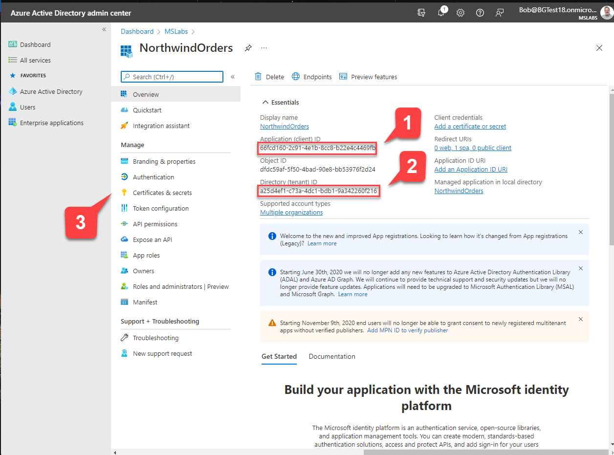

When you've recorded these values, navigate to "Certificates & secrets" 3️⃣.

Now you will create a client secret, which is like a password for your application to use when it needs to authenticate with Azure AD.

- Select "+ New client secret" 1️⃣
- Enter a description 2️⃣ and select an expiration date 3️⃣ for your secret 
- Select "Add" to add your secret. 4️⃣

The secret will be displayed just this once on the "Certificates and secrets" screen. Copy it now and store it in a safe place.

!!! warning "Managing app secrets is an ongoing responsibility"
    App secrets have a limited lifetime, and if they expire your application may stop working. You can have multiple secrets, so plan to roll them over as you would with a digital certificate.

!!! danger "Keep your secrets secret!"
    Give each developer a free developer tenant and register their apps in their tenants so each developer has his or her own app secrets. Limit who has access to app secrets for production. If you're running in Microsoft Azure, a great place to store your secrets is [Azure KeyVault](https://azure.microsoft.com/en-us/services/key-vault/){target="_blank"}. You could deploy an app just like this one and store sensitive application settings in Keyvault. See [this article](https://docs.microsoft.com/en-us/azure/app-service/app-service-key-vault-references?WT.mc_id=m365-58890-cxa){target="_blank"} for more information.

### Step 3: Verify permission to call the Microsoft Graph API

The app registration created an identity for your application; now we need to give it permission to call the Microsoft Graph API. The Microsoft Graph is a RESTful API that allows you to access data in Azure AD and Microsoft 365, including Microsoft Teams.

- While still in the app registration, navigate to "API Permissions" 1️⃣ and notice there is already a permission there, "User.Read" 2️⃣.

This permission is "delegated" (it acts on behalf of the logged-in user). For an explanation of application vs. delegated permissions, see [this documentation](https://docs.microsoft.com/en-us/azure/active-directory/develop/v2-permissions-and-consent#permission-types?WT.mc_id=m365-58890-cxa){target="_blank"}.

???+ info "More information"
    

      <iframe src="//www.youtube.com/embed/SaBbfVgqZHc" frameborder="0" allowfullscreen></iframe>
      
Understanding Single Sign-On (SSO) with Azure AD

    

    

      <iframe src="//www.youtube.com/embed/RjGVOFm39j0" frameborder="0" allowfullscreen></iframe>
      
Learn about multi-tenant applications

    

 or watch [this video](https://www.youtube.com/watch?v=SaBbfVgqZHc).

The permission is for calling the Microsoft Graph, and it allows reading the logged-in user's profile, which includes the user's Employee ID.

The Northwind Orders application uses the Employee ID value in each users's Azure AD profile to locate the user in the Employees table in the Northwind database. The names probably won't match unless you rename them but in a real application the employees and Microsoft 365 users would be the same people.
### Step 4: Consent to the permission

You have added the permission but nobody has consented to it. If you return to the permission page for your app, you can see that the new permission has not been granted. 1️⃣ To fix this, select the "Grant admin consent for <tenant>" button and then agree to grant the consent 2️⃣. When this is complete, the message "Granted for <tenant>" should be displayed for each permission.

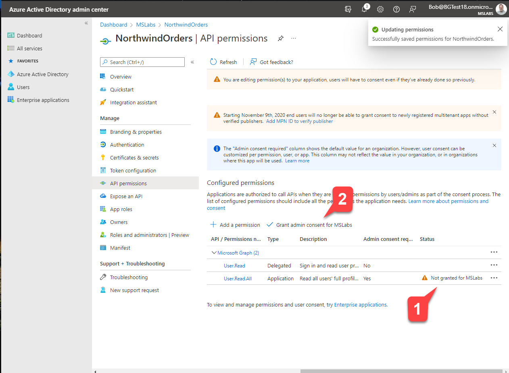

### Step 5: Expose an API

The Northwind Orders app is a full stack application, with code running in the web browser and web server. The browser application accesses data by calling a web API on the server side. To allow this, we need to expose an API in our Azure AD application. This will allow the server to validate Azure AD access tokens from the web browser.

Select "Expose an API" 1️⃣ and then "Add a scope"2️⃣. Scopes expose an application's permissions; what you're doing here is adding a permission that your application's browser code can use it when calling the server. 

On the "Add a scope" flyout, edit the Application ID URI to include your ngrok URL between the "api://" and the client ID. Select the "Save and continue" button to proceed.

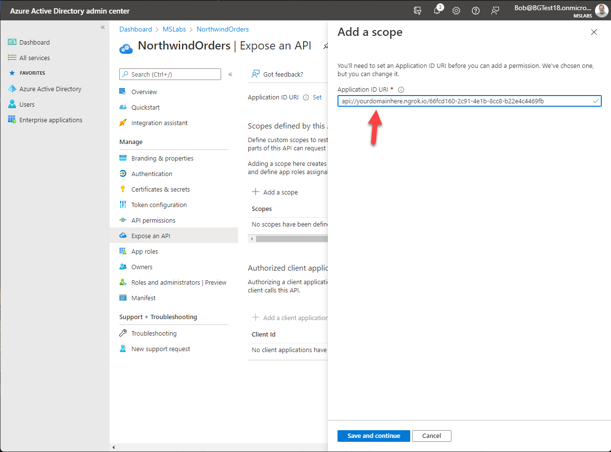

Now that you've defined the application URI, the "Add a scope" flyout will allow you to set up the new permission scope. Fill in the form as follows:
- Scope name: access_as_user
- Who can consent: Admins only
- Admin consent display name: Access as the logged in user
- Admin consent description: Access Northwind services as the logged in user
- (skip User consent fields)
- Ensure the State is set to "Enabled"
- Select "Add scope"

## Exercise 5: Configure and run the application

### Step 1: Download the starting application

Begin by downloading the app-camp repository at [https://github.com/microsoft/app-camp](https://github.com/microsoft/app-camp/){target="_blank"}. Select the "Code" button and clone or download the content to your computer.

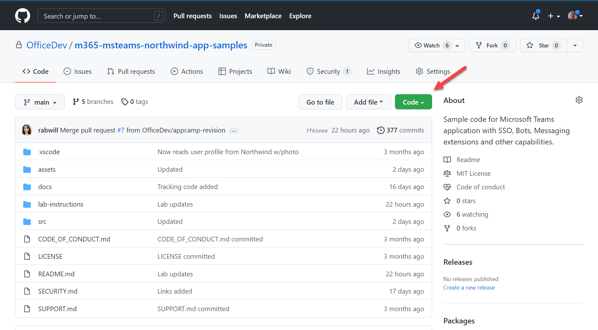

The starting code is in the `src/create-core-app/aad/A01-begin-app/` folder. Copy this folder to another location on your computer; this will be your working copy to keep the original source separate. Folders are also provided with the final code for the other labs.

!!! note
    Be sure to copy the A01-begin-app folder to a working location where you can modify the contents as you complete the labs. That way you'll still have a clean copy to start from or to compare with your work.

### Step 2: Install the app's dependencies

Using a command line tool of your choice, navigate to your working copy of the **A01-begin-app** directory and type the command:

~~~shell
npm install
~~~

This will install the libraries required to run the server side of your solution.

!!! note
    The client-side code is not bundled as it uses [JavaScript Modules](https://developer.mozilla.org/en-US/docs/Web/JavaScript/Guide/Modules){target="_blank"} (sometimes called ES Modules or ECMAScript Modules). The npm packages are used on the server side.

#### Step 3: Download the sample data

The Northwind Orders application uses the venerable Northwind database for sample data. The Northwind Database originally shipped with Microsoft Access, then SQL Server, and now is [available as a test OData service](https://services.odata.org/V4/Northwind/){target="_blank"} from the [OData organization](https://www.odata.org/){target="_blank"}. In this step, you'll download the entire Northwind database from this test service to local JSON files, which are used by the Northwind Orders application.

Using a command line tool in your working directory, type:

~~~shell
npm run db-download
~~~

This will create a JSON file in the **northwindDB** folder for each table in the Northwind database. The appliction reads and writes these JSON files. It's generous to call these files a "database", but it works well for a single-user lab environment.

#### Step 4: Configure the app settings

In a code editor, open the working folder you created in Step 2. Copy the *.env_sample* file to a new file called *.env* and open the new file. It will look like this:

~~~text
COMPANY_NAME=Northwind Traders
PORT=3978

HOSTNAME=something.ngrok.io
TENANT_ID=00000000-0000-0000-0000-000000000000
CLIENT_ID=00000000-0000-0000-0000-000000000000
CLIENT_SECRET=xxxxx
~~~

Fill in the information you've gathered so far, including your ngrok hostname and the information from the app registration.

#### Step 5: Run the application

To run the application, open a command line in your working folder and type:

~~~shell
npm start
~~~

At this point you should be able to browse to your ngrok URL and use the application. Note that due to the ngrok tunnel, you can try your app from anywhere on the Internet.

You will quickly be directed to the Microsoft login page. 

Log in using one of the accounts you set up with an employee ID in Exercise 3, and you should be presented with the app's home page. The home page shows the employee name and picture from the Northwind database.

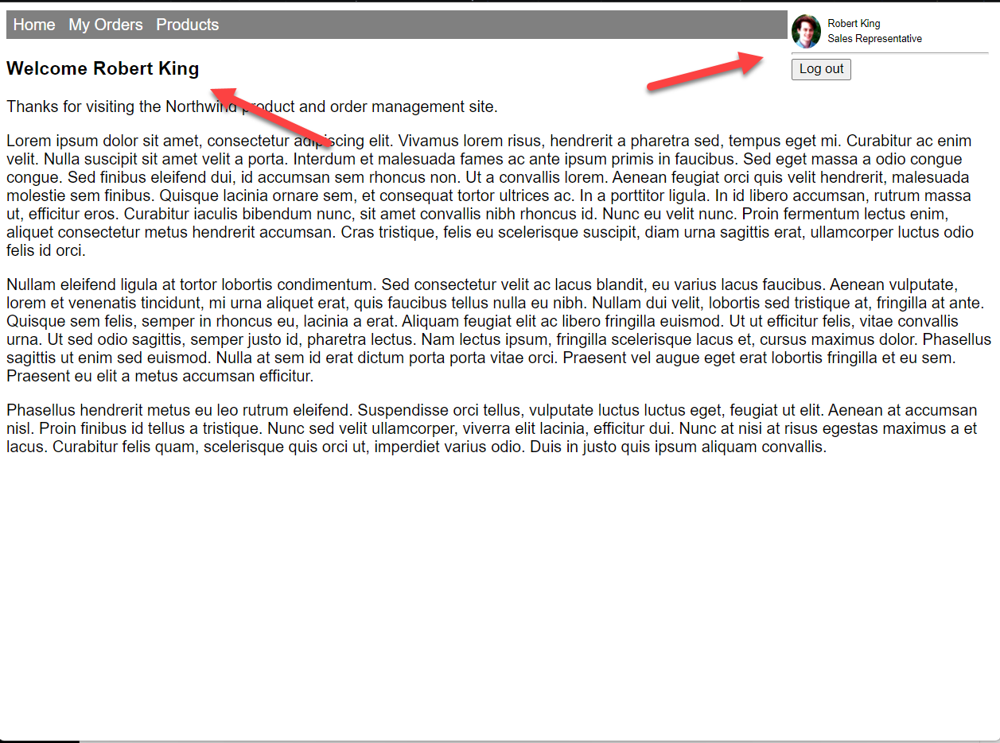

Select "My Orders" in the top navigation bar to view the employee's orders.

You can click on any order to view the details.

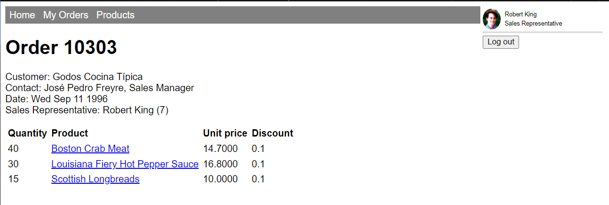

From here you can select on any product to view its details. Much of the data is hyperlinked in this fashion.

You can also select on "Products" in the top navigation to view a list of product categories.

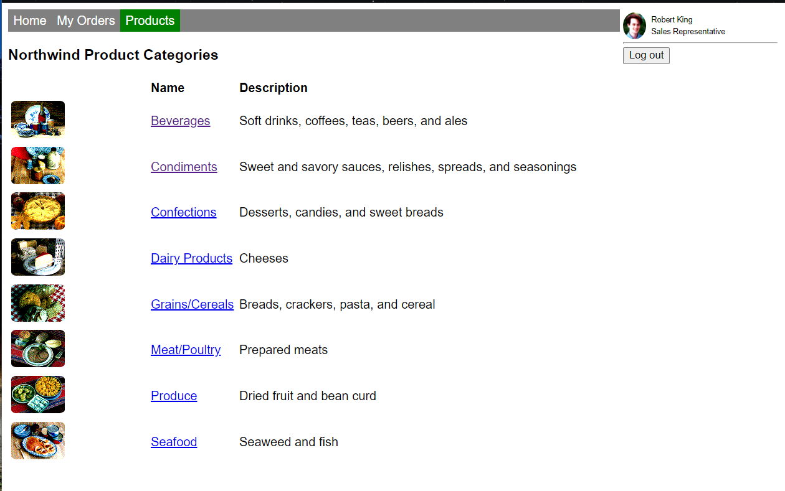

From there you can select into a product category to view a list of products, and then you can select into a product to see its details. The product detail page shows all the orders for the product, which leads to a list of orders, and so you can select your way around the sample data.

Try logging out and logging in; you should be able to view the orders for another user in your developer tenant who has an employee ID set to a Northwind employee ID.

## Known issues

While it will work on mobile devices, the application is not responsive and will not look good on these devices. This may be addressed in a future version of the lab.

--8<-- "issuesLink.md"

## Next steps

After completing this lab, you may continue to the next lab in this learning path, [A02-after-teams-sso: Creating a Teams app with Azure ADO SSO](./A02-after-teams-sso.md).
