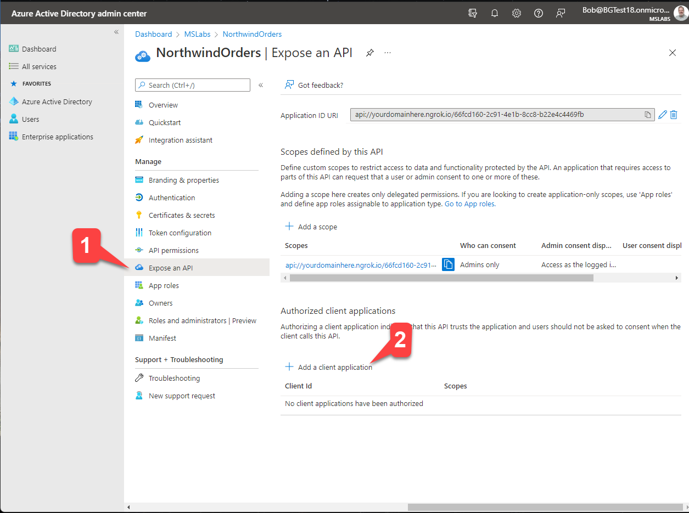
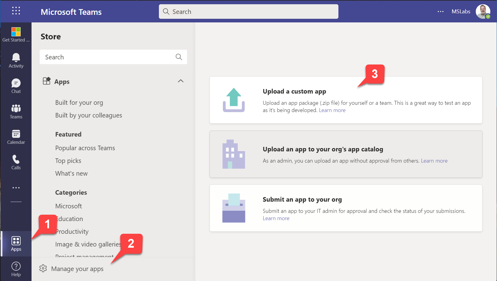
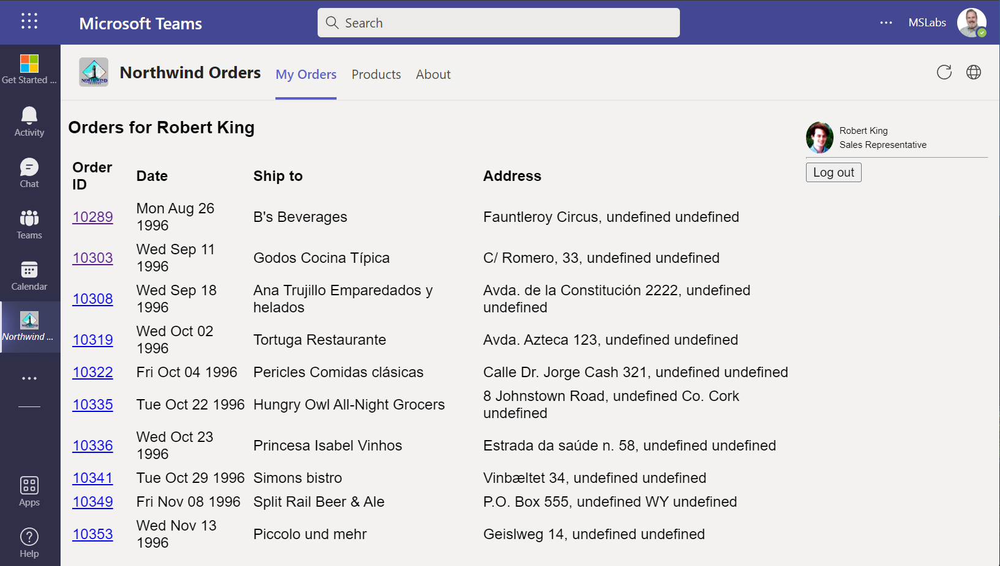

# Lab A02: Create a Teams app with Azure AD Single Sign-On

## Overview

This lab is part of Path A, which begins with a Northwind Orders application that already uses Azure AD.

---8<--- "are-you-on-the-right-path.md"

In this lab you will extend the Northwind Orders application as a personal tab in a Teams application. That means the application needs to run in an IFrame; if your app includes code that prevents this, you may need to modify it to look for the Teams referrer URL.

The Northwind Orders app doesn't check for IFrames, but Azure AD does, so the existing site won't work without modifications. To accomodate this and to prevent extra user logins, you'll set this tab up to use Teams' Azure AD Single Sign-on. 

The completed solution can be found in the [A02-after-teams-sso](https://github.com/microsoft/app-camp/blob/main/src/create-core-app/aad/A02-after-teams-sso/){target="_blank"} folder, but the instructions will guide you through modifying the app running in your working folder. 

Note that as you complete the labs, the original app should still work outside of Teams! This is often a requirement of ISV's who have an app in market and need to serve an existing customer base outside of Teams.

* [A01-begin-app: Setting up the application with Azure AD](./A01-begin-app.md) 
* [A02-after-teams-sso: Creating a Teams app with Azure ADO SSO](./A02-after-teams-sso.md) (📍You are here)
* [A03-after-apply-styling: Teams styling and themes](./A03-after-apply-styling.md)

In this lab you will learn to:

- Create an app manifest and package that can be installed into Teams
- Update your Azure AD app registration to allow Teams to issue tokens on behalf of your application
- Use the Microsoft Teams JavaScript SDK to request an Azure AD access token
- Install and test your application in Microsoft Teams

???+ info "Video briefing"
    

      </img>
      
Lab A02 Briefing

    

??? note "Table of Contents (open to display ►)"
    - [Overview](#overview)
    - [Features](#features)
    - [Project structure](#project-structure)
    - [Exercise 1: Authorize Microsoft Teams to log users into your application](#exercise-1-authorize-microsoft-teams-to-log-users-into-your-application)
        - [Step 1: Return to your app registration](#step-1-return-to-your-app-registration)
        - [Step 2: Add the Teams client applications](#step-2-add-the-teams-client-applications)
    - [Exercise 2: Create the Teams application package](#exercise-2-create-the-teams-application-package)
        - [Step 1: Copy the *manifest* folder to your working directory](#step-1-copy-the-manifest-folder-to-your-working-directory)
        - [Step 2: Examine the manifest template](#step-2-examine-the-manifest-template)
        - [Step 3: Add the Teams App ID to the .env file](#step-3-add-the-teams-app-id-to-the-env-file)
        - [Step 4: Add npm package to create .zip files](#step-4-add-npm-package-to-create-zip-files)
        - [Step 5: Build the package](#step-5-build-the-package)
    - [Exercise 3: Modify the application source code](#exercise-3-modify-the-application-source-code)
        - [Step 1: Add a module with Teams helper functions](#step-1-add-a-module-with-teams-helper-functions)
        - [Step 2: Update the login code for Teams SSO](#step-2-update-the-login-code-for-teams-sso)
        - [Step 3: Hide the navigation within Teams](#step-3-hide-the-navigation-within-teams)
        - [Exercise 4: Test your application in Microsoft Teams](#exercise-4-test-your-application-in-microsoft-teams)
        - [Step 1: Start the application](#step-1-start-the-application)
        - [Step 2: Upload the app package](#step-2-upload-the-app-package)
    - [Known issues](#known-issues)
    - [References](#references)
    - [Next Steps](#next-steps)

## Features

- Microsoft Teams personal tab application displays the Northwind Orders web application
- Users sign into the Teams application transparently using Azure AD SSO
- Application alters its appearance (hides the top navigation) when running in Teams, allowing Teams tab navigation instead

## Project structure

??? note "Project files before and after this lab (open to display ►)"
    The project structure when you start of this lab and end of this lab is as follows.
    Use this depiction for comparison.
    On your left is the contents of folder  `A01-begin-app` and on your right is the contents of folder `A02-after-teams-sso`.

    - 🆕 New files/folders

    - 🔺Files changed

    <table>
    <tr>
    <th >Project Structure Before </th>
    <th>Project Structure After</th>
    </tr>
    <tr>
    <td valign="top" >
    <pre>
    A01-begin-app
        ├── client
        │   ├── components
        │       ├── 🔺navigation.js
        │   └── identity
        │       ├── 🔺identityClient.js
        │       └── userPanel.js
        ├── modules
        │   └── env.js
        │   └── northwindDataService.js
        ├── pages
        │   └── categories.html
        │   └── categories.js
        │   └── categoryDetails.html
        │   └── categoryDetails.js
        │   └── myOrders.html
        │   └── orderDetail.html
        │   └── orderDetail.js
        │   └── privacy.html
        │   └── productDetail.html
        │   └── productDetail.js
        │   └── termsofuse.html
        ├── index.html
        ├── index.js
        ├── northwind.css
        ├── server
        │   └── constants.js
        │   └── identityService.js
        │   └── northwindDataService.js
        │   └── server.js
        ├── 🔺.env_Sample
        ├── .gitignore
        ├── 🔺package.json
        ├── README.md
    </pre>
    </td>
    <td>
    <pre>
    A02-after-teams-sso
        ├── client
        │   ├── components
        │       ├── 🔺navigation.js
        │   └── identity
        │       ├── 🔺identityClient.js
        │       └── userPanel.js
        ├── modules
        │   └── env.js
        │   └── northwindDataService.js
        │   └── 🆕teamsHelpers.js
        ├── pages
        │   └── categories.html
        │   └── categories.js
        │   └── categoryDetails.html
        │   └── categoryDetails.js
        │   └── myOrders.html
        │   └── orderDetail.html
        │   └── orderDetail.js
        │   └── privacy.html
        │   └── productDetail.html
        │   └── productDetail.js
        │   └── termsofuse.html
        ├── index.html
        ├── index.js
        ├── northwind.css
        ├── 🆕manifest
        │   └── 🆕makePackage.js
        │   └── 🆕manifest.template.json
        │   └── 🆕northwind32.png
        │   └── 🆕northwind192.png
        ├── server
        │   └── constants.js
        │   └── identityService.js
        │   └── northwindDataService.js
        │   └── server.js
        ├── 🔺.env_Sample
        ├── .gitignore
        ├── 🔺package.json
        ├── README.md
    </pre>
    </td>
    </tr>
    </table>

## Exercise 1: Authorize Microsoft Teams to log users into your application

The starting application logs users into Azure Active Directory using the [Microsoft Authentication Library (MSAL)](https://docs.microsoft.com/en-us/azure/active-directory/develop/msal-overview?WT.mc_id=m365-58890-cxa){target="_blank"}. While this works well in a web browser, it won't work reliably in a Microsoft Teams application. Instead, Microsoft Teams provides a Single Sign-On (SSO) capability so users are silently logged into your application using the same credentials they used to log into Microsoft Teams. This requires giving Microsoft Teams permission to issue Azure AD tokens on behalf of your application. In this exercise, you'll provide that permission.

### Step 1: Return to your app registration

Return to the [Azure AD admin portal](https://aad.portal.azure.com/){target="_blank"} and make sure you're logged in as the administrator of your development tenant. Click "Azure Active Directory" 1️⃣ and then "App Registrations" 2️⃣.

Select the app you registered earlier to view the application overview.

### Step 2: Add the Teams client applications

Click "Expose an API" 1️⃣ and then "+ Add a client application" 2️⃣.

Paste the ID for the Teams mobile or desktop app, `1fec8e78-bce4-4aaf-ab1b-5451cc387264` into the flyout 1️⃣ and check the scope you created earlier 2️⃣ to allow Teams to issue tokens for that scope. Then click "Add application" 3️⃣ to save your work.

Repeat the process for the Teams web application, `5e3ce6c0-2b1f-4285-8d4b-75ee78787346`.

## Exercise 2: Create the Teams application package

Microsoft Teams applications don't run "inside" of Microsoft Teams, they just appear in the Teams user interface. A tab in Teams is just a web page, which could be hosted anywhere as long as the Teams client can reach it. 

To create a Teams application, you need to create a file called *manifest.json* which contains [the information Teams needs to display the app](https://docs.microsoft.com/en-us/microsoftteams/platform/resources/schema/manifest-schema){target="_blank"}, such as the URL of the Northwind Orders application. This file is placed in a .zip file along with the application icons, and the resulting application package is uploaded into Teams or distributed through the Teams app store.

In this exercise you'll create a manifest.json file and application package for the Northwind Orders app and upload it into Microsoft Teams.

### Step 1: Copy the *manifest* folder to your working directory

Many developers use the [Teams Developer Portal](https://docs.microsoft.com/en-us/microsoftteams/platform/concepts/build-and-test/teams-developer-portal?WT.mc_id=m365-58890-cxa){target="_blank"} to create an app package; this is preferred by many enterprise developer and systems integrators. However ISV's may want to keep the app package settings in their source control system, and that's the approach used in the lab. It's just a zip file; you can create it any way you want!

!!! note "The Teams developer portal is important even if you generate your own app package!"
    Import your pacakge into the Teams Developer Portal to run validation checks prior to submitting it to the Teams app store! If you do this periodically during development you can catch issues earlier and avoid rework.

Go to your local copy of the `A02-TeamsSSO` folder on your computer and copy the *manifest* folder into the working folder you used in the previous lab. This folder contains a template for building the manifest.json file.

### Step 2: Examine the manifest template

In the manifest folder you just copied, open [manifest.template.json](https://github.com/microsoft/app-camp/blob/main/src/create-core-app/aad/A02-after-teams-sso/manifest/manifest.template.json){target="_blank"} in your code editor. This is the JSON that Teams needs to display your application.

Notice that the template contains tokens such as`<HOST_NAME>` and `<CLIENT_ID>`. A small build script will take these values from your .env file and plug them into the manifest. However there's one token, `<TEAMS_APP_ID>` that's not yet in the .env file; we'll add that in the next step.

Examine the `staticTabs` property in the manifest. It defines two tabs, one for the "My Orders" page and one for the "Products" page. The `contentUrl` is used within the Teams application, and `websiteUrl` is used if Teams can't render the tab and needs to launch it in a regular web browser. The Northwind Orders app will use the same code URL's for both.

~~~json
"staticTabs": [
  {
    "entityId": "Orders",
    "name": "My Orders",
    "contentUrl": "https://<HOST_NAME>/pages/myOrders.html",
    "websiteUrl": "https://<HOST_NAME>/pages/myOrders.html",
    "scopes": [
      "personal"
    ]
  },
  {
    "entityId": "Products",
    "name": "Products",
    "contentUrl": "https://<HOST_NAME>/pages/categories.html",
    "websiteUrl": "https://<HOST_NAME>/pages/categories.html",
    "scopes": [
      "personal"
    ]

~~~

Now examine the `webApplicationInfo` property. It contains the information Teams needs to obtain an access token using Single Sign On.

~~~json
  "webApplicationInfo": {
      "id": "<CLIENT_ID>",
      "resource": "api://<HOST_NAME>/<CLIENT_ID>"
  }
~~~

### Step 3: Add the Teams App ID to the .env file

Open the .env file in your working directory and add this line:

~~~text
TEAMS_APP_ID=1331dbd6-08eb-4123-9713-017d9e0fc04a
~~~

You should generate a different GUID for each application you register; this one is just here for your convenience. We could have hard-coded the app ID in the manifest.json template, but there are times when you need it in your code, so this will make that possible in the future.

### Step 4: Add npm package to create .zip files

Run this command in your working application folder:

~~~shell
npm install adm-zip --save-dev
~~~

### Step 5: Build the package

Open the **package.json** file in your working directory and add a script that will generate the app package. The [script code](https://github.com/microsoft/app-camp/blob/main/src/create-core-app/aad/A02-after-teams-sso/manifest/makePackage.js){target="_blank"} is in the manifest folder you just copied, so we just need to declare it in package.json. This is what `scripts` property should look like when you're done.

~~~json
"scripts": {
  "start": "nodemon server/server.js",
  "debug": "nodemon --inspect server/server.js",
  "db-download": "node northwindDB/dbDownload.js",
  "package": "node manifest/makePackage.js"
},
~~~

Now you can build a new package at any time with this command:

~~~shell
npm run package
~~~

Go ahead and run it, and two new files, manifest.json and northwind.zip (the app package) should appear in your manifest folder.

## Exercise 3: Modify the application source code

### Step 1: Add a module with Teams helper functions

Create a file called `teamsHelpers.js` in the `client/modules folder`, and paste in this code:

~~~javascript
import 'https://res.cdn.office.net/teams-js/2.0.0/js/MicrosoftTeams.min.js';

// Ensure that the Teams SDK is initialized once no matter how often this is called
let teamsInitPromise;
export function ensureTeamsSdkInitialized() {
    if (!teamsInitPromise) {
        teamsInitPromise = microsoftTeams.app.initialize();
    }
    return teamsInitPromise;
}

// Function returns a promise which resolves to true if we're running in Teams
export async function inTeams() {
    try {
        await ensureTeamsSdkInitialized();
        const context = await microsoftTeams.app.getContext();
        return (context.app.host.name === microsoftTeams.HostName.teams);
    }
    catch (e) {
        console.log(`${e} from Teams SDK, may be running outside of Teams`);    
        return false;
    }
}
~~~

These functions are used throughout the application to manage the Microsoft Teams JavaScript SDK.

Before using the Microsoft Teams JavaScript SDK for the first time on a page, you need to call the [`microsoftTeams.app.initialize()` function](https://docs.microsoft.com/en-us/javascript/api/@microsoft/teams-js/app?view=msteams-client-js-latest?WT.mc_id=m365-58890-cxa#@microsoft-teams-js-app-initialize){target="_blank"}. The first function in **teamsHelpers.js** will ensure that `initialize()` has been called exactly once on the page.W

The `inTeams()` function is used to determine if the application is running in Microsoft Teams or not. You may want to check out the [`microsoftTeams.Hostname` enumeration](https://docs.microsoft.com/en-us/javascript/api/@microsoft/teams-js/hostname?WT.mc_id=m365-58890-cxa){target="_blank"} to see other places where Teams applications will be able to run in the near future!

### Step 2: Update the login code for Teams SSO

Open the `client/identity/identityClient.js` file and add these import statements near the top.

~~~javascript
import { ensureTeamsSdkInitialized, inTeams } from '/modules/teamsHelpers.js';
import 'https://res.cdn.office.net/teams-js/2.0.0/js/MicrosoftTeams.min.js';
~~~

The first import, of course, is the Teams helper functions we just added. It's a [JavaScript module](https://developer.mozilla.org/en-US/docs/Web/JavaScript/Guide/Modules){target="_blank"} so there is no bundling; the browser will resolve the import at runtime. 

The second import will load the Teams JavaScript SDK, which creates a global object `microsoftTeams` that we can use to access the SDK. You could also load it using a `<script>` tag or, if you bundle your client-side JavaScript, using the [@microsoft/teams-js](https://www.npmjs.com/package/@microsoft/teams-js){target="_blank"} npm package.

Now modify the `getAccessToken2()` function to include this code at the top:

~~~javascript
    if (await inTeams()) {        

        await ensureTeamsSdkInitialized();
        return await microsoftTeams.authentication.getAuthToken();  

    } else {
      // existing code
    }
~~~

This code checks to see if it's running in Teams and if so, uses the Teams JavaScript SDK's `getAuthToken()` function to get the access token needed to call the server.

The completed `getAccessToken2()` function should look like this:

~~~javascript
async function getAccessToken2() {

    if (await inTeams()) {    

        await ensureTeamsSdkInitialized();
        return await microsoftTeams.authentication.getAuthToken();

    } else {

        // If we were waiting for a redirect with an auth code, handle it here
        await msalClient.handleRedirectPromise();

        try {
            await msalClient.ssoSilent(msalRequest);
        } catch (error) {
            await msalClient.loginRedirect(msalRequest);
        }

        const accounts = msalClient.getAllAccounts();
        if (accounts.length === 1) {
            msalRequest.account = accounts[0];
        } else {
            throw ("Error: Too many or no accounts logged in");
        }

        let accessToken;
        try {
            const tokenResponse = await msalClient.acquireTokenSilent(msalRequest);
            accessToken = tokenResponse.accessToken;
            return accessToken;
        } catch (error) {
            if (error instanceof msal.InteractionRequiredAuthError) {
                console.warn("Silent token acquisition failed; acquiring token using redirect");
                this.msalClient.acquireTokenRedirect(this.request);
            } else {
                throw (error);
            }
        }
    }
}
~~~

Finally, update the logoff function to disable logging off if it's running in Teams.

~~~javascript
export async function logoff() {
    getLoggedInEmployeeIdPromise = null;
    getAccessTokenPromise = null;

    if (!(await inTeams())) {
        msalClient.logoutRedirect(msalRequest);
    }
}
~~~

### Step 3: Hide the navigation within Teams

Microsoft Teams already has multiple levels of navigation, including multiple tabs as configured in the previous exercise. So the applications' built-in navigation is redundant in Teams.

To hide the built-in navigation in Teams, open the `client/components/navigation.js` file and add this import statement at the top.

~~~javascript
import { inTeams } from '../modules/teamsHelpers.js';
~~~

Now modify the `connectedCallback()` function, which displays the navigation web component, to skip rendering if it's running in Teams. The resulting function should look like this:

~~~javascript
    async connectedCallback() {

        if (!(await inTeams())) {
            let listItemHtml = "";
            topNavLinks.forEach(link => {
                if (window.location.href.indexOf(link.url) < 0) {
                    listItemHtml += '<li><a href="' + link.url + '">' + link.text + '</a></li>';
                } else {
                    return listItemHtml += '<li><a href="' + link.url + '" class="selected">' + link.text + '</a></li>';
                }
            });
            this.innerHTML = `
                <ul class="topnav">${listItemHtml}</ul>
            `;
        }

    }
~~~

!!! info "About web components"
    Web components are encapsulated custom HTML elements. They're not a Teams thing, nor do they use React or another UI library; they're built right into modern web browsers! You can learn more [in this article](https://developer.mozilla.org/en-US/docs/Web/Web_Components.){target="_blank"}

## Exercise 4: Test your application in Microsoft Teams

### Step 1: Start the application

Now it's time to run your updated application and run it in Microsoft Teams. Start the application with this command:

~~~shell
npm start
~~~

### Step 2: Upload the app package

In the Teams web or desktop UI, click "Apps" in the sidebar 1️⃣, then "Manage your apps" 2️⃣. At this point you have three choices:

* Upload a custom app (upload the app for yourself or a specific team or group chat) - this only appears if you have enabled "Upload custom apps" in your setup policy; this was a step in the previous lab
* Upload an app to your org's app catalog (upload the app for use within your organization) - this only appears if you are a tenant administrator
* Submit an app to your org (initiate a workflow asking a tenant administrator to install your app) - this appears for everyone

In this case, choose the first option 3️⃣.

Navigate to the Northwind.zip file in your manifest directory and upload it. Teams will display the application information; click the "Add" button to install it for your personal use.

### Step 3: Run the application

The application should appear without any login prompt. The app's navigation should not be displayed; instead users can navigate to "My Orders" or "Products" using the tabs in the Teams app.

!!! check "Challenge"
    You might have noticed the logout button doesn't do anything in Teams! If you wish, hide the logout button just as you hid the navigation bar. The code is in client/identity/userPanel.js.

## Known issues

While it will work on mobile devices, the application is not responsive and will not look good on these devices. This may be addressed in a future version of the lab.

--8<-- "issuesLink.md"

## References

[Single sign-on (SSO) support for Tabs](https://docs.microsoft.com/microsoftteams/platform/tabs/how-to/authentication/auth-aad-sso?WT.mc_id=m365-58890-cxa)

## Next Steps

After completing this lab, you may continue to the next lab in this learning path, [A03-after-apply-styling: Teams styling and themes](./A03-after-apply-styling.md){target="_blank"}.
