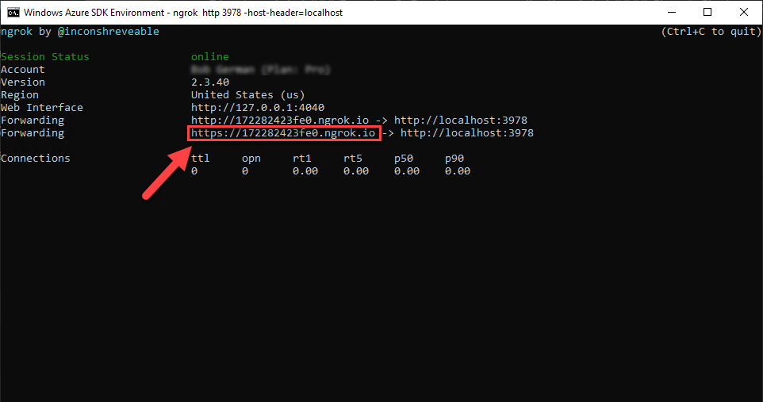
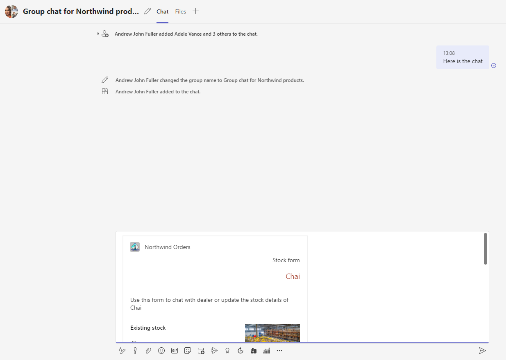

# Add a Message Extension

---8<--- "extended-lab-intro.md"

In this lab, you'll add a Search Message Extension to the Northwind Orders application so users can access and share order information in Microsoft Teams conversations. The information will be shared on an adaptive card; users receiving the card can then take action on the data.

???+ info "There are several kinds of message extensions"   
    A **Search message extension** is useful when you want to let users look up information in a Teams conversation. You can also create **Action message extension** to do things like create, add or update data in your application, and still share all this in a conversation in Teams. All this is possible using Message extensions capability in Teams.

We will cover the following concepts in this exercise:

- [Message extensions](https://docs.microsoft.com/en-us/microsoftteams/platform/messaging-extensions/what-are-messaging-extensions?tabs=nodejs&WT.mc_id=m365-58890-cxa)
- [Bot Framework](https://github.com/microsoft/botframework-sdk)
- [Adaptive cards](https://docs.microsoft.com/en-us/microsoftteams/platform/task-modules-and-cards/what-are-cards?WT.mc_id=m365-58890-cxa#adaptive-cards)

???+ info "Video briefing"
    <div class="video">
      </img>
      <div>Search Message Extension with Adaptive Cards</div>
    </div>

### Features

- A search based message extension to search for products and share result in the form of a rich  card in a conversation.
- In the rich  card, provide an input field and a submit button for users to take action to update stock value of a product in the Northwind Database, all happening in the same conversation

### Exercise 1: Bot registration

Message extensions allow users to bring the application into a conversation in Teams. You can search data in your application, perform actions on them and send back results of your interaction to your application as well as Teams to display all results in a rich card in the conversation.

Since it is a conversation between your application's web service and teams, you'll need a secure communication protocol to send and receive messages. Microsoft Teams uses the **Azure Bot Framework** for this purpose.

For that reason, you'll need to register your web service as a bot in the Bot Framework and update the app manifest file to define your web service so Teams client can know about it.

#### Step 1: Run ngrok 

> Ignore this step if you have ngrok already running

Start ngrok to obtain the URL for your application. Run this command in the command line tool of your choice:

```nodejs
ngrok http 3978 -host-header=localhost
```
The terminal will display a screen like below; Save the URL for [Step 2](#ex1-step3).




#### Step 2: Register your web service as an bot using Teams Developer Portal

<div id="ex1-step3"></div>

Microsoft Teams will communicate with your web service using the [Azure Bot Service]. In order to use this service, you need to register a bot with Microsoft Azure. There are two ways to set this up: if you have an Azure subscription, you can register your bot using the [Azure Portal](https://docs.microsoft.com/azure/bot-service/bot-service-quickstart-registration?WT.mc_id=m365-58890-cxa); if not, you can use the [Teams Developer Portal](https://docs.microsoft.com/microsoftteams/platform/concepts/build-and-test/teams-developer-portal?WT.mc_id=m365-58890-cxa).

??? info "VIDEO: Register your bot using the Azure Portal"
    <div class="video">
      <iframe src="//www.youtube.com/embed/mASUW4Hxxc0" frameborder="0" allowfullscreen></iframe>
      <div>Register and configure a bot in Microsoft Azure</div>
    </div>

These instructions will guide you through the second option, which is to register your bot using the Teams Developer Portal. The Teams Developer Portal is a valuable tool for Teams developers that is tightly integrated with the [Teams Toolkit](https://docs.microsoft.com/microsoftteams/platform/toolkit/visual-studio-code-overview?WT.mc_id=m365-58890-cxa).

- Go to [https://dev.teams.microsoft.com/home/](https://dev.teams.microsoft.com/home/).
- Select **Apps** on the left navigation.
- Search for the app **Northwind Orders**. If you don't find it, simply create a new app at random; we really just need for the Developer Portal to register our bot and we won't be managing the manifest using Developer Portal.
- On the left side, under **Configure**, select **App features**.
- From below features to add, select **Bot**.
- To configure the bot, under **Identify your bot** , select the link **Create new bot**. This will take you to **Bot management** page.
- Select the `+ New Bot ` button, which opens a dialog to input the bot name. Add a name and select **Add**.
- Once the bot is added, you will be taken to the configuration page for the bot. Update the **Endpoint address** to the ngrok url and  append `/api/messages` to the url. Select **Save**.
- Select link **Client Secrets** in the left navigation within the bot configuration page.
- Select the button, **Add client secret for your bot**
- A new secret will be generated in a dialog. Copy the *client secret* and keep safe. We will need this later.
- Now on top of the same page, Select **Bots** to go back to all the bots you have created, including the new one we created just now.
- Copy the *bot id* of the new bot, keep this copied somewhere as well. We will need this later.

### Exercise 2: Code changes
---

#### Step 1: Add new files & folders

There are new files and folders that you need to add into the project structure.

- Create a new `images` folder under `client` folder and copy over the [9 image files](https://github.com/microsoft/app-camp/tree/main/src/extend-with-capabilities/MessagingExtension/client/images){target="_blank"} needed for the rich adaptive cards to display products' inventory.

!!! note
    The Northwind Database does not have nice images for us to show rich cards with images so we have added some images and mapped them to each product using hashing mechanism.
    As long as you got the names of the images right, we don't have to worry what images your want to add in the folder 😉. You can get creative here!

- Create a new `cards` folder under the  `server` folder and add three files `errorCard.js`,`productCard.js` and `stockUpdateSuccess.js`. They are adaptive cards needed for the message extension to display in a conversation based on what state the cards are in.

For example, to display the product card, the bot code will use `productCard.js`; if the form is submitted by a user to update the stock value, the bot will use the `stockUpdateSuccess.js` card to let users know the action is completed; and in case of any error `errorCard.js` will be displayed.

!!! note
    Adaptive cards are light-weight interactive content you can place in Teams conversations and many other places. They are simple JSON. These files contain adaptive card templates which allow binding data to the JSON when the card is created.

- Copy below content into **errorCard.js**. Notice the data binding expressions such as `${productName}` and `${unitsInStock}`.

```javascript
export default{
    "type": "AdaptiveCard",
    "$schema": "http://adaptivecards.io/schemas/adaptive-card.json",
    "version": "1.4",
    "body": [
      {
        "type": "TextBlock",
        "text": "Oops! Something went wrong:",
        "wrap": true
      },      
      {
        "type": "Graph",
        "someProperty": "foo",
        "fallback": {
          "type": "TextBlock",
          "text": "Could not update stock at this time",
          "wrap": true
        }
      }
    ]
  }
```

- Copy below content into **productCard.js**

```javascript
export default
{
    "$schema": "http://adaptivecards.io/schemas/adaptive-card.json",
    "type": "AdaptiveCard",
    "version": "1.4",
    "refresh": {
        "userIds": [],
        "action": {
            "type": "Action.Execute",
            "verb": "refresh",
            "title": "Refresh",
            "data": {
                "pdtId": "${productId}",
                "pdtName": "${productName}",
                "categoryId": "${categoryId}"
            }
        }
    },
    "body": [
        {
            "type": "ColumnSet",
            "columns": [
                {
                    "type": "Column",
                    "width": "stretch",
                    "items": [
                        {
                            "type": "TextBlock",
                            "text": "Stock form",
                            "horizontalAlignment": "right",
                            "isSubtle": true,
                            "wrap": true
                        },
                        {
                            "type": "TextBlock",
                            "text": "${productName}",
                            "horizontalAlignment": "right",
                            "spacing": "none",
                            "size": "large",
                            "color": "warning",
                            "wrap": true
                        },
                        {
                            "type": "TextBlock",
                            "text": "Use this form to chat with dealer or update the stock details of ${productName}  ",
                            "isSubtle": true,
                            "wrap": true
                        }
                    ]
                }
            ]
        },
        {
            "type": "ColumnSet",
            "columns": [
                {
                    "type": "Column",
                    "width": 2,
                    "items": [
                        {
                            "type": "TextBlock",
                            "text": "Existing stock",
                            "weight": "bolder",
                            "size": "medium",
                            "wrap": true,
                            "style": "heading"
                        },
                        {
                            "type": "TextBlock",
                            "text": "${unitsInStock}",
                            "isSubtle": true,
                            "spacing": "None"
                        },
                        {
                            "type": "Input.Text",
                            "id": "txtStock",
                            "label": "New stock count",
                            "min": 0,
                            "max": 9999,
                            "errorMessage": "Invalid input, use whole positive number",
                            "style": "tel"
                        }
                    ]
                },
                {
                    "type": "Column",
                    "width": 1,
                    "items": [
                        {
                            "type": "Image",
                            "url": "${imageUrl}",
                            "size": "auto",
                            "altText": "Image of product in warehouse"
                        }
                    ]
                }
            ]
        }
    ],
    "actions": [
        {
            "type": "Action.Execute",
            "title": "Update stock",
            "verb": "ok",
            "data": {
                "pdtId": "${productId}",
                "pdtName": "${productName}",
                "categoryId": "${categoryId}"
            },
            "style": "positive"
        }
       
    ]
}
```

- Copy below content into **stockUpdateSuccess.js**

```javascript
export default
{
    "$schema": "http://adaptivecards.io/schemas/adaptive-card.json",
    "type": "AdaptiveCard",
    "version": "1.4",
    "refresh": {
        "userIds": [],
        "action": {
            "type": "Action.Execute",
            "verb": "refresh",
            "title": "Refresh",
            "data": {
                "pdtId": "${productId}",
                "pdtName": "${productName}",
                "categoryId": "${categoryId}"
            }
        }
    },
    "body": [
        {
            "type": "ColumnSet",
            "columns": [
                {
                    "type": "Column",
                    "width": "stretch",
                    "items": [
                        {
                            "type": "TextBlock",
                            "text": "Stock form",
                            "horizontalAlignment": "right",
                            "isSubtle": true,
                            "wrap": true
                        },
                        {
                            "type": "TextBlock",
                            "text": "${productName}",
                            "horizontalAlignment": "right",
                            "spacing": "none",
                            "size": "large",
                            "color": "warning",
                            "wrap": true
                        },
                        {
                            "type": "TextBlock",
                            "text": "Use this form to chat with dealer or update the stock details of ${productName}  ",
                            "isSubtle": true,
                            "wrap": true
                        }
                    ]
                }
            ]
        },
        {
            "type": "ColumnSet",
            "columns": [
                {
                    "type": "Column",
                    "width": 2,
                    "items": [
                        {
                            "type": "TextBlock",
                            "text": "Existing stock",
                            "weight": "bolder",
                            "size": "medium",
                            "wrap": true,
                            "style": "heading"
                        },
                        {
                            "type": "TextBlock",
                            "text": "${unitsInStock}",
                            "isSubtle": true,
                            "spacing": "None"
                        }
                       
                    ]
                },
                {
                    "type": "Column",
                    "width": 1,
                    "items": [
                        {
                            "type": "Image",
                            "url": "${imageUrl}",
                            "size": "auto",
                            "altText": "Image of product in warehouse"
                        }
                    ]
                }
            ]
        }
    ]
}
```

- Create a file `bot.js` inside the `server` folder. This is the `StockManagerBot` for the message extension which will handle the search, display and update functionality of products within the conversation.

!!! note "Notice the event handlers"
    The code contains these event handlers which are invoked by the Bot Framework adapter:

    - **handleTeamsMessagingExtensionQuery()** - Used in creating a Search-based Message Extension when you query which then returns the `Message Extension Response` for the query.

    - **handleTeamsMessagingExtensionSelectItem()** - Used in creating a Search-based Message Extension when select a search query result,  which then returns the `Message Extension Response` for the query.

    - **onInvokeActivity()** - If the bots receive a message activity, then the turn handler receives a notification of that incoming activity. The turn handler then sends the incoming activity to Team's activity handler `onInvokeActivity` which routes all Teams invoke activities. To implement our own logic for, you must override this method in your bot.
    
- Copy the following content into **bot.js** file.

```javascript
import { TeamsActivityHandler, CardFactory } from 'botbuilder';
import { getProductByName, updateProductUnitStock } from './northwindDataService.js';
import * as ACData from "adaptivecards-templating";
import * as AdaptiveCards from "adaptivecards";
import pdtCardPayload from './cards/productCard.js'
import successCard from './cards/stockUpdateSuccess.js';
import errorCard from './cards/errorCard.js'
export class StockManagerBot extends TeamsActivityHandler {
    constructor() {
        super();
        // Registers an activity event handler for the message event, emitted for every incoming message activity.
        this.onMessage(async (context, next) => {
            console.log('Running on Message Activity.');
            await next(); //go to the next handler 
        });
    }
    //When you perform a search from the message extension app
    async handleTeamsMessagingExtensionQuery(context, query) {
        const { name, value } = query.parameters[0];
        if (name !== 'productName') {
            return;
        }

        const products = await getProductByName(value);
        const attachments = [];

        for (const pdt of products) {
            const heroCard = CardFactory.heroCard(pdt.productName);
            const preview = CardFactory.heroCard(pdt.productName);
            preview.content.tap = {
                type: 'invoke', value: {
                    productName: pdt.productName,
                    productId: pdt.productId, unitsInStock: pdt.unitsInStock, categoryId: pdt.categoryId
                }
            };
            const attachment = { ...heroCard, preview };
            attachments.push(attachment);
        }

        var result = {
            composeExtension: {
                type: "result",
                attachmentLayout: "list",
                attachments: attachments
            }
        };

        return result;

    }
    //on preview tap of an item from the list of search result items
    async handleTeamsMessagingExtensionSelectItem(context, pdt) {
        const preview = CardFactory.thumbnailCard(pdt.productName);
        var template = new ACData.Template(pdtCardPayload);
        const imageGenerator = Math.floor((pdt.productId / 1) % 10);
        const imgUrl = `https://${process.env.HOSTNAME}/images/${imageGenerator}.PNG`
        var card = template.expand({
            $root: {
                productName: pdt.productName, unitsInStock: pdt.unitsInStock,
                productId: pdt.productId, categoryId: pdt.categoryId, imageUrl: imgUrl
            }
        });
        var adaptiveCard = new AdaptiveCards.AdaptiveCard();
        adaptiveCard.parse(card);
        const adaptive = CardFactory.adaptiveCard(card);
        const attachment = { ...adaptive, preview };
        return {
            composeExtension: {
                type: 'result',
                attachmentLayout: 'grid',
                attachments: [attachment]
            },
        };
    }
    //on every activity 
    async onInvokeActivity(context) {
        let runEvents = true;
        try {
            if (!context.activity.name && context.activity.channelId === 'msteams') {
                return await this.handleTeamsCardActionInvoke(context);
            } else {
                switch (context.activity.name) {
                    case 'composeExtension/query':
                        return this.createInvokeResponse(
                            await this.handleTeamsMessagingExtensionQuery(context, context.activity.value)
                        );

                    case 'composeExtension/selectItem':
                        return this.createInvokeResponse(
                            await this.handleTeamsMessagingExtensionSelectItem(context, context.activity.value)
                        );
                    case 'adaptiveCard/action':
                        const request = context.activity.value;

                        if (request) {
                            if (request.action.verb === 'ok') {

                                const data = request.action.data;
                                await updateProductUnitStock(data.pdtId, data.txtStock);
                                var template = new ACData.Template(successCard);
                                const imageGenerator = Math.floor((data.pdtId / 1) % 10);
                                const imgUrl = `https://${process.env.HOSTNAME}/images/${imageGenerator}.PNG`
                                var card = template.expand({
                                    $root: {
                                        productName: data.pdtName, unitsInStock: data.txtStock,
                                        imageUrl: imgUrl
                                    }
                                });
                                var responseBody = { statusCode: 200, type: "application/vnd.microsoft.card.adaptive", value: card }
                                return this.createInvokeResponse(responseBody);


                            } else if (request.action.verb === 'refresh') {
                                //refresh card
                            } else {
                                var responseBody = { statusCode: 200, type: "application/vnd.microsoft.card.adaptive", value: errorCard }
                                return this.createInvokeResponse(responseBody);

                            }

                        }
                    default:
                        runEvents = false;
                        return super.onInvokeActivity(context);

                }
            }
        } catch (err) {
            if (err.message === 'NotImplemented') {
                return { status: 501 };
            } else if (err.message === 'BadRequest') {
                return { status: 400 };
            }
            throw err;
        } finally {
            if (runEvents) {
                this.defaultNextEvent(context)();
            }
        }
    }


    defaultNextEvent = (context) => {
        const runDialogs = async () => {
            await this.handle(context, 'Dialog', async () => {
                // noop
            });
        };
        return runDialogs;
    }

    createInvokeResponse(body) {
        return { status: 200, body };
    }

}    
```

#### Step 2: Update existing files

There are files that were updated to add the new features.
Let's take files one by one to understand what changes you need to make for this exercise.
 
**1. .env**

Open the `.env` file in your working directory and add two new tokens `BOT_REG_AAD_APP_ID`(Bot id) and `BOT_REG_AAD_APP_PASSWORD`(client secret) with values copied in [Step 2](#ex1-step3).

The .env file contents will now look like below:
```
COMPANY_NAME=Northwind Traders
PORT=3978

TEAMS_APP_ID=c42d89e3-19b2-40a3-b20c-44cc05e6ee26
HOST_NAME=yourhostname.ngrok.io

TENANT_ID=c8888ec7-a322-45cf-a170-7ce0bdb538c5
CLIENT_ID=b323630b-b67c-4954-a6e2-7cfa7572bbc6
CLIENT_SECRET=111111.ABCD
BOT_REG_AAD_APP_ID=88888888-0d02-43af-85d7-72ba1d66ae1d
BOT_REG_AAD_APP_PASSWORD=111111vk
```
**2. manifest/makePackage.js**
The npm script that builds a manifest file by taking the values from your local development configuration like `.env` file, need an extra token for the Bot we just created. Let's add that token `BOT_REG_AAD_APP_ID` (bot id) into the script.

Replace code block:
<pre>
if (key.indexOf('TEAMS_APP_ID') === 0 ||
            key.indexOf('HOST_NAME') === 0 ||
            key.indexOf('CLIENT_ID') === 0) {
</pre>
With: 
<pre>
 if (key.indexOf('TEAMS_APP_ID') === 0 ||
            key.indexOf('HOST_NAME') === 0 ||
            key.indexOf('CLIENT_ID') === 0||
           <b> key.indexOf('BOT_REG_AAD_APP_ID') === 0) {</b>
</pre>

**3.manifest/manifest.template.json**

Add the message extension command information (bolded) in the manifest after `showLoadingIndicator` property:
<pre>
{
  "$schema": "https://developer.microsoft.com/en-us/json-schemas/teams/v1.8/MicrosoftTeams.schema.json",
  "manifestVersion": "1.8",
  "version": "1.6.0",
  "id": "&lt;TEAMS_APP_ID&gt;",
  "packageName": "io.github.officedev.teamsappcamp1.northwind",
  "developer": {
    "name": "Northwind Traders",
    "websiteUrl": "https://&lt;HOST_NAME&gt;/",
    "privacyUrl": "https://&lt;HOST_NAME&gt;/privacy.html",
    "termsOfUseUrl": "https://&lt;HOST_NAME&gt;/termsofuse.html"
  },
  "icons": {
      "color": "northwind192.png",
      "outline": "northwind32.png"
  },
  "name": {
    "short": "Northwind Orders",
    "full": "Northwind Traders Order System"
  },
  "description": {
    "short": "Sample enterprise app using the Northwind Traders sample database",
    "full": "Simple app to demonstrate porting a SaaS app to Microsoft Teams"
  },
  "accentColor": "#FFFFFF",
  "configurableTabs": [
    {
        "configurationUrl": "https://&lt;HOST_NAME&gt;/pages/tabConfig.html",
        "canUpdateConfiguration": true,
        "scopes": [
            "team",
            "groupchat"
        ]
    }
],
"staticTabs": [
    {
      "entityId": "Orders",
      "name": "My Orders",
      "contentUrl": "https://&lt;HOST_NAME&gt;/pages/myOrders.html",
      "websiteUrl": "https://&lt;HOST_NAME&gt;/pages/myOrders.html",
      "scopes": [
        "personal"
      ]
    },
    {
      "entityId": "Products",
      "name": "Products",
      "contentUrl": "https://&lt;HOST_NAME&gt;/pages/categories.html",
      "websiteUrl": "https://&lt;HOST_NAME&gt;/pages/categories.html",
      "scopes": [
        "personal"
      ]
    }
  ],
  "showLoadingIndicator": false,
  <b>"composeExtensions": [
    {
      "botId": "&lt;BOT_REG_AAD_APP_ID&gt;",
      "canUpdateConfiguration": true,
      "commands": [
        {
          "id": "productSearch",
          "type": "query",
          "title": "Find product",
          "description": "",
          "initialRun": false,
          "fetchTask": false,
          "context": [
            "commandBox",
            "compose"
          ],
          "parameters": [
            {
              "name": "productName",
              "title": "product name",
              "description": "Enter the product name",
              "inputType": "text"
            }
          ]
        }
      ]
    }
  ], 
  "bots": [
    {
      "botId": "&lt;BOT_REG_AAD_APP_ID&gt;",
      "scopes": [ "personal", "team", "groupchat" ],
      "isNotificationOnly": false,
      "supportsFiles": false
    }
  ],

</b>
  
  "permissions": [
      "identity",
      "messageTeamMembers"
  ],
  "validDomains": [
      "&lt;HOST_NAME&gt;"
  ],
  "webApplicationInfo": {
      "id": "&lt;CLIENT_ID&gt;",
      "resource": "api://&lt;HOST_NAME>/&lt;CLIENT_ID&gt;"
  }
}
</pre>

Update the version number so it's greater than it was; for example if your manifest was version 1.4, make it 1.4.1 or 1.5.0. This is required in order for you to update the app in Teams.

~~~json
"version": "1.5.0"
~~~

**4.server/identityService.js**

Add a condition to let validation  be performed by Bot Framework Adapter.
In the function `validateApiRequest()`, add an `if` condition and check if request is from `bot` then move to next step.

<pre>
  if (req.path==="/messages") {
        console.log('Request for bot, validation will be performed by Bot Framework Adapter');
        next();
    } else {
       //do the rest
    }
</pre>

The final form of the function definition will look as below:
<pre>
async function validateApiRequest(req, res, next) {
    const audience = `api://${process.env.HOSTNAME}/${process.env.CLIENT_ID}`;
    const token = req.headers['authorization'].split(' ')[1];

    <b>if (req.path==="/messages") {
        console.log('Request for bot, validation will be performed by Bot Framework Adapter');
        next();
    } else {
       </b> aad.verify(token, { audience: audience }, async (err, result) => {
            if (result) {
                console.log(`Validated authentication on /api${req.path}`);
                next();
            } else {
            console.error(`Invalid authentication on /api${req.path}: ${err.message}`);
                res.status(401).json({ status: 401, statusText: "Access denied" });
            }
        });
   <b> }</b>
}
</pre>

**5.server/northwindDataService.js**

Add two new functions as below
- <b>getProductByName()</b> - This will search products by name and bring the top 5 results back to the message extension's search results.
- <b>updateProductUnitStock()</b> - This will update the value of unit stock based on the input action of a user on the product result card.

Add the two new function definitions by appending below code block into the file:

```javascript
export async function getProductByName(productNameStartsWith) {
    let result = {};

    const products = await db.getTable("Products", "ProductID");
    const match = productNameStartsWith.toLowerCase();
    const matchingProducts =
        products.data.filter((item) => item.ProductName.toLowerCase().startsWith(match));

    result = matchingProducts.map(product => ({
        productId: product.ProductID,
        productName: product.ProductName,
        unitsInStock: product.UnitsInStock,
        categoryId: product.CategoryID
    }));

    return result;
}

export async function updateProductUnitStock(productId, unitsInStock) {

    const products = await db.getTable("Products", "ProductID");
    const product = products.item(productId);
    product.UnitsInStock = unitsInStock;
    productCache[productId] = null;         // Clear the product cache
    categoryCache[product.CategoryID]=null;// Clear the category cache for this product  
    await products.save();                  // Write the products "table"

}
```

**6.server/server.js**

Import the needed modules for bot related code.
Import required bot service from botbuilder package and the bot `StockManagerBot` from the newly added file `bot.js`

```javascript
import {StockManagerBot} from './bot.js';
import { BotFrameworkAdapter } from 'botbuilder';
```

!!! note
    As a standard , `app.listen()` should always be at the end of the file, so make sure your code updates happen before this request.

A bot adapter authenticates and connects a bot to a service endpoint to send and receive message.
So to authenticate, we'll need to pass the bot registration's AAD app id and app secret.

Add below code to initialize the bot adapter.

```javascript
const adapter = new BotFrameworkAdapter({
  appId: process.env.BOT_REG_AAD_APP_ID,
  appPassword:process.env.BOT_REG_AAD_APP_PASSWORD
});
```

Create the bot that will handle incoming messages.

```javascript
const stockManagerBot = new StockManagerBot();
```

For the main dialog add error handling.

```javascript
// Catch-all for errors.
const onTurnErrorHandler = async (context, error) => {
  // This check writes out errors to console log .vs. app insights.
  // NOTE: In production environment, you should consider logging this to Azure
  //       application insights.
  console.error(`\n [onTurnError] unhandled error: ${ error }`);

  // Send a trace activity, which will be displayed in Bot Framework Emulator
  await context.sendTraceActivity(
      'OnTurnError Trace',
      `${ error }`,
      'https://www.botframework.com/schemas/error',
      'TurnError'
  );

  // Send a message to the user
  await context.sendActivity('The bot encountered an error or bug.');
  await context.sendActivity('To continue to run this bot, please fix the bot source code.');
};
// Set the onTurnError for the singleton BotFrameworkAdapter.
adapter.onTurnError = onTurnErrorHandler;
```

Listen for incoming requests.

```javascript

app.post('/api/messages', (req, res) => {
  adapter.processActivity(req, res, async (context) => {
    await stockManagerBot.run(context);
  }).catch(error=>{
    console.log(error)
  });
});

```

The final **server/server.js** file should [look like this](https://github.com/microsoft/app-camp/blob/main/src/extend-with-capabilities/MessagingExtension/server/server.js){target="_blank"} (changes from other extended labs notwithstanding).

**7. package.json**

You'll need to install additional packages for adaptive cards and botbuilder.
Add below packages into the `package.json` file by run below script to install new packages:

```nodejs
npm i adaptive-expressions adaptivecards adaptivecards-templating botbuilder
```

Check if packages are added into `dependencies` in the package.json file:

```json
    "adaptive-expressions": "^4.15.0",
    "adaptivecards": "^2.10.0",
    "adaptivecards-templating": "^2.2.0",   
    "botbuilder": "^4.15.0"
```


### Exercise 3: Test the changes
---
Now that you have applied all code changes, let's test the features.

#### Step 1 : Create new teams app package

Make sure the env file is configured as per the sample file .env_Sample.
Make sure all npm packages are installed, run below script in the command line tool

```nodejs
npm i
```
Create updated teams app package by running below script:
```nodejs
npm run package
```

#### Step 2: Start your local project

Now it's time to run your updated application and run it in Microsoft Teams. Start the application by running below command: 

```nodejs
npm start
```

#### Step 3: Upload the app package

In the Teams web or desktop UI, click "Apps" in the sidebar 1️⃣, then "Manage your apps" 2️⃣. At this point you have three choices:

* Upload a custom app (upload the app for yourself or a specific team or group chat) - this only appears if you have enabled "Upload custom apps" in your setup policy; this was a step in the previous lab
* Upload an app to your org's app catalog (upload the app for use within your organization) - this only appears if you are a tenant administrator
* Submit an app to your org (initiate a workflow asking a tenant administrator to install your app) - this appears for everyone

In this case, choose the first option.


Navigate to the Northwind.zip file in your manifest directory and upload it. 
The Teams client will display the application information, add the application to a team or a group chat.


#### Step 4 : Run the application in Teams client

We have added the app into a Group chat for demonstration. Go to the chat where the app is installed.

Open the message extension app from the compose area.


Search for the product from the message extension (This should be easy if you have used [GIPHY](https://giphy.com/) before 😉)


Select the product you want to add in the conversation.


!!! note
    A little preview will be shown in the message compose area. Note at the time this lab was created, there is an outstanding platform issue related to the preview. If you are in a Teams team, this will be blank. Hence showing this capability in a group chat.

This is the product card, with a form to fill in and submit, incase the unit stock value has to be changed.


Fill in a new value in the form, and select **Update stock**.


Once it's success fully updated, the card refreshes to show the new stock value.


The stock values are saved into the JSON version of the Northwind database; if you find the product in the Products tab, you'll see the new value.

### Next steps

After completing this lab, you may continue with additional extended labs!

---8<--- "extended-lab-links.md"
