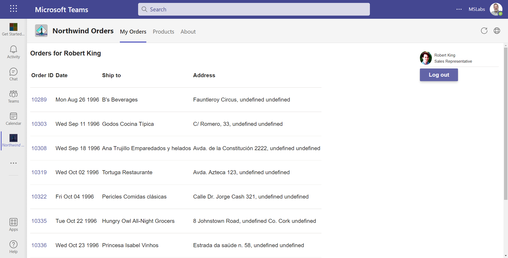

# Selling Your SaaS-based Teams Extension

---8<--- "extended-lab-intro.md"

In this lab, you'll allow users to purchase subscriptions for your Northwind Orders application as a transactable offer in a **mock** AppSource marketplace. This is similar to the purchase experience for apps listed in the Teams App Store, and it allows you to do this lab without a Partner Center account, which is required to create offers in the real AppSource. Additionally, you will integrate the Northwind Orders application with a simple licensing service that allows you to purchase licenses for your SaaS application. When you're done the Northwind Orders application will require a license to run in Teams, but will not require a license when accessing it directly. 

The AppSource simulator, as well as a sample license service, can be found [in this github repository](https://github.com/OfficeDev/office-add-in-saas-monetization-sample){target="_blank"}. The repo includes:

 * An [AppSource simulator (web site)](https://github.com/OfficeDev/office-add-in-saas-monetization-sample/tree/master/MonetizationCodeSample/AppSourceMockWebApp){target="_blank"}
 * A [sample license service](https://github.com/OfficeDev/office-add-in-saas-monetization-sample/tree/master/MonetizationCodeSample/SaaSSampleWebApi){target="_blank"} similar to one you need to provide for your app
 * A [web site with a landing page](https://github.com/OfficeDev/office-add-in-saas-monetization-sample/tree/master/MonetizationCodeSample/SaaSSampleWebApp){target="_blank"} similar to the one you need to provide for your app

If you'd like to install these services for yourself, the instructions are [here](/app-camp/supplemental/MonetizationLabSetup), but we've also hosted these services for you. These instructions assume you're just going to use the hosted services. In any case, be aware that the [license service](https://github.com/OfficeDev/office-add-in-saas-monetization-sample/tree/master/MonetizationCodeSample/SaaSSampleWebApi){target="_blank"}  and [web site with landing page](https://github.com/OfficeDev/office-add-in-saas-monetization-sample/tree/master/MonetizationCodeSample/SaaSSampleWebApp){target="_blank"}  are only samples and that your app would need to implement something similar!

!!! warning
    THE HOSTED SERVICES ARE TEMPORARY AND LIKELY TO MOVE. 
    Please be aware and check back here for updates.


## Exercise 1: Update .env

In this exercise, you will add information to your environment file about the hosted licensing service.

Your `.env` file on the Northwind Orders application needs to be updated to include values that will allow it to interact with the licensing service. This service is centrally located and you share it with the other lab participants. 

Go back to your working directory and add the below entries into `.env` file:

```text
# These values are TEMPORARY and may change without notice!
SAAS_API=https://BGmonetizationwebapi.azurewebsites.net/api/Subscriptions/CheckOrActivateLicense
SAAS_SCOPES=api://dd82efdc-c77f-49c1-9b18-ca3d76a36264/user_impersonation
OFFER_ID=contoso_o365_addin
```

## Exercise 2: Northwind Orders calls the licensing service

In this exercise, you will update the Northwind Orders app to call the licensing service.

### Step 1: Add server side code to validate the user has a license

1. In your working folder, create a new file `/server/validateLicenseService.js` 

2. Paste in the following code (or copy the file from [here](https://github.com/microsoft/app-camp/blob/main/src/extend-with-capabilities/Monetization/client/modules/northwindLicensing.js){target="_blank"}).

This code verifies the user has a license to use the Northwind Orders application. The license will only be checked when the application is being used via Teams.

~~~javascript
import aad from 'azure-ad-jwt';
import fetch from 'node-fetch';

export async function validateLicense(thisAppAccessToken) {

    const audience = `api://${process.env.HOSTNAME}/${process.env.CLIENT_ID}`;
    return new Promise((resolve, reject) => {

        aad.verify(thisAppAccessToken, { audience: audience }, async (err, result) => {
            if (result) {
                const licensingAppUrl = `${process.env.SAAS_API}/${process.env.OFFER_ID}`
                const licensingAppAccessToken = await getOboAccessToken(thisAppAccessToken);
                if (licensingAppAccessToken === "interaction_required") {
                    reject({ "status":401, "message": "Interaction required"});
                }
                
                const licensingResponse = await fetch(licensingAppUrl, {
                    method: "POST",
                    headers: {
                        "Accept": "application/json",
                        "Content-Type": "application/json",
                        "Authorization" :`Bearer ${licensingAppAccessToken}`
                    }
                });
                if (licensingResponse.ok) {
                    const licensingData = await licensingResponse.json();
                    console.log(licensingData.reason);
                    resolve(licensingData);
                } else {
                    reject({ "status": licensingResponse.status, "message": licensingResponse.statusText });
                }
            } else {
                reject({ "status": 401, "message": "Invalid client access token in northwindLicenseService.js"});
            }
        });
    });

}

// TODO: Securely cache the results of this function for the lifetime of the resulting token
async function getOboAccessToken(clientSideToken) {

    const tenantId = process.env.TENANT_ID;
    const clientId = process.env.CLIENT_ID;
    const clientSecret = process.env.CLIENT_SECRET;
    const scopes = process.env.SAAS_SCOPES;

    // Use On Behalf Of flow to exchange the client-side token for an
    // access token with the needed permissions
    
    const INTERACTION_REQUIRED_STATUS_TEXT = "interaction_required";
    const url = "https://login.microsoftonline.com/" + tenantId + "/oauth2/v2.0/token";
    const params = {
        client_id: clientId,
        client_secret: clientSecret,
        grant_type: "urn:ietf:params:oauth:grant-type:jwt-bearer",
        assertion: clientSideToken,
        requested_token_use: "on_behalf_of",
        scope: scopes
    };

    const accessTokenQueryParams = new URLSearchParams(params).toString();
    try {
        const oboResponse = await fetch(url, {
            method: "POST",
            body: accessTokenQueryParams,
            headers: {
                Accept: "application/json",
                "Content-Type": "application/x-www-form-urlencoded"
            }
        });

        const oboData = await oboResponse.json();
        if (oboResponse.status !== 200) {
            // We got an error on the OBO request. Check if it is consent required.
            if (oboData.error.toLowerCase() === 'invalid_grant' ||
                oboData.error.toLowerCase() === 'interaction_required') {
                throw (INTERACTION_REQUIRED_STATUS_TEXT);
            } else {
                console.log(`Error returned in OBO: ${JSON.stringify(oboData)}`);
                throw (`Error in OBO exchange ${oboResponse.status}: ${oboResponse.statusText}`);
            }
        }
        return oboData.access_token;
    } catch (error) {
        return error;
    }

}
~~~

### Step 2: Add a server side API to validate the user's license

Now that you have server-side code that checks the user has a license, you need to add code that validates the that license. You'll add a POST request to the the Northwind Orders application that calls the licensing service API.
 
1. In your working folder, locate the file `server/server.js` and open it in your code editor.
2. Add these lines to the top of the file.

~~~javascript
import aad from 'azure-ad-jwt';
import { validateLicense } from './validateLicenseService.js';
~~~

3. Immediately below the call to `await initializeIdentityService()`, add the following code.

~~~javascript
// Web service validates a user's license
app.post('/api/validateLicense', async (req, res) => {

  try {
    const token = req.headers['authorization'].split(' ')[1];

    try {
      let hasLicense = await validateLicense(token);
      res.send(JSON.stringify({ "validLicense" : hasLicense }));
    }
    catch (error) {
      console.log (`Error ${error.status} in validateLicense(): ${error.message}`);
      res.status(error.status).send(error.message);
    }
  }
  catch (error) {
      console.log(`Error in /api/validateAadLogin handling: ${error}`);
      res.status(500).json({ status: 500, statusText: error });
  }

});
~~~

### Step 3: Add client pages to display a license error

The app needs to be able to show if there is a licensing error. This step adds that code to the client.

1. Add a new file, `client/pages/needLicense.html`. 
2. Paste in the following HTML (or copy the file from [here](https://github.com/microsoft/app-camp/blob/main/src/extend-with-capabilities/Monetization/client/pages/needLicense.html)).

~~~html
<!doctype html>
<html>

<head>
    <meta charset="UTF-8" />
    <title>Northwind Privacy</title>
    <link rel="icon" href="data:;base64,="> <!-- Suppress favicon error -->
    <link rel="stylesheet" href="/northwind.css" />
   
</head>

<body class="ms-Fabric" dir="ltr">   
    <h1>Sorry you need a valid license to use this application</h1>
    <p>Please purchase a license from the Microsoft Teams store.       
    </p>
    <div id="errorMsg"></div>
    <script type="module" src="needLicense.js"></script>
</body>

</html>
~~~

The HTML page needs some JavaScript to work properly.

3. Create a file `/client/pages/needLicense.js`.
4. Paste in the following code (or copy the file from [here](https://github.com/microsoft/app-camp/blob/main/src/extend-with-capabilities/Monetization/client/pages/needLicense.js)).

```javascript
const searchParams = new URLSearchParams(window.location.search);

if (searchParams.has('error')) {
    const error = searchParams.get('error');
    const displayElementError = document.getElementById('errorMsg');
    displayElementError.innerHTML = error;  
}
```

### Step 4: Check if the user has a license

In this step, you will add client side function to check if the user has a license.

1. Add a new file, `client/modules/northwindLicensing.js`.
2. Paste in the following code (or copy the file from [here](https://github.com/microsoft/app-camp/blob/main/src/extend-with-capabilities/Monetization/client/modules/northwindLicensing.js)). 

This code calls the server-side API we just added using an Azure AD token obtained using Microsoft Teams SSO.

~~~javascript
import 'https://res.cdn.office.net/teams-js/2.0.0/js/MicrosoftTeams.min.js';
import { ensureTeamsSdkInitialized } from './teamsHelpers.js';

export async function hasValidLicense() {

    await new Promise((resolve, reject) => {
        microsoftTeams.initialize(() => { resolve(); });
    });

    await ensureTeamsSdkInitialized();
    const authToken = await microsoftTeams.authentication.getAuthToken();

    const response = await fetch(`/api/validateLicense`, {
        "method": "post",
        "headers": {
            "content-type": "application/json",
            "authorization": `Bearer ${authToken}`
        },
        "cache": "no-cache"
    });
   
    if (response.ok) {

        const data = await response.json();
        return data.validLicense;

    } else {

        const error = await response.json();
        console.log(`ERROR: ${error}`);

    }

}
~~~

### Step 5: Call the license API

In this step, you'll add client side code that checks the user's license on every request.

1. Open the file `client/identity/userPanel.js` in your code editor. 
    This is a web component that displays the user's picture and name on every page, so it's an easy place to check the license.
2. Add these imports at the top of the file.

~~~javascript
import { hasValidLicense } from '../modules/northwindLicensing.js';
import { inTeams } from '../modules/teamsHelpers.js';
~~~

3. Add the following code at the top of the `else` clause within the `connectedCallback()` function.

~~~javascript
    if (await inTeams()) {
        const validLicense = await hasValidLicense();  
        if (validLicense.status && validLicense.status.toString().toLowerCase()==="failure") {
                window.location.href =`/pages/needLicense.html?error=${validLicense.reason}`;
        }    
    }
~~~

The completed `userPanel.js` should look like the following code.

~~~javascript
import {
    getLoggedInEmployee,
    logoff
} from './identityClient.js';
import { inTeams } from '../modules/teamsHelpers.js';
import { hasValidLicense } from '../modules/northwindLicensing.js';

class northwindUserPanel extends HTMLElement {

    async connectedCallback() {

        const employee = await getLoggedInEmployee();

        if (!employee) {

            logoff();

        } else {

            if (await inTeams()) {
                const validLicense = await hasValidLicense();  
                if (validLicense.status && validLicense.status.toString().toLowerCase()==="failure") {
                     window.location.href =`/pages/needLicense.html?error=${validLicense.reason}`;
                }    
            }

            this.innerHTML = `<div class="userPanel">
                </img>
                <p>${employee.displayName}</p>
                <p>${employee.jobTitle}</p>
                <hr />
                <button id="logout">Log out</button>
            </div>
            `;

            const logoutButton = document.getElementById('logout');
            logoutButton.addEventListener('click', async ev => {
                logoff();
            });
        }
    }
}

// Define the web component and insert an instance at the top of the page
customElements.define('northwind-user-panel', northwindUserPanel);
const panel = document.createElement('northwind-user-panel');
document.body.insertBefore(panel, document.body.firstChild);
~~~

!!! note
    There are many ways to make the license check more robust, such as checking it on every web service call and caching this on the server side to avoid excessive calls to the licensing server. However this is just a lab so we wanted to keep it simple.

## Exercise 3: Grant consent to the licensing API

In this exercise you will grant consent to the licensing API to be called from an application running in your tenant. Without this step, you server-side API call to the licensing service would fail.

### Step 1: Add the API to APIs that your organization uses

Here you will construct and call a URL that grants tenant-wide admin consent.

The form this URL will take is as follows, where `tenant-id` is your tenant and `client-id` is the ID of the licensing API being called by the server code.

`https://login.microsoftonline.com/{tenant-id}/adminconsent?client_id={client-id}`

1. Open your `.env` file. All the information you need to construct the URL is in this file.
2. In a separate file, paste the URL as shown above.
3. Replace `{tenant-id}` with the TENANT_ID value from the `.env` file.
4. In the `SAAS_SCOPES` section is the scope of the licensing service API. Copy the GUID from this scope and use it to replace `{client-id}` in the URL you are constructing. The result should look something like this.
   
   > `https://login.microsoftonline.com/1661a74b-21d8-4cc9-9e09-e258e0a18291/adminconsent?client_id=dd82efdc-c77f-49c1-9b18-ca3d76a36264`

5. Now make your tenant aware of the licensing API by going to this URL in a browser. Paste the URL into a browser and hit **enter**.
   
   You will be redirected to a page that looks for localhost and throws an error. Don't worry, this is expected behavior. 

   You can close this browser window.

6. Open your browser to your Azure portal using your M365 credentials used for this class.
7. Click on **Azure Active Directory > App registrations**.
8. Click the **Northwind Orders** app registration.
9. Click **API permissions**.
    
    You are going to add a permission to this app registration allowing the Northwind Orders application to communicate with the licensing service API.

10. Click **Add a permission**.
11. At the top of the flyout, click **APIs my organization uses**.
    
    Because you granted cross tenant access above, the Contoso Web API will be in the list of APIs.

12. Type **Contoso Monetization Code Sample Web API**.
13. Select the API.
14. Ensure the **user_impersonation** permission is selected.
15. Click **Add a permission**.
16. Click **Grant admin consent** for (tenant name)" to the right of the **Add a Permission** button, and click the **Yes** button to confirm.
    
    Now the Northwind Orders app registration allows the Northwind Orders application to call the licensing service API.

## Exercise 4: Run the application

Now that all the pieces are in place, it's time to run the application you've set up.

### Step 1: Run Teams without a license

In this initial step, you'll run the application without a user license to see how the application behaves.

1. Ensure your NW Trader Orders application is running with the new code you just added. Restart if it is currently running.
2. Return to your application in Microsoft Teams.
3. Refresh the tab or browser if necessary. 
   The UI will begin to render, and then it will detect the license failure and display an error page.


!!! note
    The sample application checks the license in JavaScript, which is convenient for this lab but it would be easy for someone to bypass the license check. In a real application you'd probably check the license on all accesses to your application web site.

### Step 2: Purchase a subscription and set licensing policy

In a real-world situation, your SaaS offer is listed in the **Teams Store** and the **Microsoft AppSource marketplace**. Users can purchase your app in either location. 

For this lab you will use an **AppSource** simulator to mock your interactions with the actual marketplace. Just know that Teams users can purchase apps directly from the user interface when they're listed in the Teams app store.

!!! note
    For your convenience, app service simulator is temporarily hosted at https://bgmonetizationappsource.azurewebsites.net/. If you'd prefer to host it yourself, the instructions are [here](../../docs/MonetizationLabSetup.md).

1. Browse to mock AppSource URL. This should display the **AppSource** simulator. 

2. Click the **Purchase** button to purchase a subscription to the Northwind Orders application.


!!! note
    Notice that the **AppSource** simulator's background color is green to make it easy to distinguish from your app's landing page, which has a blue background.

!!! note
    The **AppSource** simulator has a mock offer name, "Contoso Apps", rather than showing the "Northwind Orders" app. This is just a constant defined in the monetization project's `SaasOfferMockData/Offers.cs` file.
    The real **AppSource** web page shows the application name and other information you would configure in Partner Center.

The **AppSource** simulator displays the plans available for the offer. The simulator has two hard-coded plans, "SeatBasedPlan" (which uses a [per-user pricing model](https://docs.microsoft.com/en-us/azure/marketplace/create-new-saas-offer-plans?WT.mc_id=m365-58890-cxa){target="_blank"}), and a "SiteBasedPlan" (which uses a [flat-rate pricing model](https://docs.microsoft.com/en-us/azure/marketplace/plan-saas-offer?WT.mc_id=m365-58890-cxa#saas-pricing-models){target="_blank"}). 

The real **AppSource** would show the plans you had defined in Partner Center, the publisher's portal for defining and publishing **AppSource** offers.

Microsoft Teams currently supports only the per-user pricing model

3. Select the "SeatBasedPlan" and click the **Purchase** button. Because this is a simulator, your credit card will not be charged.


The simulated purchase is now complete, so you will be redirected to the app's landing page. 

!!! warning
    For your convenience, the web site containing the landing page is temporarily hosted at https://bgmonetizationwebapp.azurewebsites.net/. If you'd prefer to install the services on Azure and host it yourself, the instructions are [here](../../docs/MonetizationLabSetup.md).


The landing page gives the app a chance to interact with the user and capture any configuration information it needs. Users who purchase the app in the Teams store would be brought to this same page. 

You will need to supply a page like this as part of your application; it interprets a token sent by **AppSource** and logs the user in with AAD SSO. This token is then sent to the **SaaS Fulfillment API v2**, which provides the details of the customer's subscription. 

The sample app's landing page allows the user to select a region; the app stores this information in its own database. Notice the background color of these pages is blue; the blue pages are for your application to implement and are only a sample we've hosted based on [this sample](https://github.com/OfficeDev/office-add-in-saas-monetization-sample){target="_blank"}.


!!! note
    Notice that the **Landing Page** and licensing pages' background color is blue to make it easy to distinguish from the App Source Simulator, which has a green background.

!!! warning Reminder
    Even though this lab didn't walk you through creating the landing page and other licnsing pages (the blue ones) - you as an application developer need to provide these. Many SaaS services may already have a licensing service and want to extend it to work with the Microsoft Commercial Marketplace. We're working on more options to make this easier, both for ISV's with existing licensing services and those who need a new one.

Once the region is selected, the sample app shows a welcome page with the user's name, which is obtained by [reading the user's profile with the Microsoft Graph API](https://docs.microsoft.com/en-us/graph/api/user-get?view=graph-rest-1.0&WT.mc_id=m365-58890-cxa){target="_blank"}. 

4. Click **License Settings** to view the license assignment screen.


On this screen you can add individual user licenses using the **Add User** button, or you can set a policy that allows users to claim licenses on a first come, first served basis. Turn on the **First come first served** switch to enable this option.


!!! warning Reminder
    Everything on this screen is defined by the your SaaS application. It's intended to be flexible since publishers have a wide range of licensing approaches. Apps can tell who's logging in via Azure AD and use the user ID and tenant ID to authorize access, provide personalization, etc.

### Step 3: Run the application in Teams

Now that you've purchased a subscription, you can see the Northwind Orders application in Teams.

1. Return to Microsoft Teams and refresh your application. 
    The license will be approved and the user can interact with the application normally.



2. Return to the licensing application.
   
   If you've closed the tab, you can find it at the mock AppSource URL you received earlier. 


Notice that your username has been assigned a license. The sample app stored this in a SQL Server database. When the Teams application called the licensing service, the access token contained the tenant ID and user ID, enabling the licensing service to determine that the user has a license.

## Exercise 5: Inspect the licensing code

In this exercise, you'll inspect key areas of the sample licensing service used in this lab. In an actual application, you would write your own licensing service or extend your existing licensing service to integrate it with your SaaS offer on AppSource.

### Step 1: Resolving the Marketplace Token

When a user completes the process of purchasing your application in AppSource or the Microsoft Teams app store, they are directed to the app's [landing page](https://docs.microsoft.com/en-us/azure/marketplace/azure-ad-transactable-saas-landing-page?WT.mc_id=m365-58890-cxa){target="_blank"}. This URL is for a web page provided by the software vendor and registered in Partner Center. In this lab, the landing page is part of the [SaaSSampleWebApp](https://github.com/OfficeDev/office-add-in-saas-monetization-sample/tree/master/MonetizationCodeSample/SaaSSampleWebApp){target="_blank"} sample.

Microsoft sends a marketplace token to the landing page; eventually this is resolved in the sample app's [Subscription service](https://github.com/OfficeDev/office-add-in-saas-monetization-sample/blob/7673db6c8e6c809ae7aa0ba894460183aed964fc/MonetizationCodeSample/SaaSSampleWebApi/Controllers/SubscriptionsController.cs#L134){target="_blank"}.

~~~csharp
[Route("resolve")]
[HttpPost]
public async Task<IActionResult> ResolveAsync([FromForm] string AuthCode)
{
    using var requestMessage = new HttpRequestMessage(HttpMethod.Post,
        $"{_configuration["SaaSfulfillmentAPIs:ApiEndPoint"]}/api/saas/subscriptions/resolve?api-version={_configuration["SaaSfulfillmentAPIs:ApiVersion"]}");

    // the token is not required for Mock APIs 
    // requestMessage.Headers.Authorization = new AuthenticationHeaderValue("Bearer", your_token);

    requestMessage.Headers.Add("x-ms-marketplace-token", AuthCode);

    var httpClient = _httpClientFactory.CreateClient();

    using (var response = await httpClient.SendAsync(requestMessage).ConfigureAwait(false))
    {
        if (response.StatusCode == HttpStatusCode.OK)
        {
            var content = await response.Content.ReadAsStringAsync().ConfigureAwait(false);
            var resolvedSubscription = JsonConvert.DeserializeObject<ResolvedSubscription>(content);

            var subscription = new Subscription
            {
                Id = resolvedSubscription.Id,
                OfferId = resolvedSubscription.OfferId,
                PlanId = resolvedSubscription.PlanId,
                SubscriptionName = resolvedSubscription.SubscriptionName,
                Purchaser = HttpContext.User.Identity.Name,
                PurchaserId = Guid.Parse(HttpContext.User.GetObjectId()),
                TenantId = Guid.Parse(HttpContext.User.GetTenantId()),
                PurchaseSeatsCount = resolvedSubscription.Quantity,
                AllowOverAssignment = false,
                FirstComeFirstServedAssignment = false
            };
            return Ok(subscription);
        }
        return BadRequest(response.ReasonPhrase);
    }
}
~~~

The sample calls the AppSource simulator to get information about the subscription that was purchased. In your service, you would call [this Marketplace API](https://docs.microsoft.com/en-us/azure/marketplace/partner-center-portal/pc-saas-fulfillment-subscription-api?WT.mc_id=m365-58890-cxa#resolve-a-purchased-subscription){target="_blank"} to do this exchange.

### Step 2: Examine web hooks

In addition to a landing page, your application will need to provide a set of [web hooks](https://docs.microsoft.com/en-us/azure/marketplace/partner-center-portal/pc-saas-fulfillment-webhook){target="_blank"} that Microsoft can call to let you know about subscription changes. The sample app doesn't implement all the webhooks, but does implement a subset that are supported by the AppSource simulator. The [WebHookController](https://github.com/OfficeDev/office-add-in-saas-monetization-sample/blob/7673db6c8e6c809ae7aa0ba894460183aed964fc/MonetizationCodeSample/SaaSSampleWebApi/Controllers/WebhookController.cs#L54){target="_blank"} responds to these events:

* **ChangePlan** - called when a user changes their offer plan, such as moving from a Silver to a Gold plan. Plans are defined by the software using Partner Center.
* **ChangeQuantity** - called when a user changes the quantity of seats in a per-seat SaaS offer
* **Unsubscribe** - called when a user cancels their subscription

The full list of webhooks events is [documented here](https://docs.microsoft.com/en-us/azure/marketplace/partner-center-portal/pc-saas-fulfillment-webhook?WT.mc_id=m365-58890-cxa){target="_blank"}.

### Step 3: Examine the license check

In Exercise 2 you added [code to check if the user has a license](https://github.com/microsoft/app-camp/blob/main/src/extend-with-capabilities/Monetization/server/validateLicenseService.js#L22){target="_blank"}. This call is handled here, in the [CheckOrAdtivateLicense](https://github.com/OfficeDev/office-add-in-saas-monetization-sample/blob/7673db6c8e6c809ae7aa0ba894460183aed964fc/MonetizationCodeSample/SaaSSampleWebApi/Controllers/SubscriptionsController.cs#L213){target="_blank"} method in the Subscriptions controller. Notice that this code includes some business logic and accesses a license database in Azure SQL using Entity Framework. 

The point of this is that the application is managing licenses in its own way and keeping track of them in its own database. Microsoft Commercial Marketplace manages subscriptions which grant licenses, but each application can manage those licenses however it wants to. This allows applications flexibility in how they implement licensing.

### Known issues

---8<--- "issuesLink.md"

## Next steps

After completing this lab, you may continue with additional extended labs!

---8<--- "extended-lab-links.md"