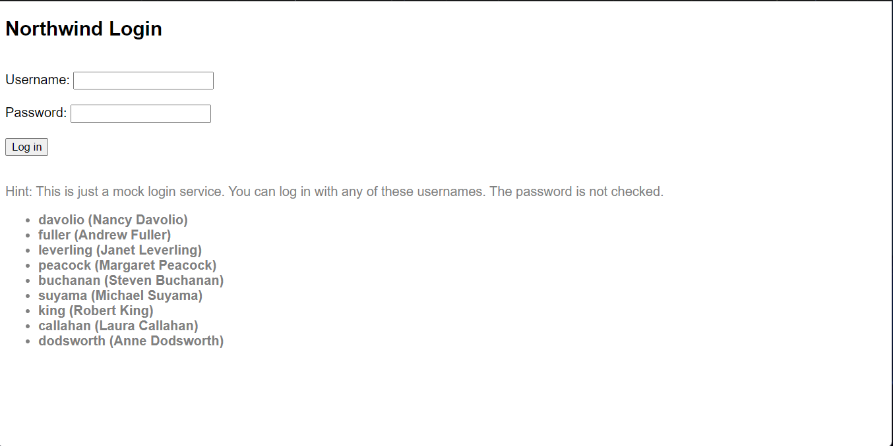

## Lab B01: Start with a non-Azure Active Directory Identity System

## Overview

This is the very first lab in Path B, which begins with an application that uses an authorization system other than Azure AD.

You will learn a pattern for adding Azure AD authentication for users while maintaining another identity system's user profiles and authorization. This won't work everywhere but a number of partners have been successful with this kind of approach. In this case, the application has a simple cookie-based authentication scheme that's not secure but is easy to understand. 

If you use an identity provider such as Auth0, Google Identity Services, Identity Server, Okta, or Ping Federate, this is the path for you. Even Azure AD B2C - which isn't at all the same as Azure AD - would follow this path.

---8<--- "are-you-on-the-right-path.md"

In this lab you will set up the Northwind Orders application, which can be found in the [B01-begin-app](https://github.com/microsoft/app-camp/tree/main/src/create-core-app/bespoke/B01-begin-app/) folder. The labs that follow will lead you step by step into extending the web application to be a Microsoft Teams application with Azure AD Single Sign-On. 

* [B01-begin-app: Setting up the application](./B01-begin-app.md) (📍You are here)
* [B02-after-teams-login: Creating a Teams application](./B02-after-teams-login.md)
* [B03-after-teams-sso: Adding Azure AD SSO to your app](./B03-after-teams-sso.md)
* [B04-after-apply-styling: Teams styling and themes](./B04-after-apply-styling.md)

In this lab you will learn to:

- Run a web application using NodeJS
- Expose a local web application using ngrok

???+ info "Video briefing"
    

      <iframe src="//www.youtube.com/embed/gzzvp9EyQkg" frameborder="0" allowfullscreen></iframe>
      
"B Path" Lab Briefing

    

### Features

- View orders associated with the logged-in user (sales representative)
- View products by category
- View product details and orders for a product
- View order details

The application is based on the Northwind Traders Database, which is a sample relational database that originally shipped with Microsoft Access. The Northwind Traders Database is now available as a [demonstration OData service](https://services.odata.org/), which is queried in this lab. This is a read-only data source; some of the later exercises appear to update the data but the changes are only stored in the server memory and will only persist until the server is restarted.

### Exercise 1: Install prerequisites

You can complete these labs on a Windows, Mac, or Linux machine, but you do need the ability to install the prerequisites. If you are not permitted to install applications on your computer, you'll need to find another machine (or virtual machine) to use throughout the workshop.

#### Step 1: Install NodeJS

NodeJS is a program that allows you to run JavaScript on your computer; it uses the open source "V8" engine, which is used in popular web browsers such as Microsoft Edge and Google Chrome. You will need NodeJS to run the web server code used throughout this workshop.

Browse to [https://nodejs.org/en/download/](https://nodejs.org/en/download/){target=_blank} and install the "LTS" (Long Term Support) version for your operating system. This lab has been ested using NodeJS version 14.17.4 and 16.14.0. If you already have another version of NodeJS installed, you may want to set up the [Node Version Manager](https://github.com/nvm-sh/nvm){target=_blank} (or [this variation](https://github.com/coreybutler/nvm-windows){target=_blank} for Microsoft Windows), which allows you to easily switch Node versions on the same computer.

#### Step 2: Install a Code Editor

You can really use any code editor you wish, but we recommend [Visual Studio Code](https://code.visualstudio.com/download){target=_blank}.

#### Step 3: Install ngrok

ngrok is a tunneling program that allows you to access your local web server (running in NodeJS in this case) from the Internet. To complete this exercise, [sign up for a free ngrok account](https://ngrok.com/){target=_blank} and install ngrok on your computer.

The free version of ngrok will assign a URL similar to https://something.ngrok.io, where "something" is a random identifier. As long as ngrok is running (leave it going in a command or terminal window), you can browse your web site at that URL. If you start and stop ngrok, or try to keep it running for more than 8 hours, you'll get a new identifier and you'll need to update your app registration, environment variables, etc. The paid version of ngrok allows you to reserve the same URL for use over time, removing the need to update it when you return to the lab.

!!! Tip
    If you restart ngrok and get a new URL under the free plan, you can refer to [this page](/app-camp/supplemental/ngrokReferences/){target="_blank"} for details on all the places in the labs where you need to update the URL.

While ngrok isn't strictly required for developing Microsoft Teams applications, it makes things much easier, especially if Bots are involved. An example of this is the Message Extension lab since Message Extensions use a Bot to communicate with Microsoft Teams.

???+ info "More information"
    

      <iframe src="//www.youtube.com/embed/A5U-3o-mHD0" frameborder="0" allowfullscreen></iframe>
      
What is ngrok and do you really need it?

    

#### Step 4: Start ngrok

In the command line tool of your choice, navigate to the folder where you've saved **ngrok.exe** and run this command:

~~~shell
ngrok http 3978
~~~

The terminal will display a screen like this; note the https forwarding URL for use in this lab. ngrok will tunnel requests on this URL to your local host on port 3978 for easy debugging.

Save this URL for use throughout the labs.

!!! warning
    Do not stop ngrok for the duration of these labs. If you do stop ngrok and are assigned a new URL, [this page](/app-camp/supplemental/ngrokReferences/){target="_blank"} lists all the exercises which involve the ngrok URL so you can easily update it.

### Exercise 2: Configure and run the application
#### Step 1: Download the starting application

The starting application is in github at [https://github.com/microsoft/app-camp](https://github.com/microsoft/app-camp){target="_blank"}. Click the "Code" button and clone or download the content to your computer.

The starting code for the "B" path is in the **src/create-core-app/bespoke/B01-begin-app** folder. Copy this folder to nother location on your computer; this will be your working copy to keep the original source separate. [Folders are also provided](https://github.com/microsoft/app-camp/tree/main/src/create-core-app/bespoke){target="_blank"} with the final code for the other labs.

#### Step 2: Install the app's dependencies

Using a command line tool of your choice, navigate to your working directory and type the command:

~~~shell
npm install
~~~

This will install the libraries required to run the server side of your solution.

#### Step 3: Download the sample data

The Northwind Orders application uses the venerable Northwind database for sample data. The Northwind Database originally shipped with Microsoft Access, then SQL Server, and now is [available as a test OData service](https://services.odata.org/V4/Northwind/){target="_blank"} from the [OData organization](https://www.odata.org/){target="_blank"}. In this step, you'll download the entire Northwind database from this test service to local JSON files, which are used by the Northwind Orders application.

Using a command line tool in your working directory, type:

~~~shell
npm run db-download
~~~

This will create a JSON file in the **northwindDB** folder for each table in the Northwind database. The appliction reads and writes these JSON files. It's generous to call these files a "database", but it works well for a single-user lab environment.

#### Step 4: Configure the app settings

In a code editor, open the working folder you created in Step 2. Copy the *.env_sample* file to a new file called *.env* and open the new file. It will look like this:

~~~text
COMPANY_NAME=Northwind Traders
PORT=3978
~~~

No changes are required to this file until future labs in the series, but you do need to create the *.env* file for the app to run.

#### Step 5: Run the application

To run the application, open a command line in your working folder and type:

~~~shell
npm start
~~~

At this point you should be able to browse to your ngrok URL (saved in Exercise 1 Step 4) and use the application. Note that due to the ngrok tunnel, you can try your app from anywhere on the Internet.

At first you will be directed to the Northwind login page.

The login system is ridiculously simple; usernames just the last names of each employee, which are stored in the Northwind employee database. Any employee last name with any password will work! As if that wasn't insecure enough, the employees are listed right on the page! (This is intended for instructional purposes, not to be secure. Do not use this code in a real application!)

Log in using one of the last names shown with a blank password; the system will ensure the employee exists and place the employee ID in a browser session cookie. Each web service request is validated by checking that the cookie contains a number. Of course a real authentication scheme would require a password or other proof of identity, and would issue a secure token in the cookie or elsewhere.

When you've logged in, you will see the Northwind Orders application. The home page contains two pieces of information from the user profile, the user's full name and a small profile card showing the user's name, job title, and a logoff button.

Click "My Orders" in the top navigation bar to view the employee's orders.

You can click on any order to view the details.

From here you can click on any product to view its details. Much of the data is hyperlinked in this fashion.

You can also click on "Products" in the top navigation to view a list of product categories.

From there you can click into a product category to view a list of products, and then you can click into a product to see its details. The product detail page shows all the orders for the product, which leads to a list of orders, and so you can click your way around the sample data.

Try logging out and logging in; you should be able to view the orders for another user based on the employee ID field in the Orders table.

!!! danger The sample login scheme is not secure
    The sample application uses a browser session cookie to establish who is logged in. **It is not secure and would be easy to fake - do not use this in a real application!** Also **be aware during testing** that your login will persist until you close all instances of your web browser. For example if you leave your browser logged in after this lab and then run Microsoft Teams in another instance of the same browser, your user will already be logged in when you get to the next lab.

--8<-- "i-finished.md"

### Known issues

While it will work on mobile devices, the application is not responsive and will not look good on these devices. This may be addressed in a future version of the lab.

--8<-- "issuesLink.md"

### Next lab

[Here is the next lab](./B02-after-teams-login.md), in which you will create a simple Teams application that displays pages from the app you just set up.

