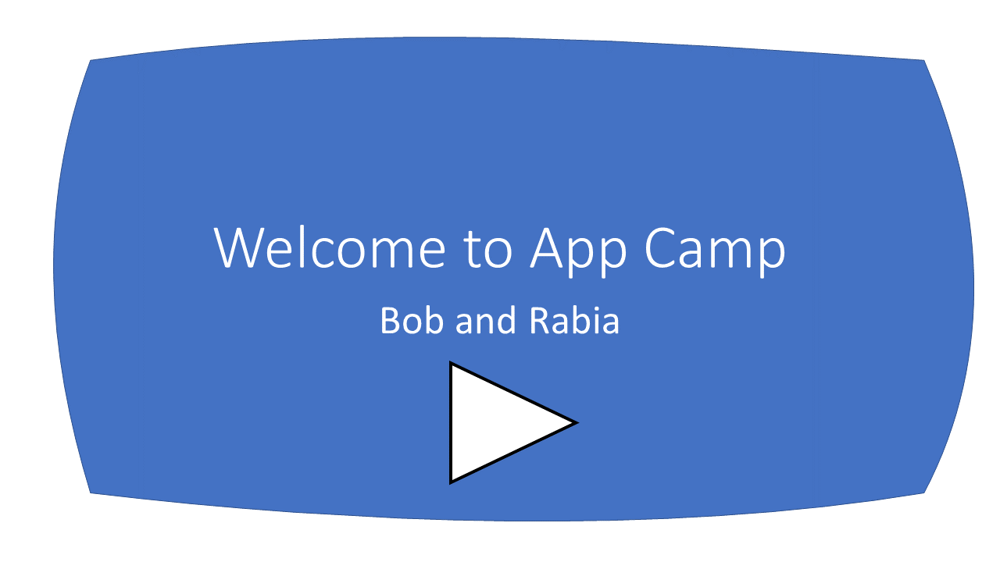

# Microsoft Teams App Camp On Demand

_Migrate applications into Microsoft Teams_

--8<-- "test.md"

Welcome to App Camp! In this on-demand workshop, you'll learn how to build Teams applications "from scratch", which is important for developers who already have an application they want to extend into Microsoft Teams, or for developers who have a specific toolchain in mind. If you're starting from scratch and open to building a React application with NodeJS/Express support, we recommend you use the [Teams Toolkit](https://docs.microsoft.com/en-us/microsoftteams/platform/toolkit/visual-studio-code-overview) rather than building your application from scratch.

This web site will guide you through a set of videos and hands-on lab exercises in which you will port a simiple web application to being a full-featured Teams application. The initial core labs will bring the web application into Teams as a personal tab with Azure AD Single Sign-on. Then the "extended" labs are available to teach you how to add features such as messaging extensions, adaptive cards, deep linking, and more. [One of the extended labs](./aad/Monetization.md) even shows you how to monetize your application in the Teams app store!

</img>

In this series of labs, you will port a simple "Northwind Orders" web application to become a full-fledged Microsoft Teams application. The core labs will show you how to make the web application into a Teams application with a personal tab and Azure AD Single Sign-on. From there, you can choose extended labs depending on the features you need in your application. After completing each lab, the solution will still work as the original stand-alone web application as well as in Microsoft Teams. This is intended to shwo how to extend an existing SaaS application into Microsoft Teams without disrupting non-Teams other users.

To make the app understandable by a wide audience, it is written in vanilla JavaScript with no UI framework, however it does use modern browser capabilities such as web components, CSS variables, and ECMAScript modules. The server side is also in plain JavaScript, using [Express](https://expressjs.com/), the most popular web server platform for NodeJS. While the code is not production quality, the writers tried to follow best practices with respect to the various API's and SDK's in use, or to call out any exceptions in comments. As for things like robust exception handling, unit testing, build pipeline, etc., those are left to you, the developer; you probably already have a setup you want to use anyway.

**Document outline**
<!-- no toc -->
- [Paths 🛣️](#paths-️) - There are two options for the core labs; this section explains
- [Labs 📚](#labs)
  - [Path A: Core application development](#path-a-core-application-development)
  - [Path B: Core application development](#path-b-core-application-development)
- [Prerequisites 📃](#prerequisites)
- [Contributing](#contributing)
- [Trademarks](#trademarks)

## Lab Prerequisites 📃 

These labs are intended for developers. Most of the labs don't assume a lot of specialized knowledge; coding is in modern JavaScript without use of specialized frameworks or libraries. But if you're not comfortable with coding, you may find it a bit challenging. The idea is to teach you the principles so you can apply them with your choice of toolsets.

To complete the labs you will need:

 * A computer with permission to install software (Windows, Mac, or Linux)
 * [NodeJS](https://nodejs.org/en/download/)
 * A code editor such as [Visual Studio Code](https://code.visualstudio.com/download)
 * [ngrok](https://ngrok.com/download) to simplify local debugging and allow debugging of bots and messaging extensions
 * A Microsoft 365 tenant (available free!)

Installation instructions are part of [the first lab](./aad/A01-begin-app.md); additional details are here [in the repo wiki](https://github.com/microsoft/app-camp/wiki/Prerequisites)

## Choose a path 🛣️

There are two paths for doing the core application development labs:

- **The "A" path** is for developers with apps that are already based on Azure Active Directory. The starting app uses Azure Active Directory and the Microsoft Authentication Library (MSAL). Path A includes optional modules for extending the core application; these all build on a correctly completed Lab A03, which is the last core lab for Azure AD.

- **The "B" path** is for developers with apps that use some other identity system. It includes a simple cookie-based auth system based on the Employees table in the Northwind database. This cookie-based system is not secure and should never be used in production! But it does serve to show how to map identities from an existing login system to Azure AD identities using Teams Single Sign-on. Path B does not include the optional modules but the Path A extended modules will probably work; we just don't have time to test all the permutations!

Links to resources referenced throughout App Camp can be found [here, on the Resources page](./docs/Resources.md).

## Labs 📚

### Path A: Core application development

##### Core labs:

In this series of labs, you'll begin with a working web application that uses the MSAL library to authorize Azure AD users. You'll extend this to also be a Teams application with Azure AD Single Sign-on. These core labs are the basis for the extended labs. [These folders](https://github.com/microsoft/app-camp/tree/main/src/create-core-app/aad) hold the completed source codes following each of the labs.

  - [A01 - Start with Azure Active Directory](./aad/A01-begin-app.md)
  - [A02 - Create a Teams app with Azure AD Single Sign-On](./aad/A02-after-teams-sso.md)
  - [A03 - Teams styling and themes](./aad/A03-after-apply-styling.md)

##### Extended Labs:

Once you have successfully completed Lab A03, you're invited to choose your own adventure(s) and add features to your Teams application. The [solution files for each lab](https://github.com/microsoft/app-camp/tree/main/src/extend-with-capabilities) are based on completing the lab directly on top of the [Lab A03 solution](https://github.com/microsoft/app-camp/tree/main/src/create-core-app/aad/A03-after-apply-styling). An ["All" solution folder](https://github.com/microsoft/app-camp/tree/main/src/extend-with-capabilities/All) is provided showing all the extended labs completed on top of Lab A03.

> For extending your application with capabilities below, make sure you complete your core Teams application lab.

  - [Add a Configurable Tab](./aad/ConfigurableTab.md)
  - [Add a Deep link to a personal Tab](./aad/Deeplink.md)
  - [Add a Messaging Extension](./aad/MessagingExtension.md)
  - [Add a Task Module ](./aad/TaskModules.md)
  - [Selling Your SaaS-based Teams Extension](./aad/Monetization.md)
   
### Path B: Core application development

##### Core labs:

In this series of labs, you'll begin with a working web application that uses the a simple bespoke authentication scheme to authorize users stored in a database. You'll extend this to also be a Teams application with Azure AD Single Sign-on, where Azure AD users are mapped to the application's users to minimize changes to the application. If you're extending an application into Teams which uses some identity system other than Azure AD yet want to gain the benefits of Azure AD SSO, this pattern may work for you. [These folders](https://github.com/microsoft/app-camp/tree/main/src/create-core-app/bespoke) hold the completed source codes following each of the labs.
  
  - [B01 - Start with a non-Azure Active Directory Identity System](./bespoke/B01-begin-app.md)
  - [B02 - Teams App with Bespoke Authentication](./bespoke/B02-after-teams-login.md)
  - [B03 - Enable Azure AD Single Sign-On](./bespoke/B03-after-teams-sso.md)
  - [B04 - Teams styling and themes](./bespoke/B04-after-apply-styling.md)
  

## Contributing

This project welcomes contributions and suggestions. Please file any issues or feature requests in the issues list for this repository. If you wish to contribute via a pull request, please fork the repo and make your PR against the main branch. Most contributions require you to agree to a
Contributor License Agreement (CLA) declaring that you have the right to, and actually do, grant us the rights to use your contribution. For details, visit https://cla.opensource.microsoft.com.

When you submit a pull request, a CLA bot will automatically determine whether you need to provide a CLA and decorate the PR appropriately (e.g., status check, comment). Simply follow the instructions provided by the bot. You will only need to do this once across all repos using our CLA.

This project has adopted the [Microsoft Open Source Code of Conduct](https://opensource.microsoft.com/codeofconduct/). For more information see the [Code of Conduct FAQ](https://opensource.microsoft.com/codeofconduct/faq/) or
contact [opencode@microsoft.com](mailto:opencode@microsoft.com) with any additional questions or comments.

## Trademarks

This project may contain trademarks or logos for projects, products, or services. Authorized use of Microsoft 
trademarks or logos is subject to and must follow 
[Microsoft's Trademark & Brand Guidelines](https://www.microsoft.com/en-us/legal/intellectualproperty/trademarks/usage/general).
Use of Microsoft trademarks or logos in modified versions of this project must not cause confusion or imply Microsoft sponsorship.
Any use of third-party trademarks or logos are subject to those third-party's policies.
