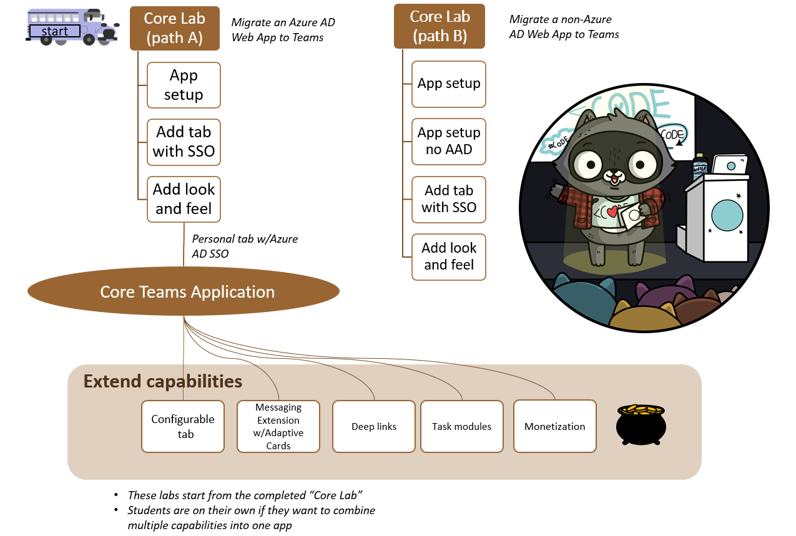

---8<--- "heading.md"

<h2>Need a hand with your Teams app?</h2>
<!-- <ul>
<li> -->
<b>Are you an ISV building a Teams app for sale in the Teams store? Could you use some support?</b> Please fill out this form to request assistance from Microsoft with the potential to be matched with a dedicated support manager if you choose to build a transactable app within the next few months. <b><a href="https://aka.ms/TeamsApp/Support" target="_blank">https://aka.ms/TeamsApp/Support</a></b>
<!-- </li>

<li>
<b>Are you a start-up</b> looking to change the world with an innovative Teams app in the store? Would you like some <b>Azure credits, and extra guidance</b>? You should sign up for Founders hub! <a href="http://aka.ms/startups" target="_blank">http://aka.ms/startups</a>
</li>

<li>
Are you a <b>Solutions Partner in the Microsoft Cloud Partner program? Want some help </b> planning, envisioning, building, and publishing Teams applications? Get started with Technical Presales & Deployment services at <a href="https://aka.ms/tpd" target="_blank">https://aka.ms/tpd</a>
</li>
</ul> -->

<h1 class="headingWithSubtitle">Microsoft Teams App Camp</h1>

Migrate applications into Microsoft Teams

!!! tip "Reactor events"
    If you missed our Reactor livestream events, please check out the recordings at <a href="https://aka.ms/TeamsAppCamp" target="_blank">https://aka.ms/TeamsAppCamp</a>!

Welcome to App Camp! In this on-demand workshop, you'll learn how to build Teams applications without special tools, which is important for developers who already have an application they want to extend into Microsoft Teams, or for developers who have a specific toolchain in mind. If you're starting a new application and you're open to building a React application with NodeJS/Express support, we recommend you use the [Teams Toolkit](https://docs.microsoft.com/microsoftteams/platform/toolkit/teams-toolkit-fundamentals?pivots=visual-studio-code?WT.mc_id=m365-58890-cxa){target=_blank}.

This web site will guide you through a set of videos and hands-on lab exercises in which you will port a simple web application to being a full-featured Teams application. The initial core labs will bring the web application into Teams as a personal tab with Azure AD Single Sign-on. Then the "extended" labs are available to teach you how to add features such as message extensions, adaptive cards, deep linking, and more. [One of the extended labs](./aad/Monetization.md) even shows you how to monetize your application in the Teams app store!

!!! warning "App Camp is for learning concepts you can apply to your application"
    The App Camp solution is designed to be simple and easy to understand; it is NOT production ready and should not be used as the basis for your coding project. App Camp teaches the concepts that allow Teams apps to be built on existing apps or app frameworks. If you want to get started quickly on a new application, please use [Teams Toolkit](https://docs.microsoft.com/microsoftteams/platform/toolkit/teams-toolkit-fundamentals?pivots=visual-studio-code?WT.mc_id=m365-58890-cxa){target=_blank}.

    If you're starting from scratch, you still can learn a lot about Teams applications and monetization here! Just don't use it as a code base!

## Video Briefings

These videos will help you understand the business of Teams applications, and will lay a foundation for understanding the technical aspects of the labs. You don't need to watch them in order to complete the labs, but they will help you understand.

???+ info "Video Briefings"
    

      <iframe src="//www.youtube.com/embed/ntFBgnrTt-s" frameborder="0" allowfullscreen></iframe>
      
Welcome to Microsoft Teams App Camp!

    

    
Business Briefing

    
What's the business case for building Teams applications? How can putting your app in the Teams app store generate revenue for you? What benefits does Microsoft offer ISV's who build Teams applications? How will my application appear to Teams users, and how will it help them? These questions and more are answered in these videos.

    

      <iframe src="//www.youtube.com/embed/iho0LJrFp9s" frameborder="0" allowfullscreen></iframe>
      
Opportunity for Startups to Build and Grow on Microsoft Teams

    

    

      <iframe src="//www.youtube.com/embed/fk8ul9xcMpc" frameborder="0" allowfullscreen></iframe>
      
Microsoft Teams Marketplace Strategy

    

    

      <iframe src="//www.youtube.com/embed/nKR4RWyGtHo" frameborder="0" allowfullscreen></iframe>
      
Buying a Teams application

    

    

      <iframe src="//www.youtube.com/embed/a5xwTOSfQNk" frameborder="0" allowfullscreen></iframe>
      
Teams app capabilities with doodles!

    

    

      <iframe src="//www.youtube.com/embed/JG5Am5nos1s" frameborder="0" allowfullscreen></iframe>
      
Success story: DecisionPoint brings conversational BI to Teams

    

    

      <iframe src="//www.youtube.com/embed/rJf-Ertex6g" frameborder="0" allowfullscreen></iframe>
      
Success story: My Serious Game brings their EdMill app to Teams

    

    
For more video case studies about successful Teams apps, please visit the <a href="https://cloudpartners.transform.microsoft.com/practices/modernworkisv?tab=success-stories" target="_blank">Modern Work ISV Program</a> page.

    
Technical Briefing: Building your Teams application

    
These videos will help you understand how Teams applications and Azure AD SSO work, so you can better understand the labs as you do them.

    

      <iframe src="//www.youtube.com/embed/EQuB8l4sccg" frameborder="0" allowfullscreen></iframe>
      
Get started building Microsoft Teams apps

    

    

      <iframe src="//www.youtube.com/embed/SaBbfVgqZHc" frameborder="0" allowfullscreen></iframe>
      
Understanding Single Sign-On (SSO) with Azure AD

    

    

      <iframe src="//www.youtube.com/embed/RjGVOFm39j0" frameborder="0" allowfullscreen></iframe>
      
Multi-tenant architecture for SaaS apps with Microsoft 365 and Azure Active Directory

    

    
Technical Briefing: Monetizing your Teams application

    
These videos explain the Microsoft Commercial Marketplace and how to integrate your application with the ecommerce system that drives it

    

      <iframe src="//www.youtube.com/embed/_-gbpXZx1D4" frameborder="0" allowfullscreen></iframe>
      
5 Steps to monetize your Teams application

    

    

      <iframe src="//www.youtube.com/embed/v-Ahdkjs7TY" frameborder="0" allowfullscreen></iframe>
      
Anatomy of a SaaS Application

    

    

      <iframe src="//www.youtube.com/embed/IQf2Zs9Mob8" frameborder="0" allowfullscreen></iframe>
      
Publish your app in the Microsoft Teams app store

    

??? info "Lab videos"
    
If you'd like to watch the labs before doing them, they are here. They're also posted at the beginning of each lab. The instructions should stand on their own - you don't need to watch in order to complete the labs - but they can help if you get stuck or want to understand the labs more deeply.

    
Start with the "core application"

    

      <iframe src="//www.youtube.com/embed/AiEDH6N1-ps" frameborder="0" allowfullscreen></iframe>
      
Lab A01: Start with a simple web app that uses Azure AD

    

    

      <iframe src="//www.youtube.com/embed/nMnUZ2PQKBc" frameborder="0" allowfullscreen></iframe>
      
Lab A02: Create a Teams app with Azure AD Single Sign-On

    

    

      <iframe src="//www.youtube.com/embed/pHm_pt5HewQ" frameborder="0" allowfullscreen></iframe>
      
Lab A03: Teams styling and themes

    

    
Use this alternative path if you want to learn how to integrate an identity system other than Azure Active Directory:

    

      <iframe src="//www.youtube.com/embed/gzzvp9EyQkg" frameborder="0" allowfullscreen></iframe>
      
Labs B01-B04: Linking your identity system to Azure AD SSO

    

    
Extended labs: Choose your own adventure!

    

      <iframe src="//www.youtube.com/embed/V8nb7N0hHmU" frameborder="0" allowfullscreen></iframe>
      
Configurable Tab

    

    

      <iframe src="//www.youtube.com/embed/u0DV2QCEKJ4" frameborder="0" allowfullscreen></iframe>
      
Deep Links

    

    

      <iframe src="//www.youtube.com/embed/-4p1jr2znQM" frameborder="0" allowfullscreen></iframe>
      
Add a Dialog

    

    

      <iframe src="//www.youtube.com/embed/RJQf3vw4LFA" frameborder="0" allowfullscreen></iframe>
      
Add a Message Extension with Adaptive Cards

    

    

      <iframe src="//www.youtube.com/embed/qvLofi22paw" frameborder="0" allowfullscreen></iframe>
      
Add Monetization

    

???+ attention "Key learning resource"
    For a complete on-demand workshop focused on Commercial Marketplace, complete with hands-on labs and videos, please visit Mastering the Marketplace. Monetized Teams Store Apps are "SaaS Offers", so <a href="http://aka.ms/mastering-the-marketplace/saas" target="_blank">the link</a> will bring you directly into that section of the training.
    

    <a href="http://aka.ms/mastering-the-marketplace/saas" target="_blank">
    </img></a>

## It's lab time!

In this series of labs, you will port a simple "Northwind Orders" web application to become a full-fledged Microsoft Teams application. The core labs will show you how to make the web application into a Teams application with a personal tab and Azure AD Single Sign-on. From there, you can choose extended labs depending on the features you need in your application. After completing each lab, the solution will still work as the original stand-alone web application as well as in Microsoft Teams. This is intended to show how to extend an existing SaaS application into Microsoft Teams without disrupting non-Teams other users.

!!! tip
    
    If in doubt, [start here](./aad/A01-begin-app.md)! 🚶🏿🚶🏽‍♀️🚶
    

To make the app understandable by a wide audience, it is written in vanilla JavaScript with no UI framework, however it does use modern browser capabilities such as web components, CSS variables, and ECMAScript modules. The server side is also in plain JavaScript, using [Express](https://expressjs.com/), the most popular web server platform for NodeJS. While the code is not production quality, the writers tried to follow best practices with respect to the various API's and SDK's in use, or to call out any exceptions in comments. As for things like robust exception handling, unit testing, build pipeline, etc., those are left to you, the developer; you probably already have a setup you want to use anyway.

## Lab Prerequisites 📃 

The labs are intended for developers. Most of the labs don't assume a lot of specialized knowledge; coding is in modern JavaScript without use of specialized frameworks or libraries. But if you're not comfortable with coding, you may find it a bit challenging. The idea is to teach developers the principles so they can apply them to their choice of toolsets.

To complete the labs you will need:

 * A computer with permission to install software (Windows, Mac, or Linux)
 * [NodeJS](https://nodejs.org/en/download/){target="_blank"}
 * A code editor such as [Visual Studio Code](https://code.visualstudio.com/download){target="_blank"}
 * [ngrok](https://ngrok.com/download){target="_blank"} to simplify local debugging and allow debugging of bots and message extensions
 * A Microsoft 365 tenant [(available free!)](https://developer.microsoft.com/en-us/microsoft-365/dev-program){target="_blank"}

Installation instructions are part of [the first lab](./aad/A01-begin-app.md); additional details are here [in the repo wiki](https://github.com/microsoft/app-camp/wiki/Prerequisites){target="_blank"}

???+ tip
    DON'T DEVELOP IN PRODUCTION
    
    It may be tempting to do labs or build solutions in the Microsoft 365 tenant where you work every day, but there are good reasons to have a dedicated dev tenant - and probably additional staging/test tenants as well. They're free, and you can safely experiment as a tenant admin without risking your production work.
    

      <iframe src="//www.youtube.com/embed/DhhpJ1UjbJ0" frameborder="0" allowfullscreen></iframe>
      
Set up your new Microsoft 365 Developer Subscription

    

## Choose a path 🛣️

There are two paths for doing the core application development labs:

- [**Path "A"**](#path-a-start-with-azure-ad) is for developers with apps that are already based on Azure Active Directory. The starting app uses Azure Active Directory and the Microsoft Authentication Library (MSAL). Path A includes optional modules for extending the core application; these all build on a correctly completed Lab A03, which is the last core lab for Azure AD.

- [**Path "B"**](#path-b-start-with-a-non-azure-ad-identity-solution) is for developers with apps that use some other identity system. It includes a simple cookie-based auth system based on the Employees table in the Northwind database. This cookie-based system is not secure and should never be used in production! But it does serve to show how to map identities from an existing login system to Azure AD identities using Teams Single Sign-on. Path B does not include the optional modules but the Path A extended modules will probably work; we just don't have time to test all the permutations!

## Labs 📚

### Path A: Start with Azure AD

##### Core labs

In this series of labs, you'll begin with a working web application that uses the MSAL library to authorize Azure AD users. You'll extend this to also be a Teams application with Azure AD Single Sign-on. These core labs are the basis for the extended labs. [These folders](https://github.com/microsoft/app-camp/tree/main/src/create-core-app/aad){target="_blank"} hold the completed source codes following each of the labs.

---8<--- "a-path-links.md"

##### Extended Labs

Once you have successfully completed Lab A03, you're invited to choose your own adventure(s) and add features to your Teams application. The [solution files for each lab](https://github.com/microsoft/app-camp/tree/main/src/extend-with-capabilities){target="_blank"} are based on completing the lab directly on top of the [Lab A03 solution](https://github.com/microsoft/app-camp/tree/main/src/create-core-app/aad/A03-after-apply-styling){target="_blank"}. An ["All" solution folder](https://github.com/microsoft/app-camp/tree/main/src/extend-with-capabilities/All){target="_blank"} is provided showing all the extended labs completed on top of Lab A03.

---8<--- "extended-lab-links.md"

### Path B: Start with a non-Azure AD identity solution

##### Core labs

In this series of labs, you'll begin with a working web application that uses the a simple bespoke authentication scheme to authorize users stored in a database. You'll extend this to also be a Teams application with Azure AD Single Sign-on, where Azure AD users are mapped to the application's users to minimize changes to the application. If you're extending an application into Teams which uses some identity system other than Azure AD yet want to gain the benefits of Azure AD SSO, this pattern may work for you. [These folders](https://github.com/microsoft/app-camp/tree/main/src/create-core-app/bespoke){target="_blank"} hold the completed source codes following each of the labs.
  
---8<--- "b-path-links.md"

## Contributing

This project welcomes contributions and suggestions. Please file any issues or feature requests in the issues list for this repository. If you wish to contribute via a pull request, please fork the repo and make your PR against the main branch. Most contributions require you to agree to a
Contributor License Agreement (CLA) declaring that you have the right to, and actually do, grant us the rights to use your contribution. For details, visit [https://cla.opensource.microsoft.com](https://cla.opensource.microsoft.com){target="_blank"}.

When you submit a pull request, a CLA bot will automatically determine whether you need to provide a CLA and decorate the PR appropriately (e.g., status check, comment). Simply follow the instructions provided by the bot. You will only need to do this once across all repos using our CLA.

This project has adopted the [Microsoft Open Source Code of Conduct](https://opensource.microsoft.com/codeofconduct/){target="_blank"}. For more information see the [Code of Conduct FAQ](https://opensource.microsoft.com/codeofconduct/faq/){target="_blank"} or
contact [opencode@microsoft.com](mailto:opencode@microsoft.com) with any additional questions or comments.

## Trademarks

This project may contain trademarks or logos for projects, products, or services. Authorized use of Microsoft 
trademarks or logos is subject to and must follow 
[Microsoft's Trademark & Brand Guidelines](https://www.microsoft.com/en-us/legal/intellectualproperty/trademarks/usage/general){target="_blank"}.
Use of Microsoft trademarks or logos in modified versions of this project must not cause confusion or imply Microsoft sponsorship.
Any use of third-party trademarks or logos are subject to those third-party's policies.

