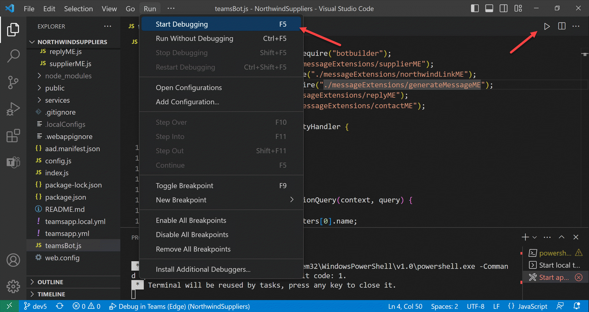
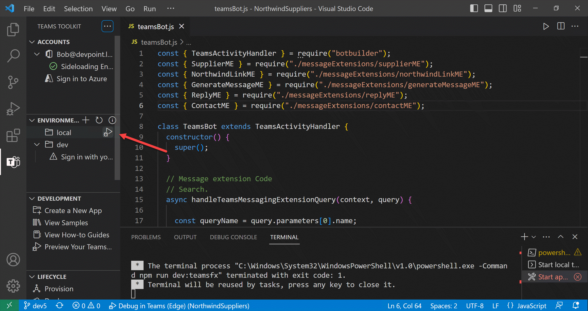

---8<--- "heading2.md"

# Lab 1: Create your first app with Teams Toolkit

???+ info "Lab Outline"

    * __[Lab 1 - Create your first app with Teams Toolkit](./01-create-app.md)__
    In this lab, you'll set up Teams Toolkit and create a Teams message extension.
    * __[Lab 2 - Integrate business data with your application](./02-integrate-web-service.md)__
    In this lab, you'll brand your new app as "Northwind Suppliers", and will provide the ability to insert data from the Northwind Traders sample database in a Microsoft Teams conversation. You'll also learn how to create and send adaptive cards with your message extension.
    * __[Lab 3 - Add link unfurling](./03-add-link-unfurling.md)__
    In this lab, you'll learn how to use Link Unfurling, which provides a custom summary when a user includes your URL in a conversation
    * __[Lab 4 - Action message extensions with Open AI](./04-add-ai.md)__
    In this lab, you'll learn how to build "Action" message extensions which can be launched directly
    or in the context menu of another Teams message to take action on it. The labs use the Open AI
    commercial web services (in Azure or using an Open AI account) to generate messages.
    * __[Lab 5 - Single Sign-on and Microsoft Graph](./05-add-sso.md)__
    In this lab, you'll learn how to authenticate users with Azure AD Single Sign-On, and to call the
    Microsoft Graph API. This same process would be used when calling any
    web service that's secured with Azure AD on behalf of the logged-in user.
    * __[Lab 6 - Run the app in Outlook](./06-run-in-outlook.md)__
    In this lab, you'll run the Northwind Suppliers application in Microsoft Outlook.

## Overview

From the beginning, a core tenet of Teams App Camp has been to help developers _reuse_ and _repurpose_ existing applications as Microsoft Teams apps in addition to creating new ones. This led to a decision to make the App Camp labs using general-purpose development tools, so developers can learn how Teams apps work in sufficient detail to implement them with any tool chain.

The tooling for building Teams apps - specifically [Teams Toolkit](https://learn.microsoft.com/en-us/microsoftteams/platform/toolkit/teams-toolkit-fundamentals?pivots=visual-studio-code){target="_blank"}, has improved since then, and many developers may want to build a new extension to their app using these tools. This led to this new set of labs, __Teams App Camp: Next Adventure__.

In these labs, you'll learn how to leverage existing web services to become Teams apps using the [Teams Toolkit for Visual Studio Code](https://aka.ms/teams-toolkit){target=_blank}. While this doesn't allow you to choose just any tool chain, it makes it much easier to write a new Teams app and to deploy it in Microsoft Azure.

In this lab you will learn to:

- Install Teams Toolkit for Visual Studio Code
- Create and run a Teams application with a Search-based Message Extension

## Exercise 1: Set up your Microsoft 365 Subscription

To install and run your own Teams app, you'll need a Microsoft 365 tenant where you have administrator permission. Fortunately you can get one for free through the Microsoft 365 Developer Program! In the labs which follow, you'll also use this tenant to run Microsoft Teams.

### Step 1: Get a tenant

!!! warning "Attention Build 2023 workshop and lab attendees"
    Your instructor will provide a tenant that's ready to go, so you can skip to [Exercise 2](/app-camp/new-adventure/01-create-app/#exercise-2-install-teams-toolkit-and-prerequisites). If you already have your own Microsoft 365 developer subscription, feel free to use that instead.

If you don't yet have a tenant, please join the [Microsoft 365 Developer Program](https://developer.microsoft.com/microsoft-365/dev-program?WT.mc_id=m365-58890-cxa){target=_blank} to get a free one. Your tenant includes 25 [E5 user licenses](https://www.microsoft.com/microsoft-365/enterprise/compare-office-365-plans?WT.mc_id=m365-58890-cxa){target=_blank} and can be renewed as long as you keep developing!

Select "Join now" to begin.

Log in with any Microsoft personal or work and school account, enter your information, and select "Next". You will have an opportunity to choose what kind of "sandbox" you want; the "Instant sandbox" is recommended.

Follow the wizard and select your administrator username and password, tenant domain name, etc. The domain name you choose is just the left-most portion - for example if you enter "Contoso" your domain will be "Contoso.onmicrosoft.com".

Remember this information as you'll need it throughout the labs! You will log in as &gt;username&lt;@&gt;domain&lt;.onmicrosoft.com with the password you chose. You'll be prompted for your phone number and then the system will set up your subscription.

Eventually you'll be prompted to log into your new tenant. Be sure to use the new administrator credentials you just created, not the ones you used when you signed up for the developer program.

!!! tip "Tip: Navigating many tenants"
    Consider creating a browser profile for each tenant that will have its own favorites, stored credentials, and cookies so you can easily swtch between tenants as you work.

!!! note "You may be asked to enable multi-factor authentication (MFA)"
    [This is certainly a good idea!](https://www.microsoft.com/security/blog/2019/08/20/one-simple-action-you-can-take-to-prevent-99-9-percent-of-account-attacks/){target=_blank} Just follow the instructions. If you really must turn off MFA, [here are instructions](https://docs.microsoft.com/en-us/answers/questions/101179/how-to-disable-the-two-factor-authentication-from.html){target=_blank}. 

??? info "More tips on setting up your Microsoft 365 Development Tenant!"
    

      <iframe src="//www.youtube.com/embed/DhhpJ1UjbJ0" frameborder="0" allowfullscreen></iframe>
      
Setting up your Microsoft 365 Development tenant

    

### Step 2: Enable Teams application uploads

By default, end users can't upload Teams applications directly; instead an administrator needs to upload them into the enterprise app catalog. In this step you will ensure your tenant is set up for direct uploads by Teams Toolkit (or in Teams itself).

  a. Navigate to [https://admin.microsoft.com/](https://admin.microsoft.com/){target=_blank}, which is the Microsoft 365 Admin Center.

  b. In the left panel of the admin center, select "Show all" to open up the entire navigation

  

  When the panel opens, select Teams to open the Microsoft Teams admin center.

  

  c. In the left of the Microsoft Teams admin center, open the Teams apps accordion 1️⃣ and select Setup Policies 2️⃣. You will see a list of App setup policies. Select the Global (Org-wide default) policy 3️⃣.

  

 d. Ensure the first switch, "Upload custom apps" is turned On.

 

Be sure to scroll down and select the "Save" button to persist your change.

 
 We have been working to get this enabled by default on developer tenants, so it may already be set for you. The change can take up to 24 hours to take effect, but usually it's much faster.

## Exercise 2: Install Teams Toolkit and prerequisites

!!! warning "Attention Build 2023 workshop and lab attendees"
    Start here once you have a Microsoft 365 developer subscription login.
    
    Visual Studio Code and NodeJS 18.x have already been installed on your computer, so you can skip to [Step 3](/app-camp/new-adventure/01-create-app/#step-3-install-teams-toolkit).

You can complete these labs on a Windows, Mac, or Linux machine, but you do need the ability to install the prerequisites. If you are not permitted to install applications on your computer, you'll need to find another machine (or virtual machine) to use throughout the workshop.

### Step 1: Install Visual Studio Code

It should be no surprise that [Teams Toolkit for Visual Studio Code](){target=_blank} requires Visual Studio Code! You can download it here: [Visual Studio Code](https://code.visualstudio.com/download){target=_blank}.

### Step 2: Install NodeJS

NodeJS is a program that allows you to run JavaScript on your computer; it uses the open source "V8" engine, which is used in popular web browsers such as Microsoft Edge and Google Chrome. You will need NodeJS to run the web server code used throughout this workshop.

Browse to [https://nodejs.org/en/download/](https://nodejs.org/en/download/){target=_blank} and install version 18.x, the "LTS" (Long Term Support) version for your operating system. This lab has been tested using NodeJS version 18.16.0. If you already have another version of NodeJS installed, you may want to set up the [Node Version Manager](https://github.com/nvm-sh/nvm){target=_blank} (or [this variation](https://github.com/coreybutler/nvm-windows){target=_blank} for Microsoft Windows), which allows you to easily switch Node versions on the same computer.

### Step 3: Install Teams Toolkit

These labs are based on [Teams Toolkit version 5.0](https://marketplace.visualstudio.com/items?itemName=TeamsDevApp.ms-teams-vscode-extension){target=_blank}.
Follow the steps as shown in the screen shot below.

1️⃣ Open Visual Studio Code and click on the Extensions toolbar button

2️⃣ Search for "Teams" and locate Teams Toolkit

3️⃣ Click "Install"

!!! note "If you have Teams Toolkit installed but hidden"
    If you previously installed Teams Toolkit, and then hid it on the Visual Studio sidebar, you might wonder why you can't see it. Right-click on the left sidebar and check off Teams Toolkit to bring it back into view.

## Exercise 3: Create a Search Message Extension application

Follow the steps as shown in the screen shot below.

1️⃣ Select Teams Toolkit in the Visual Studio Code sidebar

2️⃣ Click "Create a New App"; the command bar will open

3️⃣ Choose "Message Extension"

You'll be presented with a list of templates for Teams message extensions.
Select "Custom Search Results".

For this lab, select "JavaScript" as the programming language.

At this point, you're asked to select a folder where your application will be created; you can select the default or your favorite source location on your machine. 

Then you'll be asked to enter the name of your application. For this lab, enter "NorthwindSuppliers".

Teams Toolkit will generate a your application and open a new instance of Visual Studio Code in the application folder. 

1️⃣  Close the original instance of Visual Studio Code

2️⃣  Continue working in the new instance of Visual Studio code

1️⃣ In the new instance of Visual Studio Code, ensure that Teams Toolkit is selected in the Visual Studio Code sidebar

2️⃣ Under "ACCOUNTS", click "Sign in to Microsoft 365"

A pop-up dialog box will invite you to sign in. Log in using the administrator account for the Microsoft 365 tenant you created in Exercise 1.

When you've completed the sign-in process, close the pop-up web browser.

Teams Toolkit will check to be sure app sideloading is enabled. You should see a green check mark indicating that it is; if not, ensure that application uploads are enabled as explained in [Exercise 1 Step 2](/app-camp/new-adventure/01-create-app/#step-2-enable-teams-application-uploads).

## Exercise 4: Run the application

!!! warning "Ensure you have a Teams chat in progress with an internal or guest user"
    If you are beginning with a brand new tenant, and have never had a Teams chat, the application won't
    start up correctly as it troies to install your app in the most recent chat. To address this, open [Microsoft Teams](https://teams.microsoft.com){target="_blank"} and log into your new tenant. Click the chat bubble in the left sidebar and start a chat with someone - anyone!
    If you set up test users along with your tenant, you should be able to chat with "Megan Bowen" or "Adele Vance".

    Also note that ["external"](https://aka.ms/external-vs-guest-users){target="_blank"} users can't use Teams apps, so if your chat is based only on Skype for Business federation, it won't work. Use an invited "guest" user or a user within your developer tenant.

At this point, Teams Toolkit has generated the application code, which in this case is a web service running in NodeJS with [Restify](http://restify.com/){target="_blank"} and using the [Azure Bot Framework SDK](https://learn.microsoft.com/javascript/api/?view=botbuilder-ts-latest){target="_blank"}. To run it, press F5 or click the debug button.

You will be prompted to select your debug configuration; select "Debug in Teams (Edge)" or "Debug in Teams (Chrome)" (or another browser choice if it's offered).

While you're waiting for the app to start, reflect on all the tasks that Teams Toolkit is doing - especially the first time you run it.

1. Provision

    Teams message extensions communicate with Teams using the Azure Bot Framework. That's why your new web service uses the Bot SDK. This provides a secure channel that's optimized for real-time interaction, whether it's a chat message, searching in a message extension, or clicking a button on an adaptive card; all these things use the Bot Framework in Teams.

    - To use the Bot Framework, the app needs a Bot registration. Teams Toolkit registers bots in the [Bot Developer Portal](https://dev.botframework.com/bots){target="_blank"}. Bots can also be registered as resources in Microsoft Azure.

    - Each bot has an Azure AD identity, and Teams Toolkit registers that as well. You can view the registration in the [Azure AD admin center](https://aad.portal.azure.com/){target="_blank"}. What are often referred to as the Bot ID and secret are actually the application ID and secret of this app registration. Your bot code will validate incoming requests using this information to ensure they're coming from the Azure Bot Channel Service.

    - HTTP requests from the Azure Bot Channel Service need to reach your web service somehow; normally this kind of incoming request will be blocked by the user's firewall. To allow for local debugging, Teams Toolkit will set up a tunnel using the new Visual Studio Code [dev tunnels](https://devblogs.microsoft.com/microsoft365dev/teams-toolkit-for-visual-studio-code-update-april-2023/){target="_blank"}. Teams Toolkit will update the bot registration with the URL of this tunnel so Teams can communicate with your app.

2. Deploy

    - Teams Toolkit will perform local validation on your application package before uploading it to Teams to ensure it conforms to the manifest schema and that the icon files conform to guidelines.

    - Teams Toolkit will install all the npm packages used by your application; this can take a while the first time.

    - Teams Toolkit will run your application and connect the debugger to Visual Studio Code.

3. Publish

    - Teams Toolkit will create a [Teams App Manifest](https://learn.microsoft.com/microsoftteams/platform/resources/schema/manifest-schema){target="_blank"}, which is a JSON file that includes all the information Teams needs to display and interact with your app. Then it will create a Teams app package, which is just a .zip archive containing the manifest and two application icons.

    - Teams Toolkit will then upload the package into Microsoft Teams and open a web browser that's deep linked to install the app in Teams.

And so finally a browser opens up to test the application. You may be asked to log into your Microsoft 365 tenant, and to allow the NodeJS web server through the firewall.

Eventually the deep link will render the application's installation screen in Microsoft Teams. Click the "Add" button to install the app.

Teams will open a conversation and open your new message extension. It's a pop-up that users would normally access from below the message compose window; here Teams has opened the message extension automatically.

You may be asked to log in again as your app opens for the first time.

Click the text box marked "Your search query" and enter a query such as "teamsfx". This starting message extension actually searches the list of npm packages, so you should see several packages with "teamsfx" in the name.

Choose one of the package names and Teams will insert a message card in the conversation containing information about that package. 

1️⃣ You can also type a message of your own to go along with the card
  
2️⃣ Click Send  to share the card with whoever you're chatting with

You have just integrated a web service with Teams, so end users can search for information and share it with their colleagues.

??? tip "There are at least 5 ways to start your app with Teams Toolkit - can you find them all?"

    There are so many ways to start your application - pick the one that you find easiest!

    - On any tab in VS Code, you can use the Run menu 1️⃣, click the toolbar button 2️⃣, or mash F5 on your keyboard.

    

    - On the "Debug" tab, you can start your app with the debug tool, which lets you pre-select a debugger configuration in the dropdown to the right of the button.

    

    - On the Teams Toolkit tab, you can start the app with a button that appears to the right of the environment, which will be "local" for local debugging.

    

## What's next?

Before you continue to the next lab, please stop the debugger by shutting the debug browser window or pressing the disconnect button in the Visual Studio Code toolbar. The next lab requires a complete, cold restart of your application.

In the [next lab](./02-integrate-web-service.md), you'll brand the application and update it to retrieve information about Northwind Suppliers. You'll also replace the somewhat boring message card (a [Hero Card](https://learn.microsoft.com/microsoftteams/platform/task-modules-and-cards/cards/cards-reference#hero-card){target="_blank"}) with a much more fun [Adaptive Card](https://adaptivecards.io/){target="_blank"}.

## Known issues

--8<-- "issuesLink.md"

