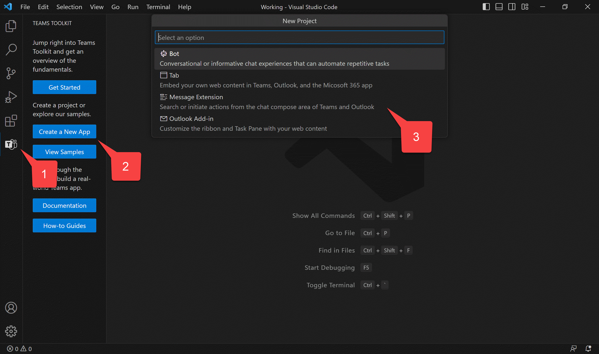
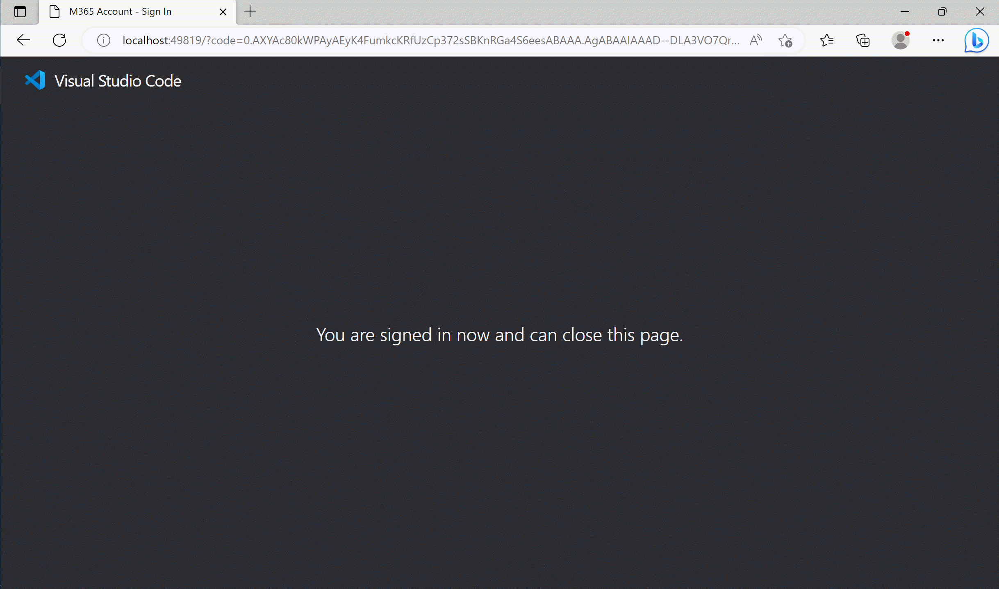

---8<--- "heading2.md"

# Lab 1: Create your first app with Teams Toolkit

## Overview

In this lab you will learn to:

- Install Teams Toolkit for Visual Studio Code
- Create and run a Teams application with a Search-based Message Extension

## Exercise 1: Install Teams Toolkit for Visual Studio Code

You can complete these labs on a Windows, Mac, or Linux machine, but you do need the ability to install the prerequisites. If you are not permitted to install applications on your computer, you'll need to find another machine (or virtual machine) to use throughout the workshop.

### Step 1: Ensure prerequisites are installed

--8<-- "i-finished.md"

## Known issues

While it will work on mobile devices, the application is not responsive and will not look good on these devices. This may be addressed in a future version of the lab.

--8<-- "issuesLink.md"

## Next steps

After completing this lab, you may continue to the next lab in this learning path, [A02-after-teams-sso: Creating a Teams app with Azure ADO SSO](./A02-after-teams-sso.md).

