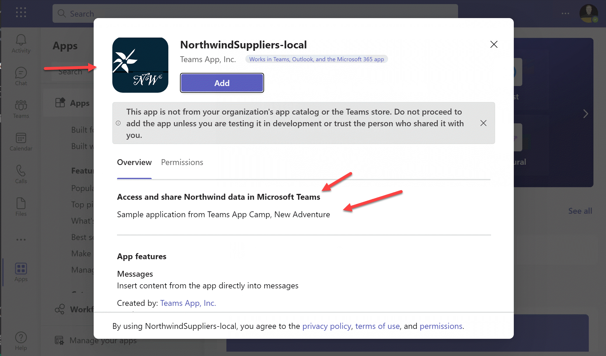
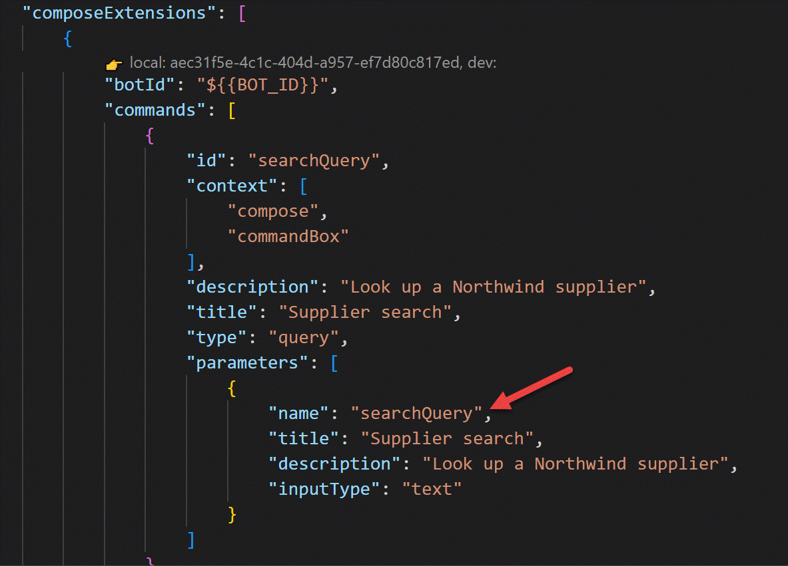
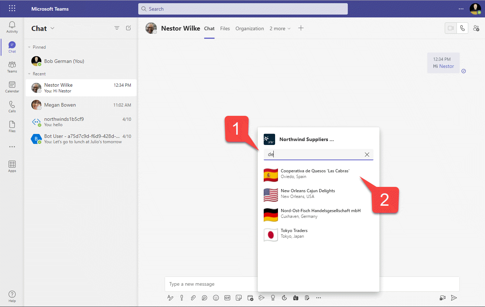
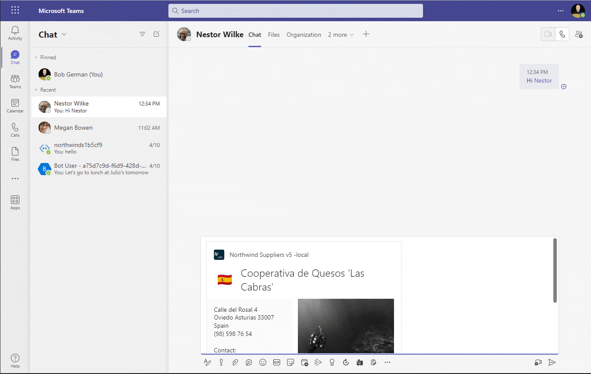
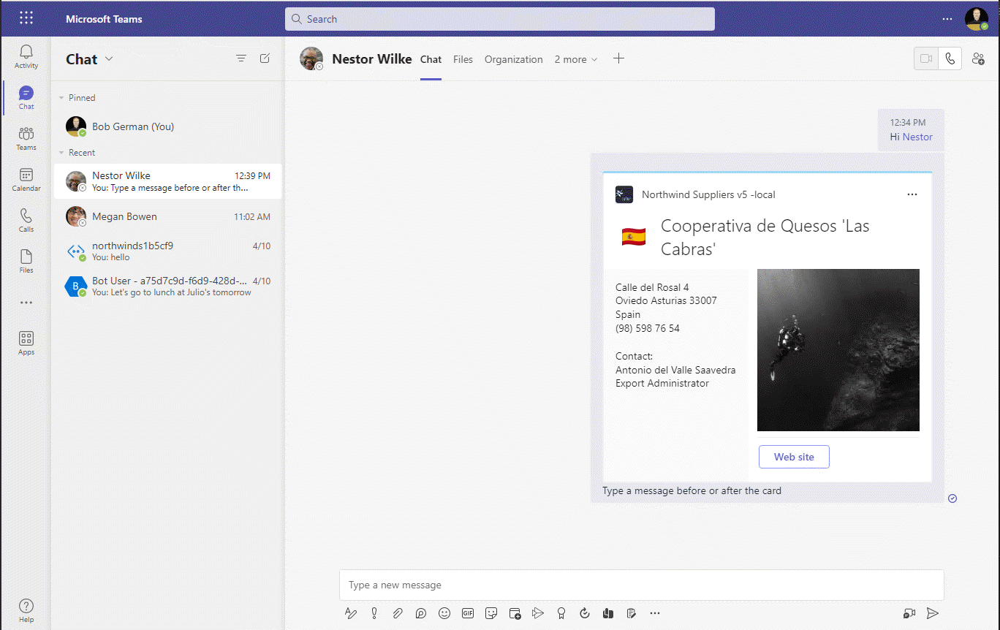
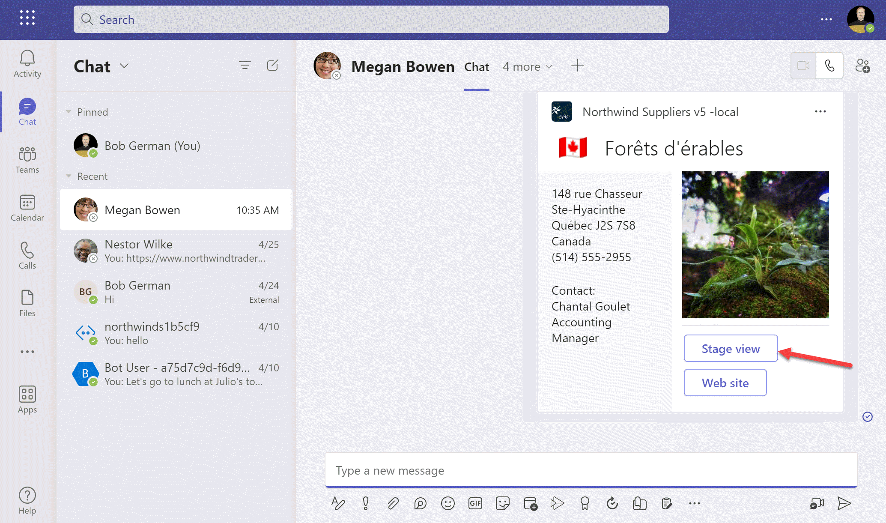
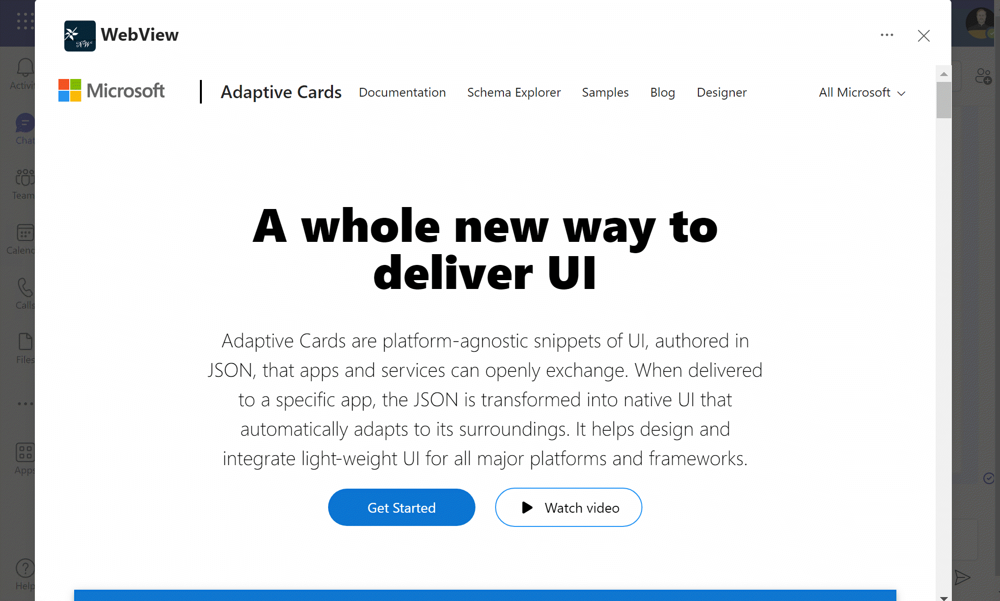

---8<--- "heading2.md"

# Lab 2: Integrate business data with your app

???+ info "Lab Outline"

    * __[Lab 1 - Create your first app with Teams Toolkit](./01-create-app.md)__
    In this lab, you'll set up Teams Toolkit and create a Teams message extension.
    * __<span style="color: red;">THIS LAB:</span>
    [Lab 2 - Integrate business data with your application](./02-integrate-web-service.md)__
    In this lab, you'll brand your new app as "Northwind Suppliers", and will provide the ability to insert data from the Northwind Traders sample database in a Microsoft Teams conversation. You'll also learn how to create and send adaptive cards with your message extension.
    * __[Lab 3 - Add link unfurling](./03-add-link-unfurling.md)__
    In this lab, you'll learn how to use Link Unfurling, which provides a custom summary when a user includes your URL in a conversation
    * __[Lab 4 - Action message extensions with Open AI](./04-add-ai.md)__
    In this lab, you'll learn how to build "Action" message extensions which can be launched directly
    or in the context menu of another Teams message to take action on it. The labs use the Open AI
    commercial web services (in Azure or using an Open AI account) to generate messages.
    * __[Lab 5 - Single Sign-on and Microsoft Graph](./05-add-sso.md)__
    In this lab, you'll learn how to authenticate users with Azure AD Single Sign-On, and to call the
    Microsoft Graph API. This same process would be used when calling any
    web service that's secured with Azure AD on behalf of the logged-in user.## Overview
    * __[Lab 6 - Run the app in Outlook](./06-run-in-outlook.md)__
    In this lab, you'll run the Northwind Suppliers application in Microsoft Outlook.

In the previous lab, you created and ran a Search Message Extension using Teams Toolkit for Visual Studio Code. This is a fairly generic message extension that searches npm packages. In this lab, you'll learn how to brand your application, use it to call an enterprise web service, and update it to send an adaptive card instead of a simpler Hero card.

## Features

- App will be listed as Northwind Suppliers with an appropriate app logo
- App will query the Northwind Suppliers database and allow searching for suppliers by name
- When a supplier is selected, the app will insert an adaptive card into the conversation

## Exercise 1: Update the App Manifest

### Step 1: Download new app icons and place them in the **appPackage** folder.

 * The large icon should be in color and 192x192 pixels:
   [northwind-suppliers-192.png](/app-camp/assets/new-adventure/northwind-suppliers-192.png){target="_blank"} 

    

 * The small icon should be monochrome and 32x32 pixels:
   [northwind-suppliers-32.png](/app-camp/assets/new-adventure/northwind-suppliers-32.png){target="_blank"} 

    

### Step 2: Update the **manifest.json** file

Close the browser to stop debugging your project. Then, in Visual Studio Code, open the Teams manifest template, **manifest.json**, which is also in the **appPackage** folder. Replace the icon file names with the new file names.

```json
"icons": {
    "color": "northwind-suppliers-192.png",
    "outline": "northwind-suppliers-32.png"
},
```

Scroll down and update the name and description fields in the manifest; these will be shown to users when they view your application in Teams. Note that the token ${{TEAMSFX_ENV}}` be expanded to indicate the Teams Toolkit current development environment, which is currently "LOCAL". Later if you wish you can create additional environments such as "DEV", "STAGING", etc.

```json
"name": {
    "short": "Northwind Suppliers-${{TEAMSFX_ENV}}",
    "full": "Northwind Suppliers - Teams App Camp New Adventure"
},
"description": {
    "short": "Access and share Northwind data in Microsoft Teams",
    "full": "Sample application from Teams App Camp, New Adventure"
},
```

While you're there, change the accent color to a lighter shade of blue in the same hue as the large icon:

```json
"accentColor": "#9EDBF9",
```

Continuing to scroll down, under `composeExtensions:` `commands:`, edit the title and description of the message extension command. These are the settings that control how the search box is presented to the user.

```json
    "commands": [
        {
            "id": "searchQuery",
            "context": [
                "compose",
                "commandBox"
            ],
            "description": "Look up a Northwind supplier",
            "title": "Supplier search",
            "type": "query",
            "parameters": [
                {
                    "name": "searchQuery",
                    "title": "Supplier search",
                    "description": "Look up a Northwind supplier",
                    "inputType": "text"
                }
            ]
        }
    ]
```

Now start your application again - in fact, if it's running, you should stop and start it so Teams Toolkit builds an updated app manifest. Now it should look a lot more "Northwindy", but of course it still just queries the npm data.




## Exercise 2: Add new Message Extension code

In this and the labs that follow, we'll be adding multiple different message extensions to the Northwind Suppliers application. For that reason, we'll put the code for each message extension in separate modules instead of placing it in-line in the [teamsBot.js](){target=_blank} file.

### Step 1: Add Message Extension logic

To begin, create a folder in the **NorthwindSuppliers** directory called **messageExtensions**. Then create a new file in the **messageExtensions** folder called **supplierME.js** and copy in the following code:

```javascript
const axios = require("axios");
const ACData = require("adaptivecards-templating");
const { CardFactory } = require("botbuilder");

class SupplierME {

    // Get suppliers given a query
    async handleTeamsMessagingExtensionQuery (context, query) {

        try {
            const response = await axios.get(
                `https://services.odata.org/V4/Northwind/Northwind.svc/Suppliers` +
                `?$filter=contains(tolower(CompanyName),tolower('${query}'))` +
                `&$orderby=CompanyName&$top=8`
            );

            const attachments = [];
            response.data.value.forEach((supplier) => {

                // Free flag images from https://flagpedia.net/
                const flagUrl = this.#getFlagUrl(supplier.Country);
                const imageUrl = `https://picsum.photos/seed/${supplier.SupplierID}/300`;

                const itemAttachment = CardFactory.heroCard(supplier.CompanyName);
                const previewAttachment = CardFactory.thumbnailCard(supplier.CompanyName,
                    `${supplier.City}, ${supplier.Country}`, [flagUrl]);

                previewAttachment.content.tap = {
                    type: "invoke",
                    value: {    // Values passed to selectItem when an item is selected
                        queryType: 'supplierME',
                        SupplierID: supplier.SupplierID,
                        flagUrl: flagUrl,
                        imageUrl: imageUrl,
                        Address: supplier.Address || "",
                        City: supplier.City || "",
                        CompanyName: supplier.CompanyName || "unknown",
                        ContactName: supplier.ContactName || "",
                        ContactTitle: supplier.ContactTitle || "",
                        Country: supplier.Country || "",
                        Fax: supplier.Fax || "",
                        Phone: supplier.Phone || "",
                        PostalCode: supplier.PostalCode || "",
                        Region: supplier.Region || ""
                    },
                };
                const attachment = { ...itemAttachment, preview: previewAttachment };
                attachments.push(attachment);
            });

            return {
                composeExtension: {
                    type: "result",
                    attachmentLayout: "list",
                    attachments: attachments,
                }
            };

        } catch (error) {
            console.log(error);
        }
    };

    handleTeamsMessagingExtensionSelectItem (context, selectedValue) {

        // Read card from JSON file
        const templateJson = require('../cards/supplierCard.json');
        const template = new ACData.Template(templateJson);
        const card = template.expand({
            $root: selectedValue
        });

        const resultCard = CardFactory.adaptiveCard(card);

        return {
            composeExtension: {
                type: "result",
                attachmentLayout: "list",
                attachments: [resultCard]
            },
        };

    };

    // Get a flag image URL given a country name
    // Thanks to https://flagpedia.net for providing flag images
    #getFlagUrl (country) {

        const COUNTRY_CODES = {
            "australia": "au",
            "brazil": "br",
            "canada": "ca",
            "denmark": "dk",
            "france": "fr",
            "germany": "de",
            "finland": "fi",
            "italy": "it",
            "japan": "jp",
            "netherlands": "nl",
            "norway": "no",
            "singapore": "sg",
            "spain": "es",
            "sweden": "se",
            "uk": "gb",
            "usa": "us"
        };

        return `https://flagcdn.com/32x24/${COUNTRY_CODES[country.toLowerCase()]}.png`;

    };
}

module.exports.SupplierME = new SupplierME();
```

???+ note "Code walk-through"
    
    Here are some highlights about the code you just copied:

    - <u>`handleTeamsMessagingExtensionQuery (context, query)`</u> - This function will be called when someone types something into the search box in your message extension. That means you might get partial queries. You can also tell Teams to call your message extension as soon as the user opens it up - with an empty query - using the [`initialRun` parameter](https://learn.microsoft.com/en-us/microsoftteams/platform/resources/schema/manifest-schema#composeextensionscommands){target="_blank"} in the manifest.

        Notice that this function is calling a public web service, which is a sample [OData database](https://www.odata.org/odata-services/#3){target="_blank"} hosted by the [OData team](https://www.odata.org/){target="_blank"}  and including an [OData filter](https://www.odata.org/getting-started/basic-tutorial/#queryData){target="_blank"} to select suppliers containing the user's query. It's worth learning OData because it's used on the [Microsoft Graph](https://developer.microsoft.com/graph){target="_blank"}, which is the server-side API for Microsoft 365 and Microsoft Teams.
    
        The function returns an array of [attachments](https://learn.microsoft.com/azure/bot-service/bot-builder-howto-add-media-attachments?view=azure-bot-service-4.0&tabs=javascript){target="_blank"}. Each of these attachments includes an `itemAttachment` (which will be shown by default if the user selects an item), a `previewAttachment`, which is shown in the search results list, and a `value` which is passed to the `handleTeamsMessagingExtensionSelectItem` when someone selects an item in the search results

    - <u>`handleTeamsMessagingExtensionSelectItem (context, selectedValue)`</u> - This function will be called when a user clicks an item in the query search results. The `value` for that item (from the previous function) is passed in, so we can hand ourselves the data we need to create the adaptive card.

        The code binds this value to the adaptive card template with this code:

            const templateJson = require('./supplierCard.json');
            const template = new ACData.Template(templateJson);
            const card = template.expand({
                $root: selectedValue
            });
            

        The function returns the adaptive card for insertion in the compose box in Microsoft Teams.

    - <u>`#getFlagUrl (country)`</u> - The cards were boring without any pictures, so this private function finds a flag image for each supplier based on its country. Thanks to [https://flagpedia.net](https://flagpedia.net){target="_blank"} for the wonderful collection of national flags!

### Step 2: Add the adaptive card file

The new message extension will use an adaptive card to display supplier data. Adaptive cards are JSON structures defining the card to be displayed; we'll use [adaptive card templating](https://learn.microsoft.com/en-us/adaptive-cards/templating/){target="_blank"} so we can keep the JSON in its own file and inject the data at runtime.

Begin by creating a new folder **cards** under the **NorthwindSuppliers** folder. Then create a file, **supplierCard.json** in the **cards** folder and paste in the following JSON:

~~~json
{
    "type": "AdaptiveCard",
    "$schema": "http://adaptivecards.io/schemas/adaptive-card.json",
    "version": "1.4",
    "body": [
        {
            "type": "ColumnSet",
            "columns": [
                {
                    "type": "Column",
                    "width": "50px",
                    "verticalContentAlignment": "center",
                    "items": [
                        {
                            "type": "Container",
                            "items": [
                                {
                                    "type": "Image",
                                    "horizontalAlignment": "center",
                                    "url": "${flagUrl}",
                                    "altText": "${Country} flag"
                                }
                            ]
                        }
                    ]
                },
                {
                    "type": "Column",
                    "items": [
                        {
                            "type": "Container",
                            "items": [
                                {
                                    "type": "TextBlock",
                                    "size": "extraLarge",
                                    "weight": "lighter",
                                    "text": "${CompanyName}",
                                    "wrap": true
                                }
                            ],
                            "bleed": true
                        }
                    ]
                }
            ]
        },
        {
            "type": "ColumnSet",
            "columns": [
                {
                    "type": "Column",
                    "items": [
                        {
                            "type": "Container",
                            "spacing": "none",
                            "style": "emphasis",
                            "items": [
                                {
                                    "type": "TextBlock",
                                    "spacing": "small",
                                    "text": "${Address}",
                                    "wrap": true
                                },
                                {
                                    "type": "TextBlock",
                                    "spacing": "none",
                                    "text": "${City} ${Region} ${PostalCode} ${Country}",
                                    "wrap": true
                                },
                                {
                                    "type": "TextBlock",
                                    "spacing": "none",
                                    "text": "${Phone}",
                                    "wrap": true
                                },
                                {
                                    "type": "TextBlock",
                                    "spacing": "large",
                                    "text": "Contact:",
                                    "wrap": true
                                },
                                {
                                    "type": "TextBlock",
                                    "spacing": "none",
                                    "text": "${ContactName}",
                                    "wrap": true
                                },
                                {
                                    "type": "TextBlock",
                                    "spacing": "none",
                                    "text": "${ContactTitle}",
                                    "wrap": true
                                }
                            ],
                            "bleed": true,
                            "height": "stretch"
                        }
                    ],
                    "width": 45
                },
                {
                    "type": "Column",
                    "items": [
                        {
                            "type": "Container",
                            "height": "stretch",
                            "items": [
                                {
                                    "type": "ColumnSet",
                                    "columns": [
                                        {
                                            "type": "Column",
                                            "verticalContentAlignment": "center",
                                            "items": [
                                                {
                                                    "type": "Image",
                                                    "url": "${imageUrl}"
                                                }
                                            ],
                                            "width": "stretch"
                                        }
                                    ]
                                },
                                {
                                    "type": "ActionSet",
                                    "separator": true,
                                    "actions": [
                                        {
                                            "type": "Action.OpenUrl",
                                            "title": "Web site",
                                            "url": "https://adaptivecards.io"
                                        }
                                    ],
                                    "spacing": "medium"
                                }
                            ]
                        }
                    ],
                    "width": 55
                }
            ],
            "height": "stretch"
        }
    ]
}
~~~

???+ note "Code walk-through"
    Visit [https://adaptivecards.io](https://adaptivecards.io){target="_blank"} to learn all about adaptive cards. There are a ton of samples and also an [adaptive card designer](https://adaptivecards.io/designer/){target="_blank"}. The card used in this lab was created using this designer.

    The JSON includes data binding expressions using the [Adaptive Cards Template Language](https://learn.microsoft.com/adaptive-cards/templating/language){target="_blank"}. For example, the expression `${flagUrl}` inserts the value of `selectedValue.flagUrl` in the message extension code.

### Step 3: Install the adaptivecards-templating npm package

The templating won't work without the adaptive card templates library, so go to a command line and, within the **NorthwindSuppliers** folder run this command to install it.

```shell
npm install adaptivecards-templating
```

!!! tip "Easy way to open a command line in Visual Studio Code"
    You can open a command line right in Visual Studio code, even if Teams Toolkit is alredy using the terminal window. Just go to the Terminal menu and select "New Terminal" or, on Windows, type "ctrl+shift+back tick". Notice that there are tiny tabs to the right of the terminal window that allow you to select which one you're looking at - and Teams Toolkit sometimes has a few of them running!

## Step 4: Update the Teams Bot

Recall that message extensions are web services that use the Azure Bot Framework to communicate with Microsoft Teams. So of course, there is a bot; Teams Toolkit generated the bot code in a file that's aptly called **teamsBot.js**.

In this step, we'll remove the call to the npm library and instead call the message extension code we just added. We'll set up a couple of switch statements that will make it easier to add more message extensions in the labs that follow.

Edit **teamsBot.js** and replace the `require` statements at the top with these:

```javascript
const { TeamsActivityHandler } = require("botbuilder");
const { SupplierME } = require("./messageExtensions/supplierME");
```

This gives us a reference to the supplierME message extension, and drops the requirement for axios and the card actory since they're being handled in the supplierME code.

Next, replace the `handleTeamsMessagingExtensionQuery()` function with this shorter version:

```javascript
  async handleTeamsMessagingExtensionQuery(context, query) {

    const queryName = query.parameters[0].name;
    const searchQuery = query.parameters[0].value;

    switch (queryName) {
      case "searchQuery":  // Search for suppliers
        return await SupplierME.handleTeamsMessagingExtensionQuery(context, searchQuery);
      default:
        return null;
    }
  }
```

Notice that the switch statement uses the `queryName` "searchQuery" to determine that the request is for our new SupplierME message extension. This is because the parameter `searchQuery` was specified in this message extension command back in Exercise 1 Step 2.



Finally, replace the `handleTeamsMessagingExtensionSelectItem()` with this version, which will dispatch SelectItem events to our message extension.

```javascript
  async handleTeamsMessagingExtensionSelectItem(context, item) {

    switch (item.queryType) {
      case "supplierME":  // Search for suppliers
        return SupplierME.handleTeamsMessagingExtensionSelectItem(context, item);
      default:
        return null;
    }

  }
```

## Exercise 3: Run the app

It's time to run the app once again and test your message extension. After the initial run, you can access you app in whatever conversation it was installed in by clicking the "..." in the compose box 1️⃣  and selecting the application 2️⃣. 


Enter a search query 1️⃣ and you'll be presented with a list of Northwind suppliers, complete with their national flags. Select a flag 2️⃣ to insert an adaptive card into the conversation.



At this point you can edit the message as you wish to add some more information along with the adaptive card.



The card stays in the conversation, providing information and the ability to take action. This card is very simple and only shows the ability to open a web page, but there are better options than that! For example, in [this lab](../aad/MessagingExtension.md){target="_blank"}, you can learn how to send data back to your app from the adaptive card! But it's written for another application (the "Northwind Orders" application), which doesn't use Teams Toolkit.



!!! check "Challenge"
    Here's something to try on your own! Examine the [message extension lab](../aad/MessagingExtension.md){target="_blank"} for the other code base, and figure out how to add the ability to send data back to the
    Northwind Suppliers app. To do that, you'll need to:
     - Update the adaptive card to include one or more input boxes and a submit button
     - Add code to **TeamsBot.js** that will run when a card is submitted
     - If you want to stay with the structure of these labs, add a small function in **TeamsBot.js** that calls a public method in **SupplierME.js**. To do that, you'll have to figure out how to distinguish card submissions
     from the Northwind Suppliers card vs. other cards you might add in the future.
    
    You shouldn't need to change the Teams manifest, but you might have a challenge finding a place to write the data out to since we don't really have a database :). But it's still worth experimenting with!

## Exercise 4 (Optional): Add Stage View

You may notice that the adaptive card you added has a "View" button which launches a web browser view of the [Adaptive Cards web site](https://adaptivecards.io){target=_blank}. This uses the "OpenUrl" action, which opens a web page.

While this is reasonable, it leads users away from Microsoft Teams and your application running there! An easy solution is to display the web site in [stage view](https://learn.microsoft.com/microsoftteams/platform/tabs/tabs-link-unfurling#invoke-stage-view-from-adaptive-card).

In this optional exercise you'll add another vbutton to the card which displays the same web site in Stage View.

### Step 1: Update the adaptive card

Open the **cards/supplierCard.json** file you added earlier in this lab. Scroll down to the `"type": "ActionSet"` element and add another action to the `"actions"` array before the `"type": "Action.OpenUrl"` action.

~~~json
    {
    	"type": "Action.Submit",
    	"title": "Stage view",
    	"data": {
    		"msteams": {
    			"type": "invoke",
    			"value": {
    				"type": "tab/tabInfoAction",
    				"tabInfo": {
    					"contentUrl": "https://adaptivecards.io",
    					"websiteUrl": "https://adaptivecards.io",
    					"name": "WebView",
    					"entityId": "entityId"
    				}
    			}
    		}
    	}
    },

~~~

### Step 2: Add to the valid domains in the app manifest

The action you just added doesn't require any supporting code, but it will fail if the `"contentUrl"` is not included in the Teams app manifest. This is a security feature - as an app developer, you decide what web servers are valid for your app, and Teams blocks any others.

To add this, open the **appPackage/manifest.json** file. Scroll down to find the `"validDomains"` object and add `"adaptivecards.io"` so the web page can be displayed in Teams.

~~~json
"validDomains": [
    "adaptivecards.io"
],
~~~

### Step 3: Run the app

Stop and restart your application in Teams Toolkit to force the app manifest to be updated. When you run the app, you will see a second button on each adaptive card, "Stage View".



When you click the button, the Adaptive Cards web site will appear in a pop-up window in Teams.



Note that this won't work if the target web site includes code that prohibits running in an IFrame. Since Teams renders these pages in an IFrame, this requires changes to the target web site. Such a web site could check the `window.ref

## Next steps

After completing this lab, you may continue to the next lab in this learning path, [Lab 3 - Add link unfurling](./03-add-link-unfurling.md).

## Known issues

--8<-- "issuesLink.md"


