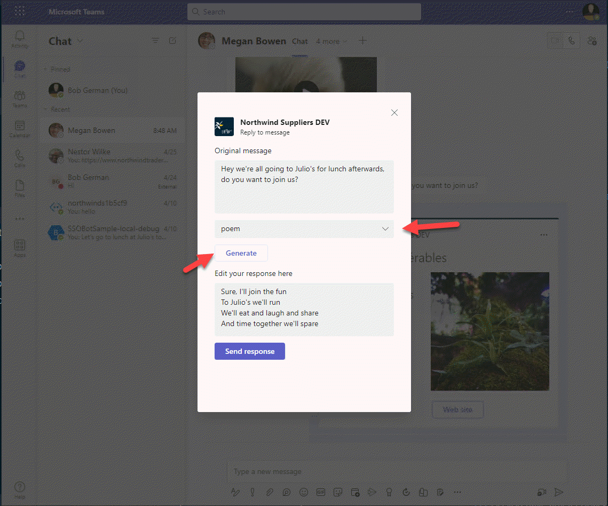
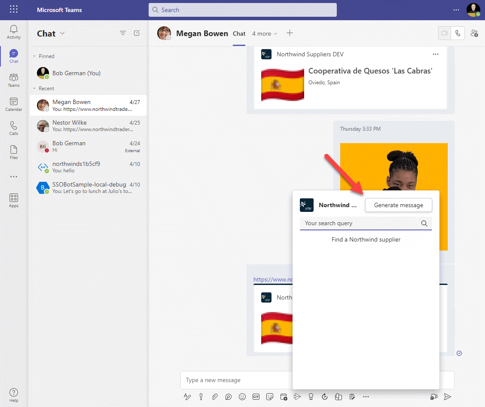
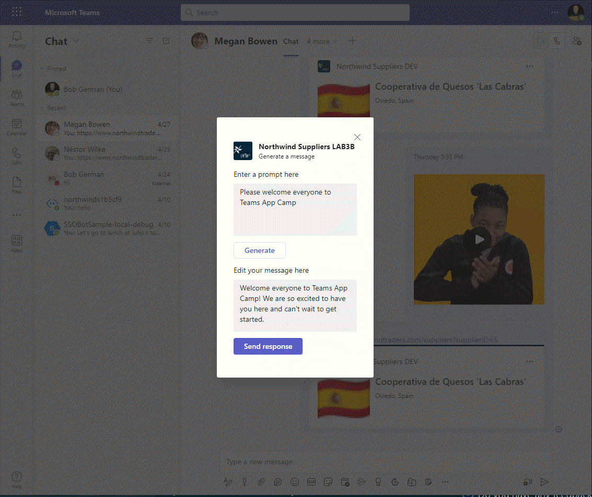
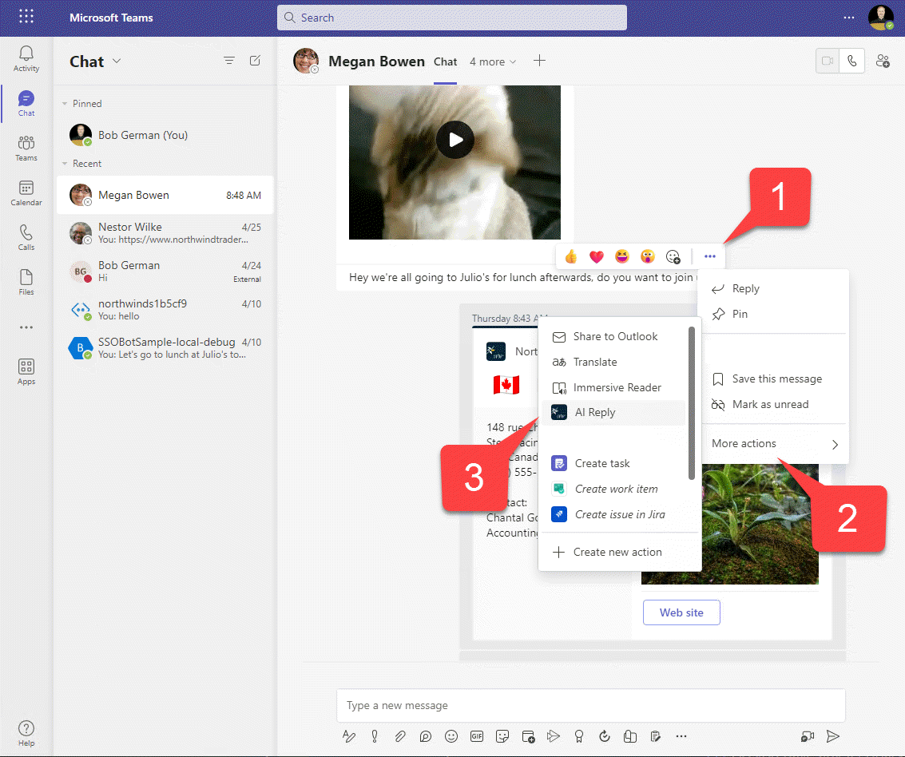

---8<--- "heading2.md"

# Lab 4: Action message extensions with Open AI

???+ info "Lab Outline"

    * __[Lab 1 - Create your first app with Teams Toolkit](./01-create-app.md)__
    In this lab, you'll set up Teams Toolkit and create a Teams message extension.
    * __[Lab 2 - Integrate business data with your application](./02-integrate-web-service.md)__
    In this lab, you'll brand your new app as "Northwind Suppliers", and will provide the ability to insert data from the Northwind Traders sample database in a Microsoft Teams conversation. You'll also learn how to create and send adaptive cards with your message extension.
    * __[Lab 3 - Add link unfurling](./03-add-link-unfurling.md)__
    In this lab, you'll learn how to use Link Unfurling, which provides a custom summary when a user includes your URL in a conversation
    * __
    [Lab 4 - Action message extensions with Open AI](./04-add-ai.md)__
    In this lab, you'll learn how to build "Action" message extensions which can be launched directly
    or in the context menu of another Teams message to take action on it. The labs use the Open AI
    commercial web services (in Azure or using an Open AI account) to generate messages.
    * __[Lab 5 - Single Sign-on and Microsoft Graph](./05-add-sso.md)__
    In this lab, you'll learn how to authenticate users with Azure AD Single Sign-On, and to call the
    Microsoft Graph API. This same process would be used when calling any
    web service that's secured with Azure AD on behalf of the logged-in user.
    * __[Lab 6 - Run the app in Outlook](./06-run-in-outlook.md)__
    In this lab, you'll run the Northwind Suppliers application in Microsoft Outlook.

## Overview

In this lab you will learn to:

- Create an action message extension accessible from the compose box in Microsoft Teams
- Create an action message extension to take action on a message in Microsoft Teams
- Interact with users using adaptive cards in a dialog through the FetchTask and SubmitAction activities
- Call the OpenAI API for an Azure OpenAI resource or the OpenAI public web service

## Features

- An action message extension that uses Open AI to help a user compose a message in Microsoft Teams
- An action message extension that works in the context menu of an existing message to help a user compose a response to a message in Microsoft Teams

For example, here is the Reply message extension in action. An adaptive card is used to interact with the user and allow a response in agreement, disagreement, poem, or a joke.

## Exercise 1: Obtain an OpenAI API key and the code to call OpenAI

There are two approaches here:

1. Set up an Azure OpenAI resource with a model such as text-davinci-003 and obtain the following information
2. Set up an account with OpenAI to access their public API

Please choose one of these approaches and follow the guidance below.

### Option 1: Use an Azure OpenAI resource

This is a good approach if you have access to an Azure subscription, and if you want to keep your data within your own Azure subscription rather than in a shared online service. [Instructions for setting it up are here](https://azure.microsoft.com/en-us/products/cognitive-services/openai-service){target=_blank}.

Once your Azure resource is running, you'll need the following information about the service to access it in your application:

  * Endpoint 1️⃣ - This is assigned when you create the OpenAI resource
  * Model 2️⃣ - Create an AI model deployment; the model text-davinci-003 works well for this lab. You need the "Model deployment name" from the left column in the list of model deployments.
  * Version - This is the API version; use "2023-03-15-preview" for now
  * API Key 3️⃣ - Obtain an API key 

Next, edit your **env/.env.local** file and add the following lines, filling in the information above.

~~~text
AZURE_OPENAI_BASE_PATH=https://something.openai.azure.com/
AZURE_OPENAI_MODEL=text-davinci-003
AZURE_OPENAI_API_VERSION=2023-03-15-preview
~~~

Since the API key is secret, add it to the **env/.env.local.user** file as follows:

~~~text
SECRET_AZURE_OPENAI_API_KEY=xxxxxxxxxxxxxxx
~~~

These aren't the actual .env files however - in order for your code to read the values, we need to instruct Teams Toolkit to add them to the .env file at runtime. To do this, edit the **teamsapp.local.yml** file. Add lines below the existing configuration for `envs` as follows:

~~~yaml
  - uses: file/createOrUpdateEnvironmentFile # Generate runtime environment variables
    with:
      target: ./.localConfigs
      envs:
        BOT_ID: ${{BOT_ID}}
        BOT_PASSWORD: ${{SECRET_BOT_PASSWORD}}
        AZURE_OPENAI_BASE_PATH: ${{AZURE_OPENAI_BASE_PATH}}
        AZURE_OPENAI_MODEL: ${{AZURE_OPENAI_MODEL}}
        AZURE_OPENAI_API_VERSION: ${{AZURE_OPENAI_API_VERSION}}
        AZURE_OPENAI_API_KEY: ${{SECRET_AZURE_OPENAI_API_KEY}}
~~~

!!! warning "Indentation matters in .yml files"
    This is a "yaml" file, which is sensitive to indentation. Make sure the lines you add are indented the same as the `BOT_ID` and `BOT_PASSWORD` entries or it won't work.

Now let's add code to call the Azure OpenAI service. Create a folder **services** within your project. In this new folder, create a file **azureOpenAiService.js** and paste in this code:

~~~javascript
const { OpenAIClient, AzureKeyCredential } = require("@azure/openai");

class AzureOpenAiService {
    constructor() {
        this.openai = new OpenAIClient(process.env.AZURE_OPENAI_BASE_PATH,
             new AzureKeyCredential(process.env.AZURE_OPENAI_API_KEY));
    }
    async generateMessage(prompt) {

        try {
            const response = await this.openai.getCompletions(
                "text-davinci-003",
                [ prompt ],
                {
                    temperature: 0.6,
                    maxTokens: 200
                }
                
            );
            
            let result = response.choices[0].text;

            return result.trim();

        } catch (e) {

            console.log(`Error ${e}`);
            return "Error";

        }

    }
}

module.exports.OpenAiService = new AzureOpenAiService();
~~~

### Option 2: Use the OpenAI Platform

This is a good approach if you want to obtain [AI service directly from OpenAI](https://platform.openai.com/){target=_blank}, and is a quick way to get started with an OpenAI trial account. You'll need to [obtain an API key](https://platform.openai.com/account/api-keys){target=_blank} to use the service. Note that if you've been using Chat GPT for a while your trial API access may already have expired; visit the [usage page](https://platform.openai.com/account/usage){target=_blank} to check your status.

All you need for the lab is an OpenAI API key. Since it's a secret and shouldn't be displayed in the Teams Toolkit logs, it belongs in the **env/.env.local.user** file with a name that begins with `SECRET`:

~~~text
SECRET_OPENAI_API_KEY=your-key-here-xxxxxx
~~~

This isn't the actual .env file however - nor is *.env.local*. In order for your code to read the value, we need to instruct Teams Toolkit to add it to the .env file at runtime. To do this, edit the **teamsapp.local.yml** file. Add a line below the existing configuration for `envs` as follows:

~~~yaml
  - uses: file/createOrUpdateEnvironmentFile # Generate runtime environment variables
    with:
      target: ./.localConfigs
      envs:
        BOT_ID: ${{BOT_ID}}
        BOT_PASSWORD: ${{SECRET_BOT_PASSWORD}}
        OPENAI_API_KEY: ${{SECRET_OPENAI_API_KEY}}
~~~

!!! warning "Indentation matters in .yml files"
    This is a "yaml" file, which is sensitive to indentation. Make sure the line you add is indented the same as the `BOT_ID` and `BOT_PASSWORD` entries or it won't work.

Now let's add code to call the OpenAI service. Create a folder **services** in your project. In this new folder, create a file **openAiService.js** and paste in this code:

~~~javascript
const { OpenAIClient, OpenAIKeyCredential  } = require("@azure/openai");

class OpenAiService {
    constructor() {
        this.openai = new OpenAIClient(process.env.AZURE_OPENAI_BASE_PATH,
             new OpenAIKeyCredential(process.env.OPENAI_API_KEY));
    }
    
    async generateMessage(prompt) {

        try {

            const response = await this.openai.getCompletions(
                "text-davinci-003",
                [ prompt ],
                {
                    temperature: 0.6,
                    maxTokens: 200
                }
                
            );
            
            let result = response.choices[0].text;

            return result.trim();

        } catch (e) {

            console.log(`Error ${e}`);
            return "Error";

        }

    }
}

module.exports.OpenAiService = new OpenAiService();
~~~

???+ note "Code walk-through"
    You might notice that the Azure OpenAI and OpenAI services are very similar. They both have `generateMessage()` functions that call openAiClient.createCompletion() with a prompt, and receive a response from the AI model. 
    
    They also both use the [OpenAI API](https://github.com/openai/openai-node){target=_blank}. This is a client-side library for calling OpenAI services, from NodeJS in this case.

## Exercise 2: Install the Open AI API package

In the previous exercise, you added code that uses the OpenAI API, but we haven't installed the npm module for it. The same module works for both Azure OpenAI and the OpenAI Platform.

Open a terminal window in Visual Studio Code or in your local operating system, and navigate to your **NorthwindSuppliers** project folder. Then type this command:

~~~sh
npm install @azure/openai
~~~

## Exercise 3: Add Action message extensions to the Teams manifest

OK now that we have an AI service to build on, let's create the message extensions. There will be two of them: one that generates a new message and is accessible from a button next to the compose box pop-up, and the other replies to a message and is accessible from the context menu of a message.

Open **appPackage/manifest.json** in your code editor and add these two elements to the `commands` array within `composeExtensions`:

~~~json
    {
        "id": "generateMessage",
        "context": [
            "compose",
            "commandBox"
        ],
        "description": "Generate a message using AI",
        "title": "Generate message",
        "type": "action",
        "fetchTask": true
    },
    {
        "id": "replyToMessage",
        "context": [
            "message"
        ],
        "description": "Generate an agreeable response",
        "title": "AI Reply",
        "type": "action",
        "fetchTask": true
    }
~~~

!!! note
    Be sure to separate these new commands from the previous "searchQuery" command with a comma. If you're new to JSON, and all the nested brackets are a bit confusing, feel free to copy the entire updated **manifest.json** file [from here](https://github.com/microsoft/app-camp/blob/main/src/teams-toolkit/Lab04-AIExtension/NorthwindSuppliers/appPackage/manifest.json){target=_blank}

Notice that the new commands are both of type `action`, with `fetchTask` set to `true`. This will cause Teams to fetch an adaptive card from your service and display a dialog containing the card so the user can interact with your application. You could also present a web page in this fashion, but in this lab we'll just use an adaptive card.

Also notice that the `generateMessage` action runs in the context of the `compose` box or `commandBox` at the top of the Teams user interface. `replyToMessage` runs in the context of a `message`. These settings control the location where Teams displays your action message extension.

## Exercise 4: Add a message extension to generate a message

### Step 1: Add JavaScript code

Now, as before, we'll make a separate JavaScript module for each of our message extensions. Create a new file called **generateMessageME.js** in the **messageExtensions** folder. Paste this code into the file:

~~~javascript
const ACData = require("adaptivecards-templating");
const { CardFactory } = require("botbuilder");
const { OpenAiService } = require("../services/azureOpenAiService");
// const { OpenAiService } = require("../services/openAiService");

class GenerateMessageME {

    // Ref documentation
    // https://learn.microsoft.com/en-us/microsoftteams/platform/messaging-extensions/how-to/action-commands/define-action-command

    async handleTeamsMessagingExtensionFetchTask (context, action) {
        try {
            return this.#displayAdaptiveCardResponse("Please generate a message for me to send.");
        } catch (e) {
            console.log(e);
        }
    }

    async handleTeamsMessagingExtensionSubmitAction (context, action) {

        try {

            switch (action.data?.intent) {
                case "send": {
                    return await this.#sendMessageResponse(action.data?.message);
                }
                default: {
                    return await this.#displayAdaptiveCardResponse(action.data?.prompt);
                }
            }
        }
        catch (e) {
            console.log(e);
        }
    }

    // Generate a response that will display the adaptive card form in Teams
    async #displayAdaptiveCardResponse (prompt) {

        const text = await OpenAiService.generateMessage(prompt);

        // Read card from JSON file
        const templateJson = require('../cards/generateMessageCard.json');
        const template = new ACData.Template(templateJson);
        const cardContents = template.expand({
            $root: {
                prompt: prompt,
                message: text
            }
        });

        const card = CardFactory.adaptiveCard(cardContents);
        return {
            task: {
                type: 'continue',
                value: {
                    card: card,
                    height: 400,
                    title: `Generate a message`,
                    width: 300
                }
            }
        };
    }

    // Generate a response that will add a message to the Teams compose box
    async #sendMessageResponse (message) {

        const messageHtml = message.replace(/\n/g, " ");

        const heroCard = CardFactory.heroCard('', messageHtml);
        const attachment = {
            contentType: heroCard.contentType,
            content: heroCard.content,
            preview: heroCard
        };

        return {
            composeExtension: {
                type: 'result',
                attachmentLayout: 'list',
                attachments: [
                    attachment
                ]
            }
        };
    }

}

module.exports.GenerateMessageME = new GenerateMessageME();
~~~

!!! warning "Adjust if using the OpenAI platform service"
    If you're using Azure OpenAI, then this code is ready to go. If you're using the public OpenAI platform, then you need to comment out the `require` statement for `/services/azureOpenAiService` and un-comment the one for `/services/openAiService`.

???+ note "Code walk-through"
    Take a moment to examine the code you just added.

    The `handleTeamsMessagingExtensionFetchTask()` function is called when the action message extension is invoked by a user. This function will return an adaptive card as part of a "continue" task, which tells Teams to display the card and interact with the user. The function `#displayAdaptiveCardResponse()` generates a response to Teams that includes the adaptive card to be displayed.

    When the user clicks a button on the adaptive card, the card data is submitted and the `handleTeamsMessagingExtensionSubmitAction()` function is called. If the `send` button was pressed, the `#sendMessageResponse` function returns a response with a hero card containing the message to be sent; this inserts the generated message into the compose box for the user to send.

### Step 2: Add the adaptive card

Add a new file, **generateMessageCard.json** in the **cards** folder you created in Lab 2. Paste this JSON into the file.

~~~json
{
    "type": "AdaptiveCard",
    "$schema": "http://adaptivecards.io/schemas/adaptive-card.json",
    "version": "1.4",
    "body": [
        {
            "type": "Input.Text",
            "label": "Enter a prompt here",
            "isMultiline": true,
            "value": "${prompt}",
            "id": "prompt"
        },
        {
            "type": "ActionSet",
            "actions": [
                {
                    "type": "Action.Submit",
                    "title": "Generate",
                    "data": {
                        "intent": "generate"
                    }
                }
            ]
        },
        {
            "type": "Input.Text",
            "label": "Edit your message here",
            "isMultiline": true,
            "value": "${message}",
            "id": "message"
        }
    ],
    "actions": [
        {
            "type": "Action.Submit",
            "title": "Send response",
            "data": {
                "intent": "send"
            }
        }
    ]
}
~~~

???+ note "Code walk-through"
    This is what the card will look like when it's displayed:
    
    
    Notice there are 2 buttons, "Generate" and "Send" on the card. These correspond to the 2 `Action.Submit` actions in the card JSON. These will both cause the `handleTeamsMessagingExtensionSubmitAction()` event to fire in the bot, which will call the corresponding function in **generateMessageME.js**. So how will the message extension determine which button was pressed?

    The answer is that the actions each submit a bit more data in addition to the input fields on the card. The first `Action.Submit` sends an `intent` property value of `"generate"` and the second one sends an `intent` value of `"send"`; the code in **generateMessageME.js** will use this value to figure out which button was pressed.

## Exercise 5: Add a message extension to reply to a message

### Step 1: Add JavaScript code

Create a new file called **replyME.js** in the **messageExtensions** folder. Paste this code into the file:

~~~javascript
const ACData = require("adaptivecards-templating");
const { CardFactory } = require("botbuilder");
const { OpenAiService } = require("../services/azureOpenAiService");
// const { OpenAiService } = require("../services/openAiService");

class ReplyME {

    // Ref documentation
    // https://learn.microsoft.com/en-us/microsoftteams/platform/messaging-extensions/how-to/action-commands/define-action-command

    async handleTeamsMessagingExtensionFetchTask(context, action) {
        try {

            const userMessage = this.#getUserMessage(action);
            return this.#displayAdaptiveCardResponse(userMessage, "agree");

        } catch (e) {
            console.log(e);
        }
    }

    async handleTeamsMessagingExtensionSubmitAction(context, action) {

        try {

            const userMessage = action.data?.message;
            const replyType = action.data?.replyType;

            switch (action.data?.intent) {
                case "send": {
                    return await this.#sendMessageResponse(action.data?.replyText);
                }
                default: {
                    return this.#displayAdaptiveCardResponse(userMessage, replyType);
                }
            }

        }

        catch (e) {
            console.log(e);
        }
    }

    // Get the original message the user invoked the ME on and also the type
    // of response indicated in the adaptive card (agree, disagree, poem, or joke).
    // Default to "agree" if we're displaying the 1st adaptive card
    #getUserMessage(action) {
        let userMessage = action.messagePayload?.body?.content;
        const messageType = action.messagePayload?.body?.contentType;
        if (messageType === "html") {
            userMessage = userMessage.replace(/<[^>]*>?/gm, '');
        }

        return userMessage;
    }

    // Generate a response that will display the adaptive card form in Teams
    async #displayAdaptiveCardResponse(message, replyType) {

        const prompt = this.#getPrompt(message, replyType);
        const replyText = await OpenAiService.generateMessage(prompt);

        // Read card from JSON file
        const templateJson = require('../cards/replyCard.json');
        const template = new ACData.Template(templateJson);
        const cardContents = template.expand({
            $root: {
                message: message,
                replyText: replyText,
                replyType: replyType
            }
        });

        const card = CardFactory.adaptiveCard(cardContents);
        return {
            task: {
                type: 'continue',
                value: {
                    card: card,
                    height: 500,
                    title: `Reply to message`,
                    width: 400
                }
            }
        };

    }

    // Generate a response that will add a message to the Teams compose box
    async #sendMessageResponse(messageText) {

        const messageHtml = messageText.replace(/\n/g, " ");

        const heroCard = CardFactory.heroCard('', messageHtml);
        const attachment = {
            contentType: heroCard.contentType,
            content: heroCard.content,
            preview: heroCard
        };

        return {
            composeExtension: {
                type: 'result',
                attachmentLayout: 'list',
                attachments: [
                    attachment
                ]
            }
        };
    }

    // Get the OpenAI prompt based on the user message and reply type
    #getPrompt(userMessage, replyType) {

        switch (replyType) {
            case "agree": {
                return `Please generate an agreeable response to the following message: "${userMessage}"`;
            }
            case "disagree": {
                return `Please generate a polite response in disagreement to the following message: "${userMessage}"`;
            }
            case "poem": {
                return `Please generate a short poem in response to the following message: "${userMessage}"`;
            }
            case "joke": {
                return `Please generate a dad joke in response to the following message: "${userMessage}"`;
            }
            default: {
                return `Please respond to the following message: "${userMessage}"`;
            }
        }
    }
}

module.exports.ReplyME = new ReplyME();
~~~

!!! warning "Adjust if using the OpenAI platform service"
    If you're using Azure OpenAI, then this code is ready to go. If you're using the public OpenAI platform, then you need to comment out the `require` statement for `/services/azureOpenAiService` and un-comment the one for `/services/openAiService`.

### Step 2: Add the adaptive card

Add a new file, **replyCard.json** in the **cards** folder you created in Lab 2. Paste this JSON into the file.

~~~json
{
    "type": "AdaptiveCard",
    "$schema": "http://adaptivecards.io/schemas/adaptive-card.json",
    "version": "1.4",
    "body": [
        {
            "type": "Input.Text",
            "label": "Original message",
            "isMultiline": true,
            "value": "${message}",
            "id": "message"
        },
        {
            "type": "Input.ChoiceSet",
            "choices": [
                {
                    "title": "agree",
                    "value": "agree"
                },
                {
                    "title": "disagree",
                    "value": "disagree"
                },
                {
                    "title": "poem",
                    "value": "poem"
                },
                {
                    "title": "joke",
                    "value": "joke"
                }
            ],
            "value": "${replyType}",
            "placeholder": "Select a response type",
            "id": "replyType"
        },
        {
            "type": "ActionSet",
            "actions": [
                {
                    "type": "Action.Submit",
                    "title": "Generate",
                    "data": {
                        "intent": "generate"
                    }
                }
            ]
        },
        {
            "type": "Input.Text",
            "label": "Edit your response here",
            "isMultiline": true,
            "value": "${replyText}",
            "id": "replyText"
        }
    ],
    "actions": [
        {
            "type": "Action.Submit",
            "title": "Send response",
            "data": {
                "intent": "send"
            }
        }
    ]
}
~~~

## Exercise 6: Update the bot code to call the message extensions

Now that the message extension code is in place, all that remains is to call it from the Bot. This works the same as the other message extensions except different events will be fired.

Begin by opening **teamsBot.js** and add these lines near the top, below the `require` statement for the `SupplierME`.

~~~javascript
const { GenerateMessageME } = require("./messageExtensions/generateMessageME");
const { ReplyME } = require("./messageExtensions/replyME");
~~~

Now add these event handlers below the `handleTeamsAppBasedLinkQuery` function.

~~~javascript
  async handleTeamsMessagingExtensionFetchTask(context, action) {

    switch (action.commandId) {
      case "generateMessage": {
        return await GenerateMessageME.handleTeamsMessagingExtensionFetchTask(context, action);
      }
      case "replyToMessage": {
        return await ReplyME.handleTeamsMessagingExtensionFetchTask(context, action);
      }
      default: {
        return null;
      }
    }
  }

  async handleTeamsMessagingExtensionSubmitAction(context, action) {

    switch (action.commandId) {
      case "generateMessage": {
        return await GenerateMessageME.handleTeamsMessagingExtensionSubmitAction(context, action);
      }
      case "replyToMessage": {
        return await ReplyME.handleTeamsMessagingExtensionSubmitAction(context, action);
      }
      default: {
        return null;
      }
    }
  }
~~~

## Exercise 7: Run the solution

Finally the moment has arrived - it's time to hit F5 or click the Run button in Teams Toolkit. As before, it will run for a while and then open a browser containing a Teams application installation screen. Install the app and you should land in a chat with the message extension open. This time, however, it will include a "Generate Message" button.

### Step 1: Test the Generate Message button

Go ahead and click the "Generate Message" button; a dialog should appear displaying an adaptive card based on the template in **cards/generateMessageCard.json**. The initial prompt is displayed, along with an AI generated message that can be sent to the Teams chat.

Users can send the message immediately by clicking "Send response", or they can edit the prompt and click "Generate". This allows the user to iterate and find the best prompt to generate the message they'd like to send.

When the user clicked the "Generate" button, the code in **messageExtensions/generateMessageME.js** responded with a `continue` response containing the updated adaptive card. When the user clicks the "Send" button, the code will respond with a `result` response containing a hero card to that is inserted into the conversation. 

Using this technique, it's possible to lead users through a sequence of screens with various adaptive cards and web pages, and then to insert a card into the conversation that other users can act on.

Note that, like the Search message extension, this action message extension inserts content into the compose box. The user can edit their own message including the card, and then click send to share it in the conversation.

### Step 2: Test the message reply feature

To begin, send a message into the Teams chat where your application is running. It needs to be a simple text message.

1️⃣ Hover over or tap the message to reveal its contet menu. Click the "..."

2️⃣ Click "More Actions"; this will open a context menu for taking action on the message, and your app should be on that menu with the name "AI Reply"

3️⃣ Click "AI Reply"

Click the "AI Reply" button to open a dialog showing an adaptive card based on the **cards/replyCard.json** template.

You should see the original message and a drop-down where you can select the type of response you'd like. The default is "agree" but there are some other options as well.

Select one of the other options and click "Generate". As before, the message extension will respond to Teams with a `continue` response containing an updated adaptive card.

To complete the lab, click "Send" and send the message.

--8<-- "i-finished.md"

## Next steps

After completing this lab, you may continue to the next lab in this learning path, [Lab 5 - Single Sign-on and Microsoft Graph](./05-add-sso.md).

## Known issues

--8<-- "issuesLink.md"

