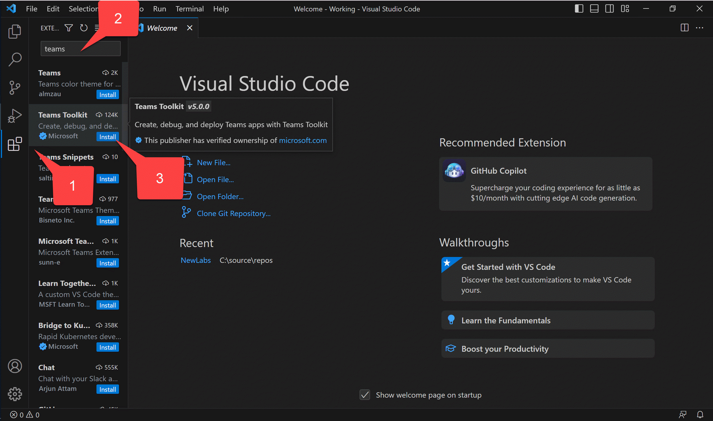

---8<--- "heading2.md"

# Lab 5: Single Sign-on and Microsoft Graph

???+ info "Lab Outline"

    * __[Lab 1 - Create your first app with Teams Toolkit](./01-create-app.md)__
    In this lab, you'll set up Teams Toolkit create a Teams message extension
    * __[Lab 2 - Integrate business data with your application](./02-integrate-web-service.md)__
    In this lab, you'll brand your new app as "Northwind Suppliers", and will provide the ability to insert data from the Northwind Traders sample database in a Microsoft Teams conversation. You'll also learn how to create and send adaptive cards with your message extension.
    * __[Lab 3 - Add link unfurling](./03-add-link-unfurling.md)__
    In this lab, you'll learn how to use Link Unfurling, which provides a custom summary when a user includes your URL in a conversation
    * __[Lab 4 - Action message extensions with Open AI](./04-add-ai.md)__
    In this lab, you'll learn how to build "Action" message extensions which can be launched directly
    or in the context menu of another Teams message to take action on it. The labs use the Open AI
    commercial web services (in Azure or using an Open AI account) to generate messages.
    * __THIS LAB:
    [Lab 5 - Single Sign-on and Microsoft Graph](./05-add-sso.md)__
    In this lab, you'll learn how to authenticate users with Azure AD Single Sign-On, and to call the
    Microsoft Graph API. This same process would be used when calling any
    web service that's secured with Azure AD on behalf of the logged-in user.

## Overview

In this lab you will learn to:

- Do a thing
- Do another thing

## Features

- List app features that will be added in this lab

## Exercise 1: Do the first thing

### Step 1: And do it well...

--8<-- "i-finished.md"

## Known issues

--8<-- "issuesLink.md"

## Next steps

After completing this lab, you may continue to the next lab in this learning path, [lab-name](./02-lab-something.md).

