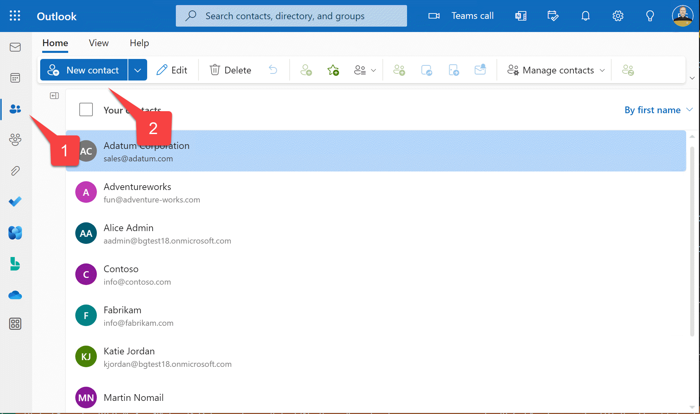
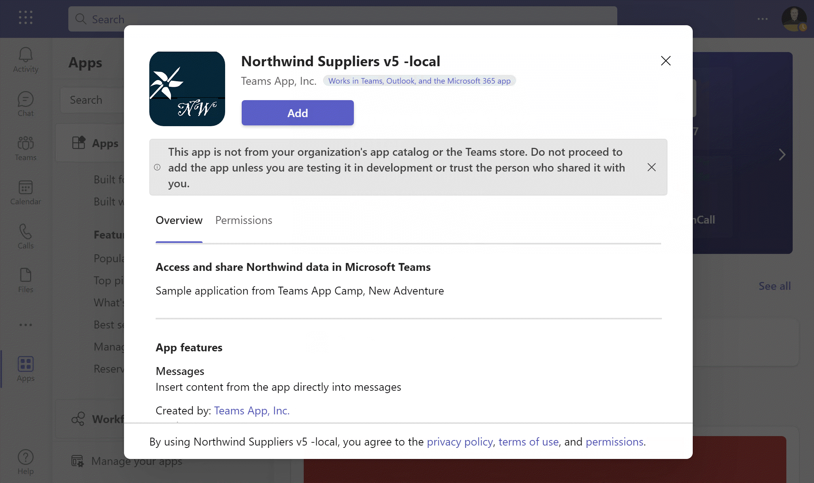
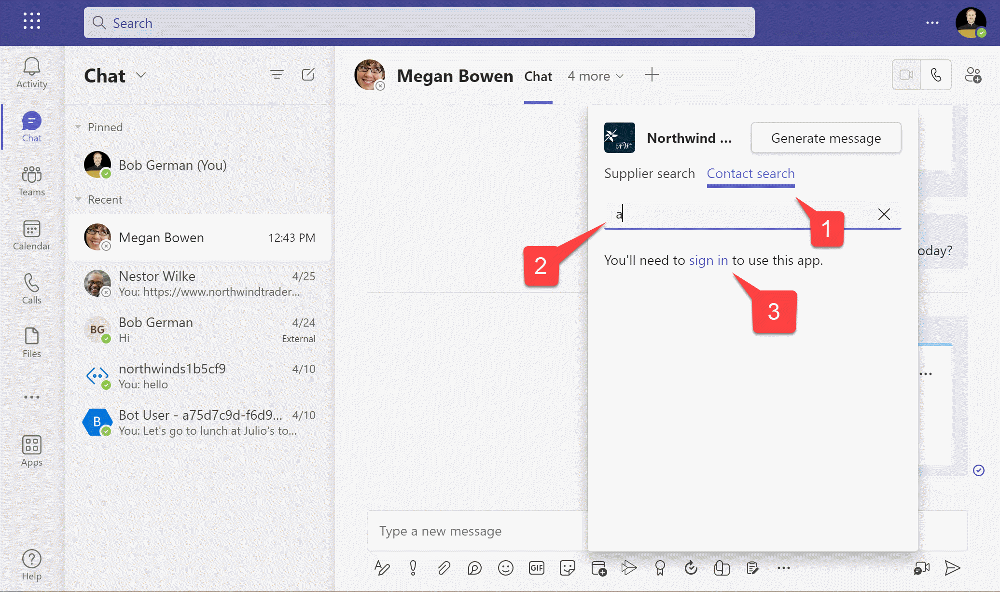
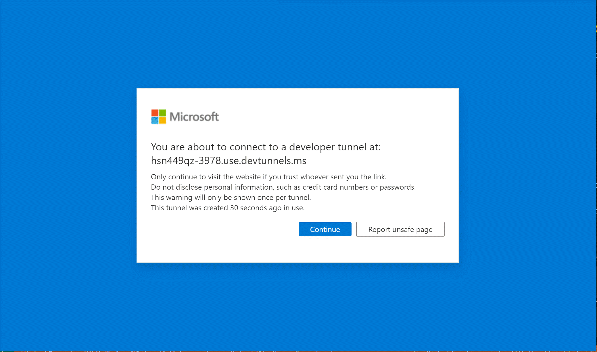
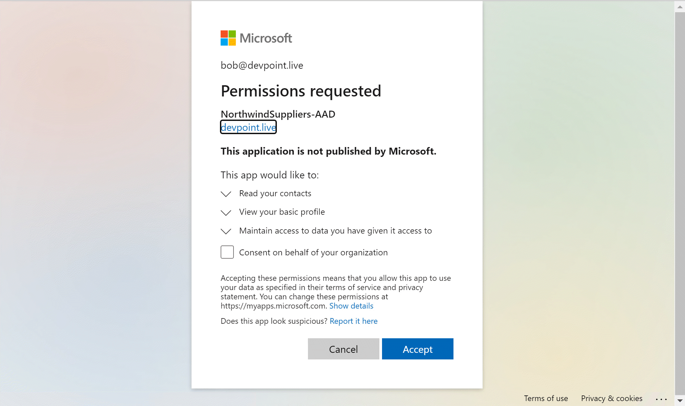

---8<--- "heading2.md"

# Lab 5: Single Sign-on and Microsoft Graph

???+ info "Lab Outline"

    * __[Lab 1 - Create your first app with Teams Toolkit](./01-create-app.md)__
    In this lab, you'll set up Teams Toolkit and create a Teams message extension.
    * __[Lab 2 - Integrate business data with your application](./02-integrate-web-service.md)__
    In this lab, you'll brand your new app as "Northwind Suppliers", and will provide the ability to insert data from the Northwind Traders sample database in a Microsoft Teams conversation. You'll also learn how to create and send adaptive cards with your message extension.
    * __[Lab 3 - Add link unfurling](./03-add-link-unfurling.md)__
    In this lab, you'll learn how to use Link Unfurling, which provides a custom summary when a user includes your URL in a conversation
    * __[Lab 4 - Action message extensions with Open AI](./04-add-ai.md)__
    In this lab, you'll learn how to build "Action" message extensions which can be launched directly
    or in the context menu of another Teams message to take action on it. The labs use the Open AI
    commercial web services (in Azure or using an Open AI account) to generate messages.
    * __THIS LAB:
    [Lab 5 - Single Sign-on and Microsoft Graph](./05-add-sso.md)__
    In this lab, you'll learn how to authenticate users with Azure AD Single Sign-On, and to call the
    Microsoft Graph API. This same process would be used when calling any
    web service that's secured with Azure AD on behalf of the logged-in user.
    * __[Lab 6 - Run the app in Outlook](./06-run-in-outlook.md)__
    In this lab, you'll run the Northwind Suppliers application in Microsoft Outlook.

## Overview

In this lab you will learn to:

- Add Azure Active Directory single sign-on (SSO) to your app so users can seamlessly log into your app with the same account they use in Microsoft Teams
- Access a REST service that's secured with Azure Active Directory from a Teams message extension or bot
- Access the [Microsoft Graph API](https://learn.microsoft.com/graph/use-the-api){target=_blank} to access user content in Microsoft 365. Your app will act on behalf of the logged-in user so they can securely access their own content within your application.

## Features

In this lab, you'll build a Search message extension that queries a user's personal contact list and allows them to share a contact in a Teams conversation.

## Exercise 1: Set up your project for Azure AD Single Sign-on

Applications secured with Azure Active Directory must be _registered_ and granted _permission_. Teams Toolkit will do this work for you, but you have to update your project to make that happen. In this exercise, you'll modify the Teams Toolkit project files to provision your app registration in Azure AD.

???+ info "More information"
    

      <iframe src="//www.youtube.com/embed/SaBbfVgqZHc" frameborder="0" allowfullscreen></iframe>
      
Understanding Single Sign-On (SSO) with Azure AD

    

    

      <iframe src="//www.youtube.com/embed/RjGVOFm39j0" frameborder="0" allowfullscreen></iframe>
      
Learn about multi-tenant applications

    

### Step 1: Add an Azure AD App manifest file to define the Azure AD Application

In this step, you'll add a file that defines the application that Teams Toolkit will register for your application. The AAD manifest allows you to customize various aspects of your application registration. For example, this one sets up `contacts.read` permission on the Microsoft Graph API so your app can read the user's contacts.

Create a file **aad.manifest.json** in the root of your project folder, and paste in this JSON:

~~~json
{
  "id": "${{AAD_APP_OBJECT_ID}}",
  "appId": "${{AAD_APP_CLIENT_ID}}",
  "name": "NorthwindSuppliers-AAD",
  "accessTokenAcceptedVersion": 2,
  "signInAudience": "AzureADMyOrg",
  "optionalClaims": {
      "idToken": [],
      "accessToken": [
          {
              "name": "idtyp",
              "source": null,
              "essential": false,
              "additionalProperties": []
          }
      ],
      "saml2Token": []
  },
  "requiredResourceAccess": [
      {
          "resourceAppId": "Microsoft Graph",
          "resourceAccess": [
              {
                  "id": "Contacts.Read",
                  "type": "Scope"
              }
          ]
      }
  ],
  "oauth2Permissions": [
      {
          "adminConsentDescription": "Allows Teams to call the app's web APIs as the current user.",
          "adminConsentDisplayName": "Teams can access app's web APIs",
          "id": "${{AAD_APP_ACCESS_AS_USER_PERMISSION_ID}}",
          "isEnabled": true,
          "type": "User",
          "userConsentDescription": "Enable Teams to call this app's web APIs with the same rights that you have",
          "userConsentDisplayName": "Teams can access app's web APIs and make requests on your behalf",
          "value": "access_as_user"
      }
  ],
  "preAuthorizedApplications": [
      {
          "appId": "1fec8e78-bce4-4aaf-ab1b-5451cc387264",
          "permissionIds": [
              "${{AAD_APP_ACCESS_AS_USER_PERMISSION_ID}}"
          ]
      },
      {
          "appId": "5e3ce6c0-2b1f-4285-8d4b-75ee78787346",
          "permissionIds": [
              "${{AAD_APP_ACCESS_AS_USER_PERMISSION_ID}}"
          ]
      },
      {
          "appId": "d3590ed6-52b3-4102-aeff-aad2292ab01c",
          "permissionIds": [
              "${{AAD_APP_ACCESS_AS_USER_PERMISSION_ID}}"
          ]
      },
      {
          "appId": "00000002-0000-0ff1-ce00-000000000000",
          "permissionIds": [
              "${{AAD_APP_ACCESS_AS_USER_PERMISSION_ID}}"
          ]
      },
      {
          "appId": "bc59ab01-8403-45c6-8796-ac3ef710b3e3",
          "permissionIds": [
              "${{AAD_APP_ACCESS_AS_USER_PERMISSION_ID}}"
          ]
      },
      {
          "appId": "0ec893e0-5785-4de6-99da-4ed124e5296c",
          "permissionIds": [
              "${{AAD_APP_ACCESS_AS_USER_PERMISSION_ID}}"
          ]
      },
      {
          "appId": "4765445b-32c6-49b0-83e6-1d93765276ca",
          "permissionIds": [
              "${{AAD_APP_ACCESS_AS_USER_PERMISSION_ID}}"
          ]
      },
      {
          "appId": "4345a7b9-9a63-4910-a426-35363201d503",
          "permissionIds": [
              "${{AAD_APP_ACCESS_AS_USER_PERMISSION_ID}}"
          ]
      }
  ],
  "identifierUris": [
    "api://botid-${{BOT_ID}}"
  ],
  "replyUrlsWithType": [
    {
      "url": "https://${{BOT_DOMAIN}}/auth-end.html",
      "type": "Web"
    }
  ]
}
~~~

### Step 2: Update Teams Toolkit configuration file to create the Azure AD App

Open the **teamsapp.local.yml** file. This is a YAML file that defines the steps Teams Toolkit takes to run your project. These steps are done 3 steps, as shown in the "LIFECYCLE" section of the Teams Toolkit user interface.

  * Provision - In this phase, any infrastructure needed by your app is provisioned. This includes things like the bot registration, the Teams app package, and, in this case, the Azure AD app registration

  * Deploy - In this phase, the code is built and run locally, or uploaded to Azure for environments other than "local"

  * Publish - In this phase, the app package is published to Microsoft Teams

  To provision your Azure AD app, add these lines to **teamsapp.local.yml**. You can put them directly below the `provision:` line; if you know YAML you can put them anywhere before the [teamsApp/validateManifest] directive, since the Azure AD application information is needed in validating the manifest.

~~~yaml
  - uses: aadApp/create
    with:
      name: "NorthwindSuppliers-AAD"
      generateClientSecret: true
      signInAudience: "AzureADMyOrg"
    writeToEnvironmentFile:
      clientId: AAD_APP_CLIENT_ID
      clientSecret: SECRET_AAD_APP_CLIENT_SECRET
      objectId: AAD_APP_OBJECT_ID
      tenantId: AAD_APP_TENANT_ID
      authority: AAD_APP_OAUTH_AUTHORITY
      authorityHost: AAD_APP_OAUTH_AUTHORITY_HOST
  
  - uses: aadApp/update
    with:
      manifestPath: "./aad.manifest.json"
      outputFilePath : ./build/aad.manifest.${{TEAMSFX_ENV}}.json
~~~

!!! warning "Indentation can be tricky in YAML"
    YAML  requires proper indentation; each level in the object hierarchy must be indented to indicate the structure. 2 spaces (not tabs) is a good choice. Visual Studio Code will help you here, and will underline any syntax errors in red. You'll know you got it right when the red lines disappear!

Now scroll down and find the `file/createOrUpdateEnvironmentFile` directive in the `deploy` phase. Add these variables to the `envs:` collection, right below the ones you added in the previous lab:

~~~yaml
	  M365_CLIENT_ID: ${{AAD_APP_CLIENT_ID}}
	  M365_CLIENT_SECRET: ${{SECRET_AAD_APP_CLIENT_SECRET}}
	  M365_TENANT_ID: ${{AAD_APP_TENANT_ID}}
	  INITIATE_LOGIN_ENDPOINT: ${{BOT_ENDPOINT}}/auth-start.html
	  M365_AUTHORITY_HOST: ${{AAD_APP_OAUTH_AUTHORITY_HOST}}
      M365_APPLICATION_ID_URI: api://botid-${{BOT_ID}}
~~~

## Exercise 2: Update your Teams app manifest for SSO

In the single sign-on process, Teams will hand your code an Azure AD access token for your application. This access token can be used to authorize calls to your own back-end service(s), or it can be exchanged for an access token that's used with another back-end service such as the Microsoft Graph.

Teams can't provide this access token, however, unless it knows about your application; specifically, it needs to know the application (client) ID and the ID of the bot that's connected to Teams. So you need to add this information to your Teams app manifest.

Find the Teams app manifest template in **./appPackage/manifest.json** and add the following:

~~~json
	"webApplicationInfo": {
	  "id": "${{AAD_APP_CLIENT_ID}}",
	  "resource": "api://botid-${{BOT_ID}}"
    }
~~~

Add it below the `"validDomains"` object, with a comma in between.
While we're here, we need to tell Teams to accept calls from your bot's domain, so add `${{BOT_DOMAIN}}` to the `validDomains` array.

After making these changes, the end of your **manifest.json** file should look like this:

~~~json
    "validDomains": ["${{BOT_DOMAIN}}"],
    "webApplicationInfo": {
        "id": "${{AAD_APP_CLIENT_ID}}",
        "resource": "api://botid-${{BOT_ID}}"
  }
}
~~~

## Exercise 3: (Optional) Update the project for Azure deployment

If you want to be able to deploy your project to Microsoft Azure, you'll need to make a few more changes so Teams Toolkit will set up SSO there as well as for your local environment. If you don't plan to deploy to Microsoft Azure, you can skip to the next exercise.

### Step 1: Update Teams Toolkit configuration file to create the Azure AD App during Azure deployment

Open the **teamsapp.yml** file. This is a YAML file that defines the steps Teams Toolkit takes when provisioning your project in Microsoft Azure. You'll make the same modifications here that you made in **teamsapp.local.yml** earlier.

Specifically, you need to add these lines to **teamsapp.yml**. You can put them directly below the `provision:` line; if you know YAML you can put them anywhere before the [teamsApp/validateManifest] directive, since the Azure AD application information is needed in validating the manifest.

~~~yaml
  - uses: aadApp/create
    with:
      name: "NorthwindSuppliers-AAD"
      generateClientSecret: true
      signInAudience: "AzureADMyOrg"
    writeToEnvironmentFile:
      clientId: AAD_APP_CLIENT_ID
      clientSecret: SECRET_AAD_APP_CLIENT_SECRET
      objectId: AAD_APP_OBJECT_ID
      tenantId: AAD_APP_TENANT_ID
      authority: AAD_APP_OAUTH_AUTHORITY
      authorityHost: AAD_APP_OAUTH_AUTHORITY_HOST
  
  - uses: aadApp/update
    with:
      manifestPath: "./aad.manifest.json"
      outputFilePath : ./build/aad.manifest.${{TEAMSFX_ENV}}.json
~~~

### Step 2: Add Azure AD configuration values to the Azure parameters file

Open the **infra/azure.parameters.json** file and add these properties to the `parameters` object. Remember to add a comma after the `"botDisplayName"` property to separate it from these new properties.

~~~json
    "m365ClientId": {
      "value": "${{AAD_APP_CLIENT_ID}}"
    },
    "m365ClientSecret": {
      "value": "${{SECRET_AAD_APP_CLIENT_SECRET}}"
    },
    "m365TenantId": {
      "value": "${{AAD_APP_TENANT_ID}}"
    },
    "m365OauthAuthorityHost": {
      "value": "${{AAD_APP_OAUTH_AUTHORITY_HOST}}"
    }
~~~

### Step 3: Update the Bicep file

Teams Toolkit uses [Bicep](https://learn.microsoft.com/azure/azure-resource-manager/bicep/overview){target="_blank"} to deploy applications to Microsoft Azure. In this step, you'll update the bicep file to set the Azure AD settings in the Azure App Service that will host your application.

Open the **infra/azure.bicep** file and find this line:

~~~bicep
param location string = resourceGroup().location
~~~

Add these lines below that line.

~~~bicep
	param m365ClientId string
	param m365TenantId string
	param m365OauthAuthorityHost string
	param m365ApplicationIdUri string = 'api://botid-${botAadAppClientId}'
	@secure() param m365ClientSecret string
~~~

Now scroll to the bottom of the bicep file; notice the `output` lines are at the bottom. Just before them, insert the following lines to set the properties of the app service:

~~~bicep
resource webAppSettings 'Microsoft.Web/sites/config@2021-02-01' = {
    name: '${webAppName}/appsettings'
    properties: {
    M365_CLIENT_ID: m365ClientId
    M365_CLIENT_SECRET: m365ClientSecret
    INITIATE_LOGIN_ENDPOINT: uri('https://${webApp.properties.defaultHostName}', 'auth-start.html')
    M365_AUTHORITY_HOST: m365OauthAuthorityHost
    M365_TENANT_ID: m365TenantId
    M365_APPLICATION_ID_URI: m365ApplicationIdUri
    BOT_ID: botAadAppClientId
    BOT_PASSWORD: botAadAppClientSecret
    RUNNING_ON_AZURE: '1'
    }
}
~~~

## Exercise 4: Update the application code for SSO

In this exercise, you'll modify the code to accomodate the SSO process. These steps would be used for any message extension; the new functionality to share personal contacts will be added in Exercise 5.

### Step 1: Provide HTML pages for the consent dialog

The first time a user accesses your application, they may need to consent to giving the app permission to read their personal contacts. This is performed by the [TeamsFx library](){target="_blank"}, which we'll add shortly. TeamsFx will display a pop-up window; these HTML pages are to be displayed in that pop-up, and will redirect to Azure AD to do the actual consent.

Create a new folder at the project root called **public**. 

Create a file **auth-start.html** and paste in the contents [from Teams Toolkit](https://github.com/OfficeDev/TeamsFx/blob/main/packages/fx-core/templates/plugins/resource/aad/auth/bot/js/public/auth-start.html){target="_blank"}

Create a file **auth-end.html** and paste in the contents [from Teams Toolkit](https://github.com/OfficeDev/TeamsFx/blob/main/packages/fx-core/templates/plugins/resource/aad/auth/bot/js/public/auth-end.html){target="_blank"}

???+ note "Quick way to copy from Github"
    There is a "Copy raw contents" button in the upper left corner that will copy the file contents with one click.
    

### Step 2: Install packages

The application will use two npm packages as part of the SSO process:
  * [isomorphic-fetch](https://www.npmjs.com/package/isomorphic-fetch){target="_blank"} - This is used to make a web service call to Azure Active Directory when exchanging the app's own access token for a Microsoft Graph access token
  * [@microsoft/teamsfx](https://learn.microsoft.com/microsoftteams/platform/toolkit/teamsfx-sdk){target="_blank"} - This package will simplify the SSO code, and handle launching the consent dialog if needed

Enter the following command line in the root of your project folder.

~~~sh
npm install @microsoft/teamsfx isomorphic-fetch
~~~

### Step 3: Update your index.js file to handle SSO interactions

Open the **index.js** file; this is the main entry point for your bot's web service. Add these lines at the top:

~~~javascript
require("isomorphic-fetch");
const path = require("path");
~~~

Find the code which handles messages for the bot:

~~~javascript
// Listen for incoming requests.
server.post("/api/messages", async (req, res) => {
  await adapter.process(req, res, async (context) => {
    await bot.run(context);
  });
});
~~~

Replace this code with the following. The new code adds the ability to detect a [412] ;[HTTP status code](https://http.cat){target=_blank}, "Precondition not met", which is thrown within TeamsFx if the user has not consented to the permissions requested. This is the situation that triggers the consent dialog to appear, and our code must not catch that error or execution will stop and the dialog code in TeamsFx won't run.

The new code also adds a `get` request handler to serve up the authentication HTML pages we added earlier.

~~~javascript
// Listen for incoming requests.
server.post("/api/messages", async (req, res) => {
    await adapter.process(req, res, async (context) => {
    await bot.run(context);
    }).catch((err) => {
    // Error message including "412" means it is waiting for user's consent, which is a normal process of SSO, shouldn't throw this error.
    if(!err.message.includes("412")) {
        throw err;
        }
    })
});

server.get(
    "/auth-:name(start|end).html",
    restify.plugins.serveStatic({
    directory: path.join(__dirname, "public"),
    })
);
~~~

## Exercise 5: Add the Contacts message extension

Now that we've laid the groundwork for single sign-on, we'll implement the new Contacts message extension, which calls the Microsoft Graph API to access the user's personal contacts so they can share them in Teams.

### Step 1: Add the Contacts message extension code

Add a new file, **contactME.js** within the **messageExtensions** directory, and paste in this code:

~~~javascript
const axios = require("axios");
const ACData = require("adaptivecards-templating");
const { CardFactory } = require("botbuilder");

const {
    createMicrosoftGraphClientWithCredential,
    OnBehalfOfUserCredential,
    handleMessageExtensionQueryWithSSO
} = require("@microsoft/teamsfx");
require("isomorphic-fetch");

const oboAuthConfig = {
    authorityHost: process.env.M365_AUTHORITY_HOST,
    clientId: process.env.M365_CLIENT_ID,
    tenantId: process.env.M365_TENANT_ID,
    clientSecret: process.env.M365_CLIENT_SECRET,
};
const initialLoginEndpoint = process.env.INITIATE_LOGIN_ENDPOINT;

class ContactME {

    // Get contacts given a query
    async handleTeamsMessagingExtensionQuery (context, query) {
        return await handleMessageExtensionQueryWithSSO(context, oboAuthConfig, initialLoginEndpoint,
            "Contacts.Read",
            async (token) => {
              return await this.#queryContacts(context, query, token);
            });
    }

    // Get contacts given a query and an access token for the Microsoft Graph
    async #queryContacts (context, query, token) {

        try {

            // Init OnBehalfOfUserCredential instance with SSO token
            const credential = new OnBehalfOfUserCredential(token.ssoToken, oboAuthConfig);

            // Add scope for your Azure AD app. For example: Mail.Read, etc.
            const graphClient = createMicrosoftGraphClientWithCredential(credential, "Contacts.Read");

            // Call graph api use `graph` instance to get user profile information.
            const response = await graphClient.api("/me/contacts?$select=id,displayName,emailAddresses").get();

            // Since Graph doesn't allow sorting and filtering of contacts, do it here
            // TODO: Handle multiple pages of contacts
            let contacts = response.value.filter( contact => 
                contact.displayName.toLowerCase().includes(query.toLowerCase()));

            // Sort contacts by display name
            contacts = contacts.sort((a, b) => (a.displayName > b.displayName) ? 1 : -1);

            const attachments = [];
            contacts.forEach((contact) => {

                const itemAttachment = CardFactory.heroCard(contact.displayName,);
                const previewAttachment = CardFactory.thumbnailCard(contact.displayName);

                previewAttachment.content.tap = {
                    type: "invoke",
                    value: {    // Values passed to selectItem when an item is selected
                        queryType: 'contactME',
                        id: contact.id,
                        displayName: contact.displayName,
                        email: contact.emailAddresses[0]?.address
                    },
                };
                const attachment = { ...itemAttachment, preview: previewAttachment };
                attachments.push(attachment);
            });

            return {
                composeExtension: {
                    type: "result",
                    attachmentLayout: "list",
                    attachments: attachments,
                }
            };

        } catch (error) {
            console.log(error);
        }
    };

    handleTeamsMessagingExtensionSelectItem (context, item) {

        const resultCard = CardFactory.heroCard(item.displayName, item.email);

        return {
            composeExtension: {
                type: "result",
                attachmentLayout: "list",
                attachments: [resultCard]
            },
        };
    };
}

module.exports.ContactME = new ContactME();
~~~

???+ note "Code walk-through"
    Take a moment to examine the code you just added.

    The `handleTeamsMessagingExtensionQuery()` function is called when a user enters a query into the message extension. To satisfy this request, we need an access token, so we return a call to the TeamsFx function `handleTeamsMessagingExtensionQueryWithSSO()`. This function takes care of the displaying a consent dialog if the user hasn't consented to the permissions. 
    
    It includes an argument, `oboAuthConfig`, which contains the information needed to exchange the access token provided by Teams with an access token for a web service owned by some other application (such as the Microsoft Graph). This is used by `handleTeamsMessagingExtensionQueryWithSSO() and by the call to `OnBehalfOfUserCredential()`, which we call to get a Graph client to call the Microsoft Graph.

    Once you have the Graph client, it's simple to call the Graph API and get the list of clients. To try this and other Graph API calls interactively, try the [Graph Explorer](https://developer.microsoft.com/graph/graph-explorer){target="_blank"}. This is a great place to start when writing code to call the Microsoft Graph.

### Step 2: Modify the bot to displatch messages to the Contacts message extension

Open **teamsBot.js** and add calls to the contact message extension to the `switch` statements for query message extensions.

Near the top of the file, add a `require` statement to import the contact message extension module:

~~~javascript
const { ContactME } = require("./messageExtensions/contactME");
~~~

In the `handleTeamsMessagingExtensionQuery` function, add another case to the switch statement:

~~~javascript
    case "contactME":  // Search for contacts
        return await ContactME.handleTeamsMessagingExtensionQuery(context, searchQuery);
~~~

In the `handleTeamsMessagingExtensionSelectItem` function, add another case to the switch statement:

~~~javascript
      case "contactME":  // Search for contacts
        return ContactME.handleTeamsMessagingExtensionSelectItem(context, item);
~~~

### Step 3: Add the Contacts message extension to the Teams app manifest

Edit **appPackage/manifest.json** and add a new entry to the `commands` array after the `replyToMessage` command.

~~~json
{ 
        "id": "searchContacts", 
        "context": [ 
            "compose", 
            "commandBox" 
        ], 
        "description": "Share a contact", 
        "title": "Contact search", 
        "type": "query", 
        "parameters": [ 
            { 
                "name": "contactME", 
                "title": "Contact search", 
                "description": "Type name or company", 
                "inputType": "text" 
            } 
        ] 
} 
~~~

!!! note
    If all the nested brackets are a bit confusing, feel free to copy the entire updated **manifest.json** file [from here](https://github.com/microsoft/app-camp/blob/main/src/teams-toolkit/Lab05-Lab05-ConsumeGraphAPI/NorthwindSuppliers/appPackage/manifest.json){target=_blank}

## Exercise 6: Run the application

### Step 1: Enter test data

Your message extension won't be able to display contacts if you don't have any! So take a moment to ensure you've got a few contacts in Microsoft 365.

From Microsoft Teams, click the "waffle" menu 1️⃣ and select Microsoft Outlook 2️⃣.

Within Outlook, click the "Contacts" button 1️⃣ and then enter some new contacts 2️⃣. The app is simple, and will only display the person or company name and email address. 
If you want to play along with the business scenario, make them sound like suppliers. 

### Step 2: Run the application

Click F5, use the "Run" menu, or click the Run arrow in Teams Toolkit. When the browser opens and the installation dialog opens, add the application.

Now the message extension will have two tabs for searching. Click the "Contact search" tab 1️⃣ and enter one or more letters contained in the contact names you entered in Step 12️⃣ . The first time you do this, TeamsFx will realize that nobody has consented to the app permissions, and will display a message inviting you to sign in. Click the sign-in link 3️⃣ to proceed.

Since you're running locally with [Developer Tunnels](https://code.visualstudio.com/docs/remote/tunnels){target="_blank"}, you'll see a warning screen. Users won't see this when your app is deployed.

Click "Continue" and you'll be redirected to Azure AD, where you'll be asked to consent to the app's permissions. (You were directed there by **public/auth-start.html**), which TeamsFx displayed when it found you hadn't consented). Since you're a Microsoft 365 administrator, you're also given the option to "Consent on behalf of your organization" which will consent for every user in your tenant. 

Click "Accept" to consent to the permissions and run the message extension

Now you should see a list of contacts which contain the search string.

Click on one of the contacts to insert a Hero card with the contact information into the Teams conversation.

## Next steps

At this point, you've mostly completed the labs. In [the next lab](./06-run-in-outlook.md), you will run the Northwind Suppliers app in Microsoft Outlook.

--8<-- "i-finished.md"

## Known issues

--8<-- "issuesLink.md"

