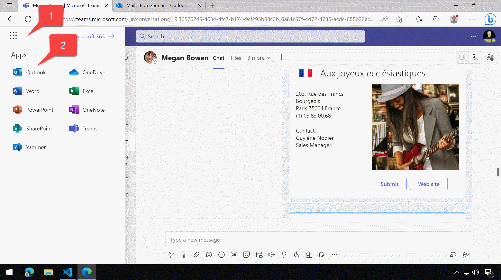
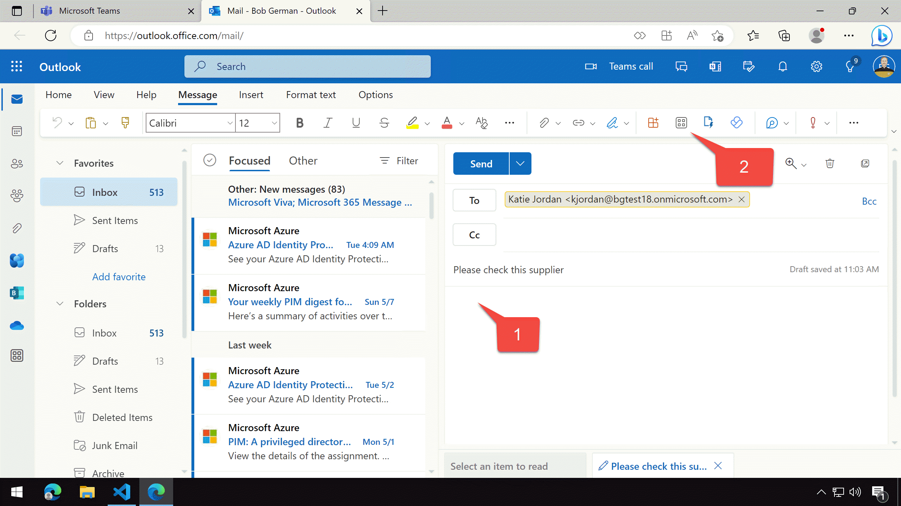
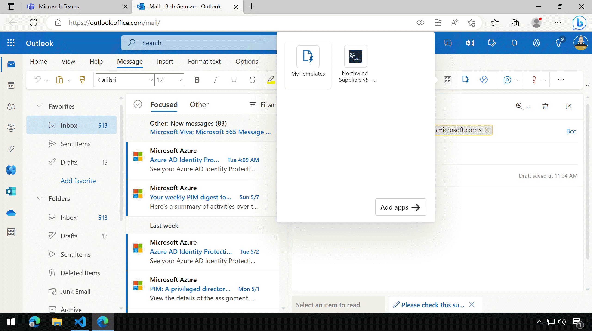
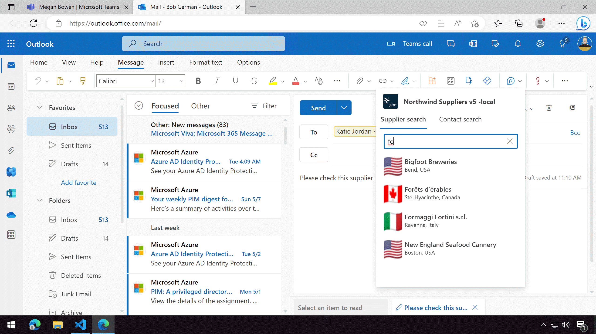
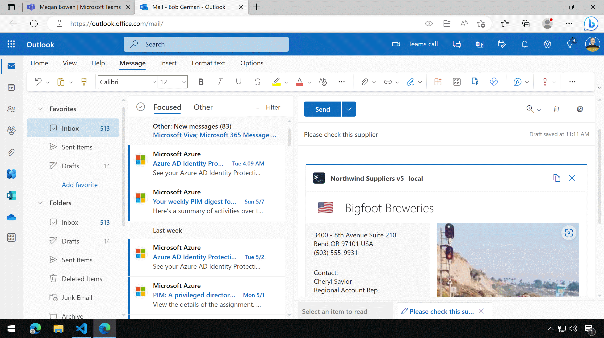

---8<--- "heading2.md"

# Lab 5: Single Sign-on and Microsoft Graph

???+ info "Lab Outline"

    * __[Lab 1 - Create your first app with Teams Toolkit](./01-create-app.md)__
    In this lab, you'll set up Teams Toolkit create a Teams message extension
    * __[Lab 2 - Integrate business data with your application](./02-integrate-web-service.md)__
    In this lab, you'll brand your new app as "Northwind Suppliers", and will provide the ability to insert data from the Northwind Traders sample database in a Microsoft Teams conversation. You'll also learn how to create and send adaptive cards with your message extension.
    * __[Lab 3 - Add link unfurling](./03-add-link-unfurling.md)__
    In this lab, you'll learn how to use Link Unfurling, which provides a custom summary when a user includes your URL in a conversation
    * __[Lab 4 - Action message extensions with Open AI](./04-add-ai.md)__
    In this lab, you'll learn how to build "Action" message extensions which can be launched directly
    or in the context menu of another Teams message to take action on it. The labs use the Open AI
    commercial web services (in Azure or using an Open AI account) to generate messages.
    * __[Lab 5 - Single Sign-on and Microsoft Graph](./05-add-sso.md)__
    In this lab, you'll learn how to authenticate users with Azure AD Single Sign-On, and to call the
    Microsoft Graph API. This same process would be used when calling any
    web service that's secured with Azure AD on behalf of the logged-in user.
    * __THIS LAB:
    [Lab 6 - Run the app in Outlook](./06-run-in-outlook.md)__
    In this lab, you'll run the Northwind Suppliers application in Microsoft Outlook.

## Overview

In this lab you will learn to access your Teams app in Microsoft Outlook.

## Features

There are no new features - but the features you already built will also work in Microsoft Outlook.

## Exercise 1: View the application in Microsoft Outlook

### Step 1: Ensure your app is running and navigate to Microsoft Outlook

While your app is running, click the "waffle" menu in Teams 1️⃣ and select "Outlook" 2️⃣.

Within Outlook, create a new email.

### Step 2: Use the Search message extensions in Outlook

Position your cursor on the body of the email 1️⃣ and click the apps button 2️⃣ to view the message extensions.

Select the Northwind Suppliers application

Enter a few letters to search for a supplier

Finally, select a supplier to insert it into the email.

Now try it again using the "Contacts" message extension.

## Next steps

Congratulations, you have completed App Camp New Adventure!
If you haven't tried the classic App Camp labs yet, click [here](/app-camp/aad/A01-begin-app) to give them a try!

--8<-- "i-finished.md"

## Known issues

--8<-- "issuesLink.md"

