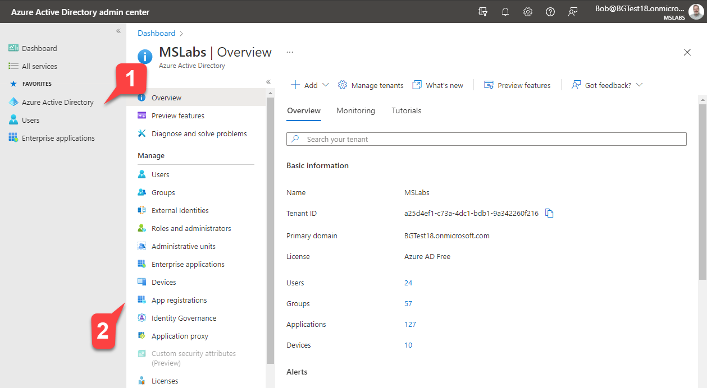
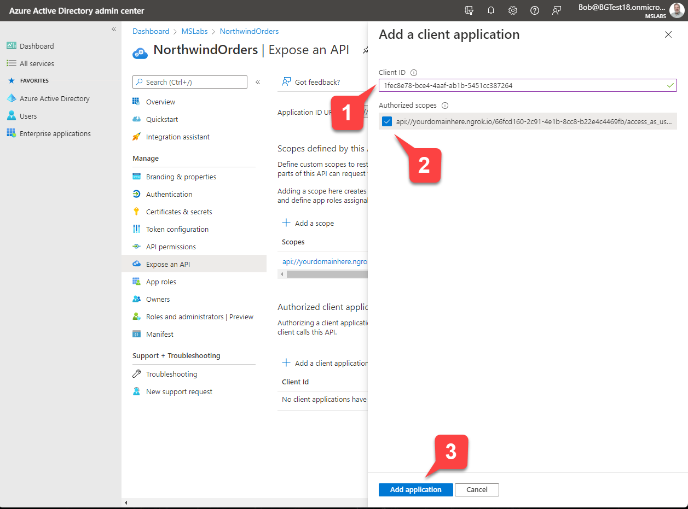

# Extend Teams app to other M365 host apps like Outlook, Office.com


## Summary

This sample is a created  using the core teams application built over the course of labs [A01](../../lab-instructions/aad/A01-begin-app.md)-[A03](../../lab-instructions/aad/A03-after-apply-styling.md) to get to the Northwind Orders core application. The app demonstrates how to use the latest Microsoft Teams JS SDK V2 to extend teams application to other M365 host apps like Outlook/Office.com


## Version history

Version|Date|Author|Comments
-------|----|----|--------
1.0|April 2022|Bob German, Tomomi Imura, Rabia Williams|Initial release
1.1|April 2022|Rabia Williams|Use Teams JS SDK v2
1.2|May 2022|Rabia Williams|Add Message extension to app

## Disclaimer

**THIS CODE IS PROVIDED *AS IS* WITHOUT WARRANTY OF ANY KIND, EITHER EXPRESS OR IMPLIED, INCLUDING ANY IMPLIED WARRANTIES OF FITNESS FOR A PARTICULAR PURPOSE, MERCHANTABILITY, OR NON-INFRINGEMENT.**

---

## Minimal Path to Awesome

### Authorize Microsoft Teams to log users into your application

Microsoft Teams provides a Single Sign-On (SSO) capability so users are silently logged into your application using the same credentials they used to log into Microsoft Teams. This requires giving Microsoft Teams permission to issue Azure AD tokens on behalf of your application. In this exercise, you'll provide that permission.

#### App registration

Go to the [Azure AD admin portal](https://aad.portal.azure.com/) and make sure you're logged in as the administrator of your development tenant. Click "Azure Active Directory" 1️⃣ and then "App Registrations" 2️⃣.



Select the app you registered earlier to view the application overview.

#### Add the M365 client applications

Click "Expose an API" 1️⃣ and then "+ Add a client application" 2️⃣.


Paste the ID for the Teams mobile or desktop app, `1fec8e78-bce4-4aaf-ab1b-5451cc387264` into the flyout 1️⃣ and check the scope you created earlier 2️⃣ to allow Teams to issue tokens for that scope. Then click "Add application" 3️⃣ to save your work.

Repeat the process for the Teams web application, `5e3ce6c0-2b1f-4285-8d4b-75ee78787346`.




Click "Expose an API" 1️⃣ and then "+ Add a client application" 2️⃣.


Paste the ID for the Teams mobile or desktop app, `1fec8e78-bce4-4aaf-ab1b-5451cc387264` into the flyout 1️⃣ and check the scope you created earlier 2️⃣ to allow Teams to issue tokens for that scope. Then click "Add application" 3️⃣ to save your work.

Repeat the process for other M365 client applications [see here](https://docs.microsoft.com/en-us/microsoftteams/platform/m365-apps/extend-m365-teams-personal-tab?tabs=manifest-teams-toolkit#update-azure-ad-app-registration-for-sso)

|Microsoft 365 client application|	Client ID|
|---|---|
|Teams desktop, mobile|	1fec8e78-bce4-4aaf-ab1b-5451cc387264|
|Teams web	|5e3ce6c0-2b1f-4285-8d4b-75ee78787346|
|Office.com|	4765445b-32c6-49b0-83e6-1d93765276ca|
|Office desktop|	0ec893e0-5785-4de6-99da-4ed124e5296c|
|Outlook desktop|	d3590ed6-52b3-4102-aeff-aad2292ab01c|
|Outlook Web Access|	00000002-0000-0ff1-ce00-000000000000|
|Outlook Web Access	|bc59ab01-8403-45c6-8796-ac3ef710b3e3|


### Project set up
- Clone or download the sample from [https://github.com/microsoft/app-camp](https://github.com/microsoft/app-camp)

- In a console, navigate to `src/extend-with-capabilities/ExtendTeamsForM365/` from the main folder `m365-msteams-northwind-app-samples`.

    ```bash
    cd src/extend-with-capabilities/ExtendTeamsForM365/
    ```

- Install modules

    ```bash
    npm install
    ```
- Bot registration
Message extensions allow users to bring the application into a conversation in Teams. You can search data in your application, perform actions on them and send back results of your interaction to your application as well as Teams to display all results in a rich card in the conversation.

Since it is a conversation between your application's web service and teams, you'll need a secure communication protocol to send and receive messages like the **Bot Framework**'s messaging schema.

You'll need to [register your web service as a bot in the Bot Framework](https://docs.microsoft.com/en-us/azure/bot-service/bot-service-quickstart-registration?view=azure-bot-service-4.0&tabs=userassigned) and update the app manifest file to define your web service so Teams client can know about it.

You will also need the Bot id and secret for env file.

You'll need to add Outlook and Teams channel in the bot configuration.
You'll also need to specify the Originator in the env file, which can be done using this [document](https://docs.microsoft.com/en-us/outlook/actionable-messages/security-requirements).


- Run ngrok - point to port 3978

    ```bash
    ngrok http -host-header=rewrite 3978
    ```

- Update the `.env` configuration 

Update the env file with the below values:

```
COMPANY_NAME=Northwind Traders
PORT=3978

TEAMS_APP_ID=<any GUID>
HOSTNAME=<Your ngrok url>
TENANT_ID=<Your tenant id>
CLIENT_ID=<client id from AAD app registration>
CLIENT_SECRET=<client secret from AAD app registration>
CONTACTS=<Any user/users you'd like to chat/mail for orders. Comma separated if more than one user>
BOT_REG_AAD_APP_ID=88888888-0d02-43af-85d7-72ba1d66ae1d
BOT_REG_AAD_APP_PASSWORD=111111vk
ORIGINATOR=00000000-0000-0000-0000-000000000000
```
### Create Northwind DB local files

Run below script to download local DB files

    ```bash
    npm run db-download
    ```

### Package & upload app

- Package the app

    ```bash
    npm run package
    ```

- Run the app locally
    ```bash
    npm start
    ```

- Upload the the packaged zip file inside `manifest` folder into Teams [using these instructions](https://docs.microsoft.com/en-us/microsoftteams/platform/concepts/deploy-and-publish/apps-upload).

## Test the app

- Launch application in Teams


- Launch application in Office.com


- Launch application in Outlook


- Search based message extension in both Teams and Outlook


## Features
- In Teams:
    - My Orders
    - My Orders Report
    - Order details
    - Open chat with sales representatives from **Order details page**
    - Search based message extension to search and update product stock
    
- In Office.com:
    - My Recent Order
    - My Recent Files
    - Order details
- In Outlook (Windows):
    - My Orders
    - Order details
    - Compose mail to sales representatives from **Order details page**
    - Search based message extension to search and update product stock
- In Outlook (Web):
    - My Orders
    - Order details
    - Search based message extension to search and update product stock